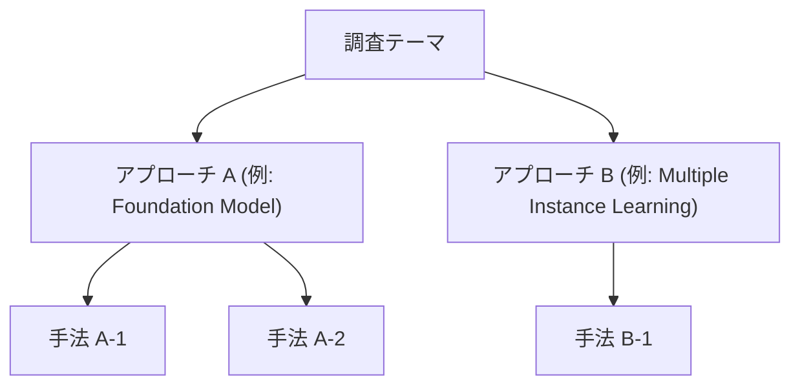

# 【調査テーマタイトルを入力】

> **調査日**: YYYY-MM-DD  
> **担当Agent**: （例: Antigravity / Research Agent）  
> **ステータス**: [調査中 / 完了 / 要追加調査]  
> **タグ**: `#カテゴリ` `#キーワード1` `#キーワード2`  

---

## 📌 エグゼクティブサマリー
- **背景と目的**: なぜこのテーマが重要なのか、何を明らかにする調査か。
- **主要な発見（Takeaways）**: 
  1. ポイント1
  2. ポイント2
  3. ポイント3
- **結論・示唆**: 今後の開発や研究方針への影響。

---

## 1. 背景・課題設定
- 対象分野における現状と課題
- なぜ今この技術・アプローチが注目されているか
- 従来の課題・限界点（計算コスト、アノテーション不足、汎化性能など）

---

## 2. 主要技術動向・アプローチ分類
本テーマにおける主な技術アプローチを体系化して整理します。

### 2.1 [アプローチ A: 例: 基盤モデルの適用]
- **概要**: 
- **代表的な手法/モデル**:
- **メリット・強み**:
- **課題・制約**:

### 2.2 [アプローチ B: 例: 弱教師あり学習・MIL]
- **概要**: 
- **代表的な手法/モデル**:
- **メリット・強み**:
- **課題・制約**:

---

## 3. 主要論文・モデル比較

| 手法/モデル名 | 発表年/会議 | 主な特徴・アーキテクチャ | データセット/検証規模 | 主な成果/SOTA比較 | リンク / PDF |
|:---|:---|:---|:---|:---|:---|
| 例: CONCH | 2024 (Nat Med) | 視覚言語基盤モデル (WSI) | 1.17M 画像テキストペア | Zero-shot分類・検索でSOTA | [Paper](papers/index.md#paper-1) |
| 例: UNI | 2024 (Nat Med) | 汎用病理基盤モデル (ViT-L) | 100M+ パッチ画像 | 多タスクで優れた汎化性 | [Paper](papers/index.md#paper-2) |

---

## 4. 詳細分析・技術的考察
- **アーキテクチャの進化トレンド**: 
- **データセット・評価ベンチマークの動向**:
- **実応用（臨床導入・推論速度・コスト）におけるボトルネック**:

---

## 5. 今後の展望・オープンクエスチョン
- 未解決の課題
- 次に注目すべき派生技術
- 本調査から派生する有望な次期調査テーマ

---

## 6. 参考文献・関連リソース
- 論文メタデータおよび詳細要約は [papers/index.md](papers/index.md) を参照。
- 調査時の検索履歴・クエリログは [notes/search_log.md](notes/search_log.md) を参照。
