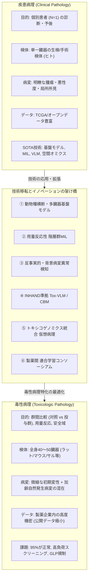
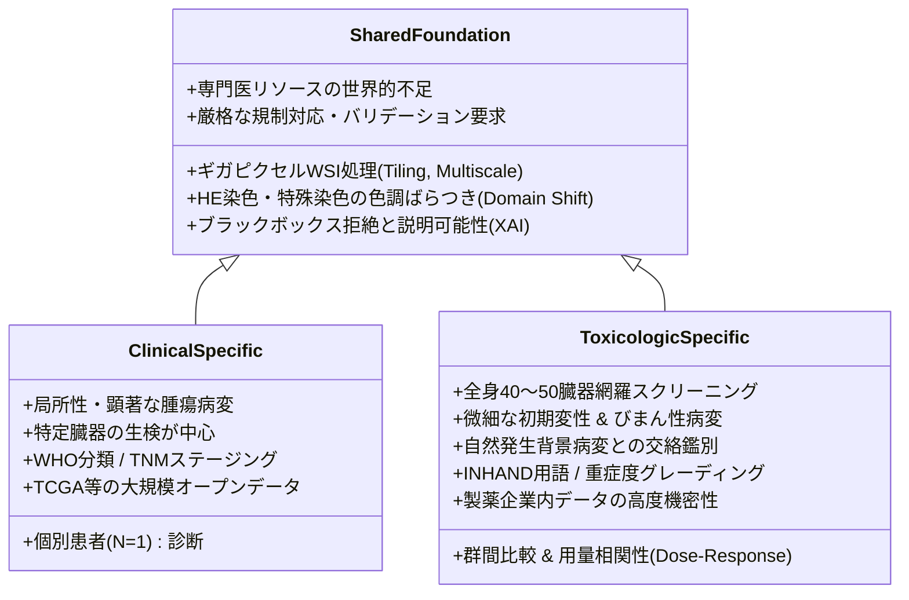
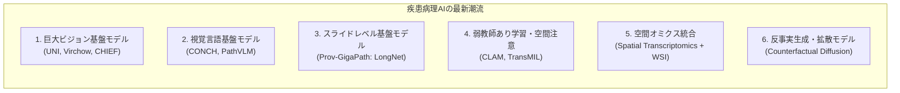
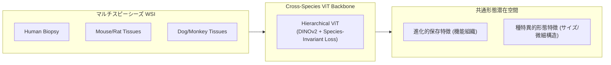
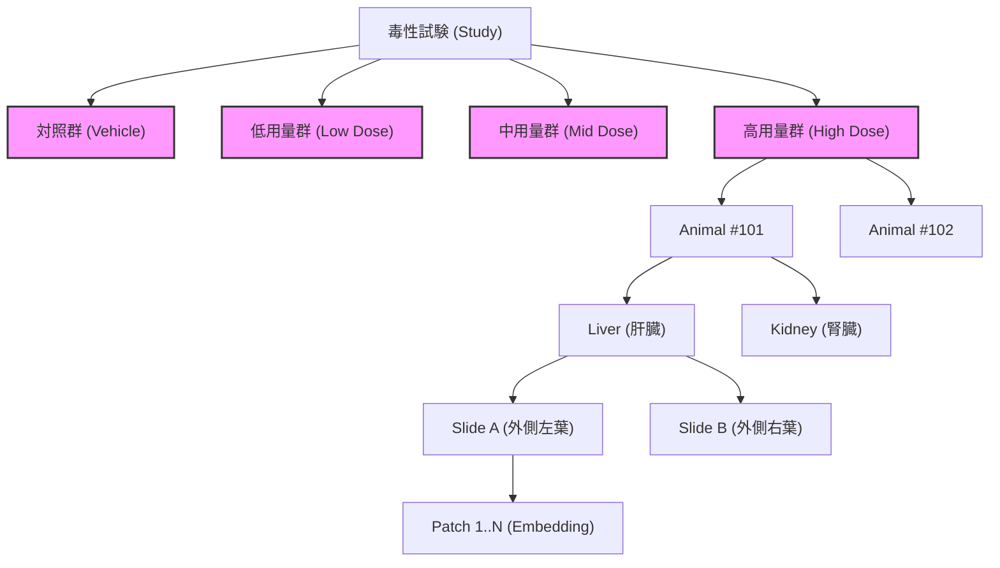
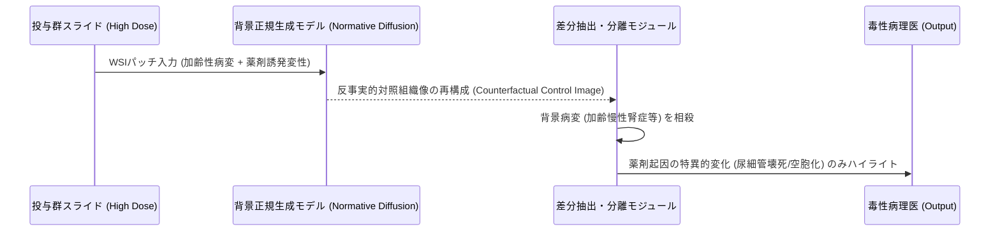
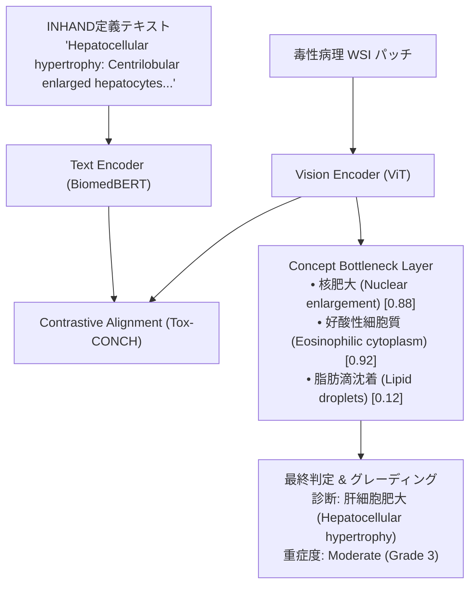
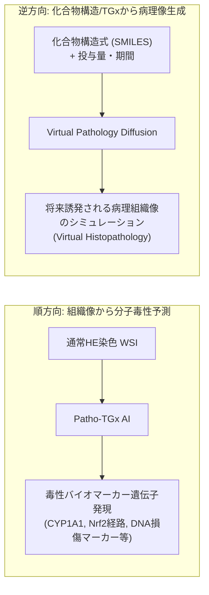
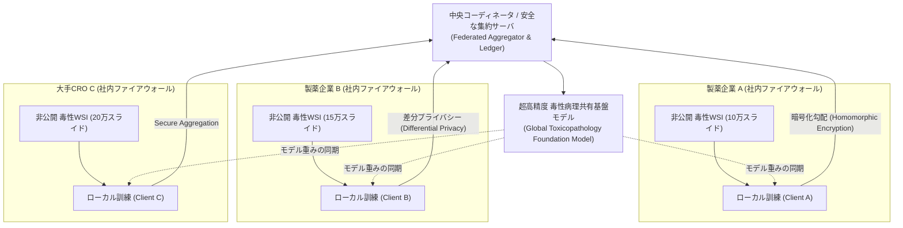
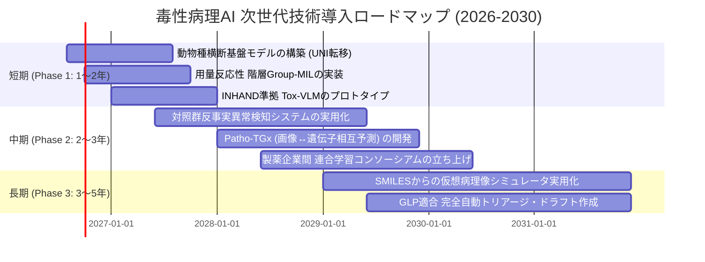

# 【調査レポート】毒性病理画像分野と疾患病理画像分野の比較・共通点と、未開拓な応用可能「ねらい目」技術の体系的分析

> **調査日**: 2026-08-18  
> **担当Agent**: Antigravity (Research Agent)  
> **ステータス**: 完了  
> **タグ**: `#毒性病理` `#疾患病理` `#ComputationalPathology` `#FoundationModels` `#CrossSpecies` `#DoseResponseMIL` `#Toxicogenomics` `#AnomalyDetection`

---

## 📌 エグゼクティブサマリー

### 背景と目的
デジタルパソロジー（Digital Pathology）および計算病理学（Computational Pathology: CPath）は、ディープラーニングと基盤モデル（Foundation Models）の台頭により急速に進化しています。しかし、その研究開発の重心は長らく**「疾患病理（人体の臨床・腫瘍病理診断）」**に置かれており、医薬品・化学物質の安全性評価を担う**「毒性病理（前臨床・非臨床動物病理）」**へのAI技術の波及には大きなギャップ（「ラストマイル問題」）が存在します。  
本調査では、両分野の目的・データ構造・診断ワークフローにおける**「共通点」と「本質的な相違点」**を多角的に比較分析した上で、疾患病理で急速に発展した最新AI技術を毒性病理へと転用・昇華させる**「未開拓だが極めて有望な6つのねらい目技術」**を体系的に提案します。

### 主要な発見（Key Takeaways）
1. **目的論の根本的相違（Individual N=1 vs Group-level Dose-Response）**:
   - 疾患病理AIは「個々の患者（N=1）にがんがあるか・どのサブタイプか」を判定するのに対し、毒性病理AIは「対照群（Control）と比較して、投与群（Low/Mid/High）で病変発生頻度や重症度が有意に増加しているか」「用量依存性（Dose-response）があるか」「無毒性量（NOAEL）はどこか」という**群間統計比較**を本質とします。
2. **スクリーニング規模と病変性質の相違**:
   - 疾患病理が「疑いのある単一臓器の局所病変」を深掘りするのに対し、毒性病理は「1個体あたり40〜50臓器の全身網羅的スクリーニング（1試験で数千枚のスライド）」を行います。さらに、スライドの95%以上が「変化なし（正常）」であり、かつ動物の加齢に伴う「自然発生背景病変（Background lesions）」が被験物質誘発病変（Treatment-related lesions）と重複・交絡します。
3. **未開拓な6大フロンティア（ねらい目技術）**:
   - 疾患病理で成功した基盤モデル（UNI, CONCH, Prov-GigaPath）や弱教師あり学習（MIL）、反事実生成モデル、空間オミクス統合の知見を、毒性病理特有のデータ構造（階層性・用量反応・INHAND用語・機密性）に合わせて再設計することで、極めて大きなブレイクスルーと創薬スクリーニングの大幅な加速が期待されます。

---

## 1. 概念定義と対象領域の明確化

| 項目 | 疾患病理画像分野 (Clinical Diagnostic Pathology) | 毒性病理画像分野 (Toxicologic / Preclinical Pathology) |
|:---|:---|:---|
| **対象被検体** | ヒト患者（手術切除検体、針生検、内視鏡生検等） | 実験動物（ラット、マウス、イヌ、カニクイザル、ミニブタ等） |
| **主たる目的** | 臨床診断、がんの確定診断・サブタイプ分類、病期・グレード判定、個別化医療（バイオマーカー・予後・治療効果予測） | 医薬品・化学物質・農薬の安全性評価、標的臓器毒性の同定、無毒性量（NOAEL/BMD）算出、毒性機序解明、ヒト外挿性評価 |
| **意思決定単位** | **個別患者単位（N = 1）** | **試験群単位（群間比較: 対照群 vs 低/中/高用量群、回復群）** |
| **病理医資格** | 人体病理専門医（Pathologist: 日本病理学会認定医、米ABP認定等） | 毒性病理専門医・獣医病理専門医（JSTP認定毒性病理専門医、JCVP/ACVP/ECVP、FIATP等） |
| **規制・規格** | 医療法、CAP/CLIA、各国の体外診断用医薬品（IVD/SaMD）規制、FDA 510(k)等 | **GLP（Good Laboratory Practice）基準**、OECDテストガイドライン、ICH安全性ガイドライン |

---

## 2. 毒性病理と疾患病理の「共通点」と「相違点」の多次元比較

### 2.1 共通点（Shared Foundations）

1. **ギガピクセル画像（Whole Slide Images: WSI）の取り扱い**:
   - どちらも数万×数万画素（数GB/スライド）の超高解像度画像を扱い、メモリ制約からパッチ分割（Tiling）、マルチスケール解像度処理、弱教師あり学習（Weakly Supervised Learning / Multiple Instance Learning: MIL）が必須基盤技術となります。
2. **染色・スキャナ間の色調変動（Staining Variation & Domain Shift）**:
   - 施設間、ロット間、固定・包埋条件、スキャナ機種の違いによる組織色調やコントラストのブレがAI性能を低下させるため、色恒常性（Color Normalization）や自己教師あり学習によるドメイン頑健性が共通して求められます。
3. **高度専門職（病理医）のリソース枯渇**:
   - 人体病理医・毒性病理医ともに世界的に深刻な人手不足にあり、診断・スクリーニングの迅速化、見落とし防止、客観的スコアリングの自動化が切望されています。
4. **ブラックボックスの拒絶と説明可能性（Explainability / XAI）**:
   - 単に「毒性あり」「がん陽性」と出力するだけでなく、「どの領域のどのような形態変化（核異型、壊死、空胞化、炎症浸潤等）に基づいて判定したか」をアテンションマップやセグメンテーションで提示できなければ、臨床医・毒性病理医に受容されません。
5. **厳格な規制要件（Quality Assurance & Regulations）**:
   - 臨床における医療機器ソフトウェア（SaMD）承認や、毒性試験におけるGLP（優良試験所基準）適合・電磁的記録信頼性要件（21 CFR Part 11等）への適合が不可欠です。

---

### 2.2 根本的な相違点（Detailed Differences）

| 比較次元 | 疾患病理画像分野 (Clinical) | 毒性病理画像分野 (Toxicologic) | 毒性病理AIにおける技術的含意 |
|:---|:---|:---|:---|
| **1. 統計的評価構造** | **N=1（個別患者）** 患者単体の組織から疾患有無・予後を判定。 | **群間比較（Dose-Response）** 対照群 vs 低・中・高用量群の統計的有意差および用量依存的増加を判定。 | 単一WSIのMILではなく、**「群・個体・臓器・スライド・パッチ」の5階層構造モデリング**と用量反応曲線フィッティングが必要。 |
| **2. スクリーニング規模と臓器数** | **特定臓器に集中** 肺癌疑いなら肺生検、乳癌なら乳腺針生検など、1患者あたり数枚のスライド。 | **全身多臓器スクリーニング** 1匹あたり40〜50臓器・組織（脳、心、肝、腎、生殖器、骨髄等）。1試験で数千枚。 | 95%以上が正常スライド。全臓器を高速にトリアージする**超高スループット異常検知**が不可欠。 |
| **3. 病変の性質と形態** | **局所性・顕著な形態異常** 腫瘍塊、腺管構造の乱れ、核異型など、比較的明瞭で局在性の高い病変。 | **微細・びまん性・初期変性** 肝細胞肥大、軽度空胞変性、単細胞壊死、好塩基化、小葉間浮腫など極めて微細。 | 単純な物体検出や粗いパッチ分類では見逃される。**超高解像度テクスチャ解析と微細異常の感度**が要求される。 |
| **4. 背景病変の存在** | **患者背景（年齢・併存症）** 非がん部組織や炎症はあるが、主病変の同定が目的。 | **自然発生背景病変（Background Lesions）** 実験動物の加齢・系統・飼育条件に伴う自発病変（慢性腎症、過形成等）が必発。 | **「加齢による自然病変」と「薬剤による誘発病変」の交絡分離（Disentanglement）**が最重要課題。 |
| **5. 診断基準とオントロジー** | **WHO分類 / TNM分類** 腫瘍型、浸潤度、Gleasonスコア、Nottinghamスコア等。 | **INHAND / SEND規格** 国際統一用語規約（INHAND）、5段階重症度（Minimal, Mild, Moderate, Marked, Severe）。 | **INHANDの語彙・定義文を学習したVision-Language Model**や、重症度グレーディングの回帰/順序学習が必要。 |
| **6. データエコシステムと機密性** | **オープンデータが豊富** TCGA (1.1万例), CAMELYON (数千枚), PANDA (1万枚以上), TIGER等のコンペ主導。 | **極めて閉鎖的・社内機密** 製薬企業・CRO内の未承認開発薬データであり、社外不出。公開データはOpen TG-GATEs等ごく一部。 | 集中型学習が困難。**企業間秘匿性を保った「連合学習（Federated Learning）」**が打開策。 |
| **7. 種差とヒト外挿** | **ヒト（Homo sapiens）単一** 人種差はあるが生物種としての組織形態は統一。 | **多種族（Rat, Mouse, Dog, Monkey, Minipig）** 種ごとの正常構造・代謝能・感受性・病変形態の差異を考慮。 | **動物種横断（Cross-Species）の相同性アライメント**と、動物所見からヒト臨床毒性への外挿予測。 |

---

## 3. 疾患病理画像分野における最新AI技術の潮流（SOTA動向）

疾患病理画像分野では、2023〜2026年にかけて以下のようなパラダイムシフトが起きています。

1. **自己教師ありビジョン基盤モデル（Self-Supervised Vision Foundation Models）**:
   - **UNI / UNI2** (Nature Medicine 2024): 1億パッチ・10万WSI・20臓器以上を用いてDINOv2で学習された汎用ViT-Large。
   - **Virchow / Virchow2** (Nature Medicine 2024): 100万枚以上のスライドから学習された632Mパラメータの超大規模モデル。
2. **視覚言語マルチモーダル基盤モデル（Vision-Language Foundation Models）**:
   - **CONCH** (Nature Medicine 2024): 117万件の画像・テキストペアにより対照学習（CoCa）されたモデル。病理オントロジーによるZero-shot分類やText-to-Image検索を実現。
3. **スライドレベル・全組織コンテキスト基盤モデル**:
   - **Prov-GigaPath** (Nature 2024): タイルレベルViTとLongNet（Dilated Attention）を組み合わせ、ギガピクセルWSI全体（数万パッチ）を1つのコンテキストとして統合処理。
4. **弱教師ありマルチインスタンス学習（MIL）の進化**:
   - **CLAM** (Nature BME 2021) や **TransMIL** (NeurIPS 2021) により、詳細アノテーションなしでスライドレベルのラベルから病変領域の特定と分類が可能に。
5. **形態画像と空間オミクスの統合（Spatial Biology Integration）**:
   - WSI組織切片画像から局所の遺伝子発現（Spatial Transcriptomics）やRNAシークエンス発現量を直接予測するモデル（HE2RNA, BLEEP, Hist2ST等）。
6. **反事実的画像生成（Counterfactual Generative Models）**:
   - 拡散モデル（Diffusion Models）やGANを用い、「もしこのがん組織が治療に奏効したらどう退縮するか」「特定遺伝子変異がある場合どのような形態変化が起きるか」を可視化する反事実シミュレーション。

---

## 4. 毒性病理画像におけるAI活用の現状とボトルネック

### 4.1 現在の到達点
- **Pfizer TRACE (2024)**: ラット肝臓組織（157試験、4.6万スライド）を対象としたマルチスケール深層学習。用量反応性の定量評価や病変スコアリングで病理医合意と高い一致度を達成。
- **Open TG-GATEs活用研究 (PathologAI等)**: 日本発のトキシコゲノミクスデータベース（170化合物、ラット肝・腎WSI）を活用した弱教師あり壊死・変性検出。
- **米国毒性病理学会（STP）の活動**: デジタル病理・AI特命グループ（SIG）による標準化提言（Turner et al. 2020, Rudmann et al. 2021）。

### 4.2 毒性病理特有のボトルネック（「ラストマイル問題」）
1. **データアクセスの極端な非対称性**: 疾患病理のように誰でも利用できるTCGA規模の公開データセットが存在せず、各製薬会社・CROがデータをサイロ化。
2. **「95%の正常スライド」をさばく過酷なトリアージ負荷**: 疾患病理は病変のある生検が前提だが、毒性病理は「何も起きていないことの証明（Safety assessment）」のために数千枚をめくる必要。
3. **自然発生背景病変ノイズ**: 老齢動物の自然発生性慢性進行性腎症（CPN）や加齢性肝過形成などが、薬剤性変化と酷似して誤検出を多発させる。
4. **GLP（優良試験所基準）とバリデーションの厳格さ**: AIの出力が規制当局（FDA/PMDA/EMA）への申請資料（IND/NDA）として受け入れられるための検証プロトコルが未確立。

---

## 5. 【核心】応用可能だが未開拓な「ねらい目」技術（6大フロンティア）

疾患病理画像で成熟した先端AI技術を、毒性病理特有の課題へと昇華させる**「6つの有望かつ未開拓な研究・開発テーマ」**を具体的に提示します。

---

### 5.1 【フロンティア 1】動物種横断・多臓器病理基盤モデル（Cross-Species Multi-Organ Foundation Models）

#### 技術的コンセプト
ヒト病理で事前学習された巨大基盤モデル（UNI, Virchow, Prov-GigaPath）の視覚特徴を基盤とし、げっ歯類（ラット、マウス）、非げっ歯類（イヌ、サル、ミニブタ）、そしてヒトの組織形態を**「進化的相同性（Evolutionary Homology）」**に基づいて共通潜在空間にマッピングする異種間基盤モデル。

#### なぜ未開拓でねらい目か？
- 疾患病理基盤モデルはヒト組織に特化しており、ラットやイヌの特殊な組織構造（例: げっ歯類特有のハーダー腺、前胃、肝臓小葉構造の種差）でドメインシフトを起こす。
- しかし、**細胞死（ネクローシス/アポトーシス）、炎症性細胞浸潤、線維化、過形成などの基本病変形態は脊椎動物間で高度に保存**されている。
- ヒト基盤モデルの重みを初期値とし、Open TG-GATEsやNTPの動物WSIを用いて「種不変特徴（Species-invariant）」と「種特異的特徴（Species-specific）」を分離学習（Disentanglement）することで、**極めて少量の動物データで高精度に動作する毒性基盤モデル**が構築可能。

---

### 5.2 【フロンティア 2】用量反応性と階層構造を組み込んだ群レベル弱教師あり学習（Dose-Response Aware Hierarchical Group-MIL）

#### 技術的コンセプト
従来のMIL（1スライド＝1バッグ）を拡張し、毒性試験の実験デザインである**「用量群（Control/Low/Mid/High） → 個体（Animal） → 臓器（Organ） → スライド（Slide） → パッチ（Patch）」**という5階層構造を直接扱うグラフ・アテンションMIL。さらに、用量の増加に伴い病変の重症度・発現率が単調増加するという生物学的制約（Monotonicity Constraint）を損失関数に組み込む。

#### 数理的工夫（Dose-Response Regularization Loss）
$$ \mathcal{L}_{total} = \mathcal{L}_{task} + \lambda_{mono} \sum_{k} \max(0, \hat{y}_{low}^{(k)} - \hat{y}_{mid}^{(k)}) + \lambda_{mono} \sum_{k} \max(0, \hat{y}_{mid}^{(k)} - \hat{y}_{high}^{(k)}) + \lambda_{BMD} \mathcal{L}_{Hill}(\hat{y}, \text{Dose}) $$
- **新規性**: 単にパッチの有無を判定するだけでなく、Hillの式やシグモイド曲線に適合する潜在表現を強制することで、**偽陽性（偶然1匹だけに生じた孤発病変）を強力に抑制し、真の被験物質誘発毒性をロバストに検出**できる。

---

### 5.3 【フロンティア 3】自然発生背景病変と薬剤誘発性病変の反事実的異常検知（Disentangled Background Normative Modeling & Counterfactual Anomaly Detection）

#### 技術的コンセプト
対照群（Control群の数百〜数千個体）の正常組織および自然発生加齢病変（Spontaneous Lesions）の画像分布を学習した**「背景正規分布モデル（Normative Baseline Model）」**を構築。投与群のスライドを入力した際、背景病変と被験物質誘発病変を分離し、**「もしこの動物が被験物質を投与されていなかったらどのような組織像だったか」を反事実生成（Counterfactual Synthesis）**して差分を可視化する。

#### なぜ疾患病理にはなく毒性病理で極めて強力か？
- 疾患病理には「厳密な同一条件の対照群（Control群）」が存在しない（個々の患者の過去データや健常者データは背景が大きく異なる）。
- 一方、毒性試験では**同一年齢・同一系統・同一飼育環境のControl群が必ず並行して試験**されている。
- この理想的な対照群データを活用した反事実異常検知は、毒性病理において極限の精度を発揮できる。

---

### 5.4 【フロンティア 4】INHAND用語体系完全準拠の毒性病理Vision-Languageモデル & Concept Bottleneck Models (Tox-VLM / INHAND-CBM)

#### 技術的コンセプト
毒性病理の国際標準規約である**INHAND（International Harmonization of Nomenclature and Diagnostic Criteria for Lesions in Rats and Mice）**の用語集、病変定義文、鑑別診断基準をテキストエンコーダに統合。さらに、診断のブラックボックス化を防ぐため、中間層に「細胞学的所見コンセプト（Cellular Concepts）」を明示的に配置するConcept Bottleneck Model (CBM) を融合。

#### 実用上のメリット
- 毒性病理医は「なぜGrade 3と判定されたのか」を、INHAND準拠の構成要素（細胞質好酸性化、中心静脈周囲優位性等）のスコアから完全に追跡・検証可能。
- 規制当局（FDA/PMDA）の査察（GLP Audit）に耐えうる完全な透明性と説明責任を提供。

---

### 5.5 【フロンティア 5】トキシコゲノミクス×毒性病理WSIのマルチモーダル相互予測・仮想毒性病理（Patho-Toxicogenomics & Virtual Histopathology）

#### 技術的コンセプト
疾患病理における「病理画像からの遺伝子変異・空間トランスクリプトーム予測」技術を、薬物安全性評価の**トキシコゲノミクス（Toxicogenomics: TGx）**に応用。Open TG-GATEsなどの大規模データを活用し、以下の双方向予測を実現する。

#### 創薬スクリーニングへの破壊的インパクト
- **早期スクリーニング（Early Safety Screening）**: 化合物を合成した初期段階で、構造式（SMILES）や短時間の細胞アッセイ発現データから、「2週間投与後にラット肝・腎でどのような病変が起きるか」を高解像度画像としてシミュレーション可能。
- **メカニズム解明**: 通常のHE染色画像から、免疫染色（IHC）やマイクロアレイを行わずとも、どの毒性シグナル伝達経路が活性化しているかをバーチャルプロファイリング。

---

### 5.6 【フロンティア 6】製薬企業間コンソーシアム型・連合学習（Federated Toxicopathology Platform / MELLODDY-Style Consortium）

#### 技術的コンセプト
創薬化学分野で成功を収めた**MELLODDY（Machine Learning Ledger of Open Drug Data）プロジェクト**のアーキテクチャを毒性病理WSIに適用。各製薬企業やCROが保有する数万〜数十万枚の機密前臨床WSIデータを社外に出すことなく、暗号化された勾配情報のみを中央アグリゲータと通信することで、**世界最大の「業界共通・毒性病理基盤モデル」**を構築する。

#### 解決される業界最大のボトルネック
- 1社単独ではカバーできない希少毒性所見（精巣毒性、特定神経毒性、血管炎等）の学習データを、競合他社と企業秘密を守りながらプール可能。
- 各社のスキャナ機種・染色プロトコルの差異を自然に吸収し、**圧倒的な汎化性能を持つ業界標準AI**が誕生。

---

## 6. 技術比較まとめと研究開発ロードマップ

### 6.1 ねらい目技術の実現難易度・インパクト比較

| ねらい目技術 | 疾患病理からの転用元技術 | 実現難易度 | 業界インパクト | 主なデータソース / 必要リソース |
|:---|:---|:---:|:---:|:---|
| **① 動物種横断・多臓器基盤モデル** | UNI, Virchow, DINOv2 | 中 | ★★★★★ | Open TG-GATEs, NTPアーカイブ, 社内前臨床WSI |
| **② 用量反応 階層群MIL** | CLAM, TransMIL, Graph MIL | 低〜中 | ★★★★☆ | 前臨床安全性試験（多用量デザイン）データセット |
| **③ 反事実的・背景病変異常検知** | Normative Modeling, Diffusion XAI | 中〜高 | ★★★★★ | 大規模Control群（Vehicle）スライドアーカイブ |
| **④ INHAND準拠 Tox-VLM / CBM** | CONCH, BiomedCLIP, Concept Bottleneck | 中 | ★★★★☆ | INHAND用語集・定義文, アノテーション付き毒性WSI |
| **⑤ トキシコゲノミクス統合 仮想病理** | HE2RNA, Spatial-ST, GenAI | 高 | ★★★★★ | Open TG-GATEs (WSI + Microarray), 社内TGxデータ |
| **⑥ 製薬間 連合学習プラットフォーム** | MELLODDY, Federated CPath | 高 (アライアンス面) | ★★★★★★ | 製薬企業・CROコンソーシアム, プライバシー保護基盤 |

---

### 6.2 段階的導入ロードマップ

---

## 7. 今後の展望・オープンクエスチョン

### 未解決の学術・技術的課題
1. **種差外挿の生物学的限界**:
   - ラットやイヌで観察された形態変化が、ヒト組織のどのような有害事象（DILI, 心毒性, 腎毒性）に対応するかをAIがどこまで定量的に架橋できるか。
2. **微小毒性変化（Sub-microscopic toxicity）の検出限界**:
   - 電子顕微鏡レベルのミトコンドリア変性やリソソーム蓄積など、光顕HE染色WSI（20x/40x）の解像限界を超える変化をどこまで超解像・テクスチャ推定で拾えるか。
3. **GLP規制当局（FDA/PMDA）とのコンセンサス形成**:
   - 「AIによるスクリーニング・陰性除外（Normal triage）」を安全性試験の正式プロセスとして認可するための客観的バリデーション基準の策定。

---

## 8. 参考文献・関連リソース

### 主要論文・文献
- **Chen, R. J., et al.** (2024). "A general-purpose foundation model for computational pathology." *Nature Medicine*, 30, 850–859. [arXiv:2308.15474](https://arxiv.org/abs/2308.15474) / [PDF](papers/pdfs/2024_Chen_UNI_PathologyFM.pdf)
- **Lu, M. Y., et al.** (2024). "A visual-language foundation model for computational pathology." *Nature Medicine*, 30, 860–870. [arXiv:2308.16147](https://arxiv.org/abs/2308.16147) / [PDF](papers/pdfs/2024_Lu_CONCH_VisionLanguage.pdf)
- **Xu, H., et al.** (2024). "A whole-slide foundation model for digital pathology from real-world data." *Nature*, 630, 181–188. [arXiv:2405.13031](https://arxiv.org/abs/2405.13031) / [PDF](papers/pdfs/2024_Xu_ProvGigaPath.pdf)
- **Vorontsov, E., et al.** (2024). "Virchow: A Million-Slide Foundation Model for Cancer Diagnosis." *Nature Medicine*, 30, 3051–3062. [arXiv:2309.07778](https://arxiv.org/abs/2309.07778) / [PDF](papers/pdfs/2023_Vorontsov_Virchow.pdf)
- **Bhattacharya, S., et al.** (2024). "Deep Learning-based Modeling for Preclinical Drug Safety Assessment." *bioRxiv*, doi:10.1101/2024.07.24.604928 / [PMC11291027](https://pmc.ncbi.nlm.nih.gov/articles/PMC11291027/)
- **Turner, O., et al.** (2020). "Society of Toxicologic Pathology Digital Pathology and Image Analysis Special Interest Group Article: Opinion on the Application of Artificial Intelligence and Machine Learning to Digital Toxicologic Pathology." *Toxicologic Pathology*, 48(8), 959–968. [DOI:10.1177/0192623320959049](https://doi.org/10.1177/0192623320959049)
- **Rudmann, D. G., et al.** (2021). "Mini Review: The Last Mile—Opportunities and Challenges for Machine Learning in Digital Toxicologic Pathology." *Toxicologic Pathology*, 49(8), 1386–1393. [DOI:10.1177/01926233211041388](https://doi.org/10.1177/01926233211041388)
- **Igarashi, Y., et al.** (2015). "Open TG-GATEs: a large-scale toxicogenomics database." *Nucleic Acids Research*, 43(D1), D921–D927. [DOI:10.1093/nar/gku955](https://doi.org/10.1093/nar/gku955)
- **Lu, M. Y., et al.** (2021). "Data-efficient and weakly supervised computational pathology on whole-slide images." *Nature Biomedical Engineering*, 5, 555–570. [arXiv:2004.09666](https://arxiv.org/abs/2004.09666) / [PDF](papers/pdfs/2021_Lu_CLAM_WSI.pdf)
- **Shao, Z., et al.** (2021). "TransMIL: Transformer based Correlated Multiple Instance Learning for Whole Slide Image Classification." *NeurIPS 2021*. [arXiv:2106.00908](https://arxiv.org/abs/2106.00908) / [PDF](papers/pdfs/2021_Shao_TransMIL.pdf)

### 関連リポジトリ・内部リンク
- 論文詳細サマリー: [papers/index.md](papers/index.md)
- 検索ログ・思考メモ: [notes/search_log.md](notes/search_log.md)
