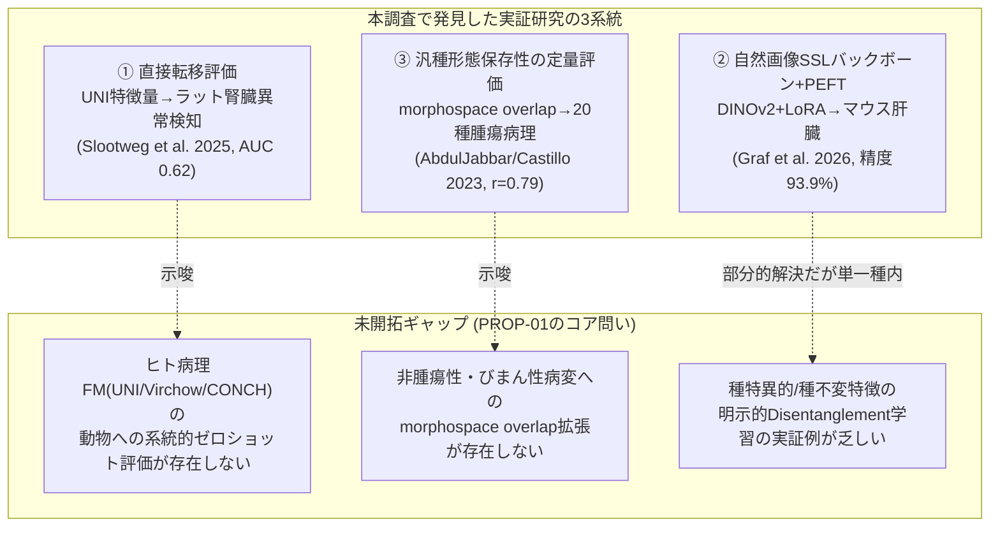
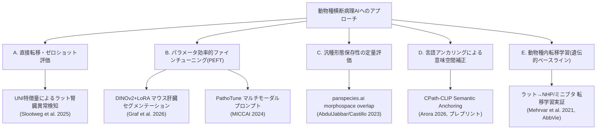
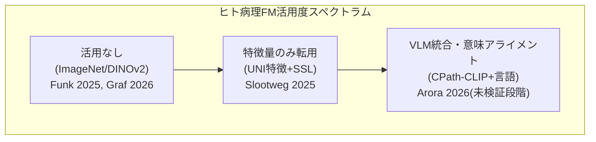
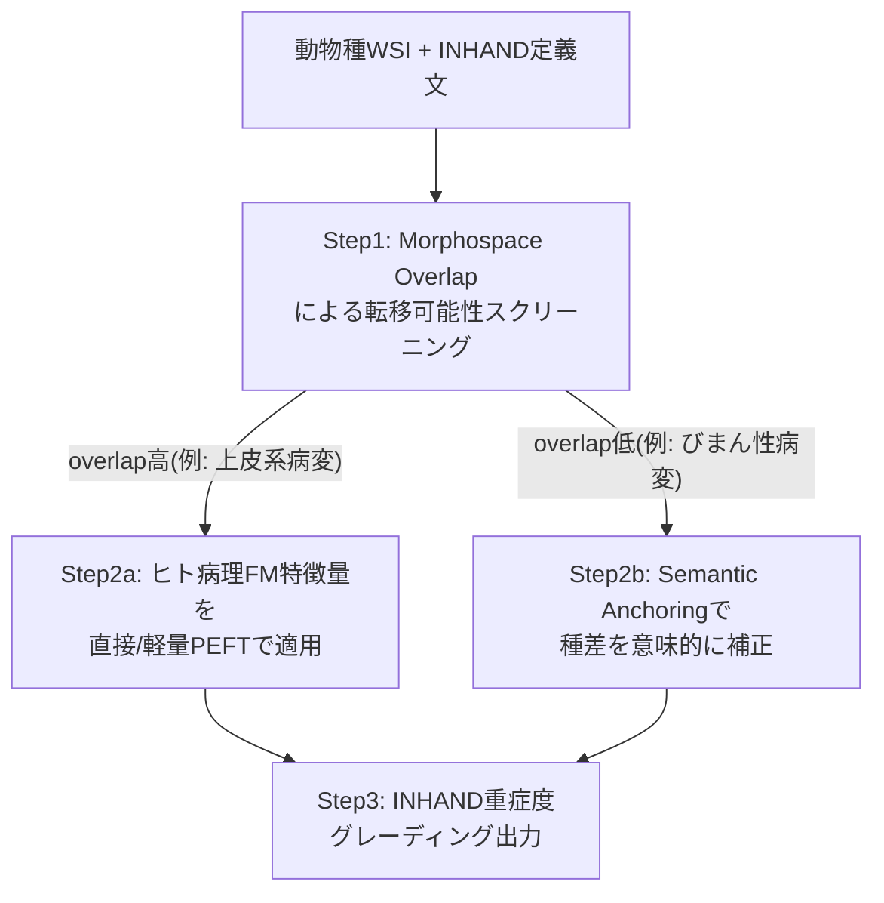

# 【調査レポート】動物種横断（Cross-Species）病理基盤モデルの構築手法と形態学的相同性アライメント技術

> **調査日**: 2026-08-19
> **担当Agent**: Claude (Research Agent)
> **ステータス**: 完了
> **タグ**: `#基盤モデル` `#CrossSpecies` `#ドメイン適応` `#毒性病理` `#LoRA` `#VisionLanguage`

---

## 📌 エグゼクティブサマリー

### 背景と目的
本調査は [PROP-01](../../../../proposals/backlog.md) として提案された、[01_toxicology_vs_clinical_pathology](../01_toxicology_vs_clinical_pathology/report.md) の「フロンティア1: 動物種横断・多臓器病理基盤モデル」を深掘りするものです。ヒト病理基盤モデル（UNI, Virchow, CONCH等）の埋め込み表現が動物組織に対してどのようなドメインシフトを起こすか、また進化的に保存された形態と種特異的形態を分離する技術の最先端実装は何かを、実在する2021〜2026年の一次文献にあたって検証しました。

### 主要な発見（Key Takeaways）
1. **「動物種横断病理基盤モデル」はまだ誰も本格的に作っていない**: ヒト病理基盤モデル（UNI等）をそのまま動物毒性病理に転用した実証研究は本調査で発見できた範囲では1件のみ（腎臓異常検知、AUC 0.62）に留まり、現行の毒性病理AI（Funk et al. 2025, Graf et al. 2026等）はいずれも**自然画像で事前学習したImageNet/DINOv2バックボーン**を用いており、ヒト病理特化基盤モデルは事実上未活用でした。これはPROP-01が「未開拓」と位置づけた仮説を裏付ける直接的な証拠です。
2. **形態学的相同性の定量評価手法は、腫瘍病理では既に存在する**: panspecies.ai（AbdulJabbar & Castillo et al. 2023）の「morphospace overlap」指標は、ヒト学習モデルが特定の動物種・病変タイプにどれだけ転移しやすいかを事前に定量評価できる枠組みですが、対象は腫瘍性病変（がん細胞・リンパ球等）に限定されており、毒性病理の主戦場である**非腫瘍性・びまん性病変（肥大、空胞変性、壊死等）への拡張は未検証**です。
3. **種差補正の技術的アプローチは大きく2系統に分岐**: ①LoRA等のPEFTで視覚バックボーンを効率的に再学習する系統（Graf et al. 2026, PathoTune）と、②視覚バックボーンを凍結したままテキスト（言語）で意味空間を補正する系統（Arora 2026の"Semantic Anchoring"）。後者はINHAND用語体系を用いたTox-VLM（PROP-05）と技術的に接続する将来性の高い方向です。
4. **直接転移の失敗は2021年から一貫して報告されている**: AbbVie（Mehrvar et al. 2021）は既に「ラットで学習したモデルは非ヒト霊長類・ミニブタへ再学習なしでは転移しない」ことを報告しており、2025〜2026年の最新研究でもこの根本課題（UNI特徴のAUC 0.62等）は未解決のままです。

---

## 1. 背景・課題設定

### 1.1 なぜ動物種横断基盤モデルが必要か
[01_toxicology_vs_clinical_pathology](../01_toxicology_vs_clinical_pathology/report.md) で整理した通り、毒性病理はラット・マウス・イヌ・カニクイザル・ミニブタなど複数動物種の全身40〜50臓器を扱う一方、ヒト病理で成功した基盤モデル（UNI, Virchow, Prov-GigaPath, CONCH）はいずれもヒト組織のみで学習されています。げっ歯類特有の組織構造（ハーダー腺、前胃、肝小葉パターン等）は、これらのモデルにとって未知のドメインです。

### 1.2 疾患病理の「種差」との違い
疾患病理における種横断研究は主に**がん（腫瘍性病変）**を対象とした比較腫瘍学（Comparative Oncology）の文脈で発展してきました（イヌの自然発生腫瘍がヒトがんのモデルとして有用、等）。一方、毒性病理が扱う病変の大半は**非腫瘍性・びまん性の初期変性**（肝細胞肥大、空胞変性、単細胞壊死等）であり、腫瘍のような明瞭な形態的特徴に乏しいという点で、既存の比較病理AI研究とは前提が異なります。この違いが、本調査の中心的な問題意識です。

### 1.3 従来の課題・限界点
- ヒト基盤モデルは20臓器以上・10万WSI規模のデータで学習されているのに対し、動物毒性病理の公開データはOpen TG-GATEs（ラット肝・腎、170化合物）等ごく限定的。
- アノテーション基準もヒト（WHO分類/TNM）と動物（INHAND、5段階重症度）で異なり、転移学習の評価軸自体が未整備。
- 「動物種横断病理基盤モデル」という名称のプロジェクト・論文は本調査時点（2026年8月）で見当たらず、関連要素技術がバラバラに存在する状態。

---

## 2. 主要技術動向・アプローチ分類

### 2.1 A. 直接転移・ゼロショット評価
- **概要**: ヒト病理基盤モデルの重みをそのまま（追加学習なし、または軽微な線形プロービングのみ）動物組織に適用し、特徴抽出器として機能するかを検証するアプローチ。
- **代表例**: Slootweg et al. (2025) — UNIの特徴量を用いたラット腎臓の自己教師あり異常検知。
- **メリット・強み**: 追加学習コストがほぼゼロで、大規模ヒト病理データの恩恵をすぐに享受できる可能性。
- **課題・制約**: AUC 0.62・NPV 89%という結果は「実用に耐えるが完全ではない」水準に留まり、単純な特徴転移だけでは種差ドメインシフトを十分に克服できないことを示唆。

### 2.2 B. パラメータ効率的ファインチューニング（PEFT）
- **概要**: LoRA等の低ランク適応や、視覚・テキストプロンプトチューニングにより、基盤モデル全体を再学習せず少量パラメータ（数%程度）のみ動物データで調整する手法。
- **代表例**: Graf et al. (2026) — DINOv2（自然画像SSL）をLoRA（rank=3）でマウス肝臓セグメンテーションに適応、既知異常93.93%・未知異常(OOD)89.38%の高精度を達成。PathoTune（MICCAI 2024）は5.9%のパラメータでフルファインチューニングに近い性能。
- **メリット・強み**: 少量の動物データ・計算資源で高精度を達成可能。Graf et al. の結果は「動物種内であればPEFTが極めて有効」ことを明確に実証。
- **課題・制約**: いずれも**単一種・単一臓器**での検証に留まり、著者ら自身が「他種・他臓器への一般化には再適応が必要」と明記。種横断のPEFT（例: マウスで学習したLoRAアダプタをラット・イヌへ転移）の実証例は本調査では発見できなかった。

### 2.3 C. 汎種形態保存性の定量評価
- **概要**: 複数動物種の病理形態的特徴を統一座標系（形態空間）にマッピングし、種間の重複度を定量化することで、AIモデルがどの種・病変タイプに転移しやすいかを事前予測する。
- **代表例**: panspecies.ai（AbdulJabbar & Castillo et al. 2023）— morphospace overlap指標が分類精度とPearson相関0.79。
- **メリット・強み**: 「なぜ転移がうまくいく/いかないか」を生物学的に解釈可能な形で説明でき、モデル開発前のフィージビリティ評価に使える。
- **課題・制約**: 対象は20種のがん病理（腫瘍細胞・リンパ球等の腫瘍免疫微小環境）に限定。毒性病理特有の非腫瘍性・びまん性病変（肥大、変性、壊死等）への指標拡張は未実施であり、PROP-01の核心的な未解決課題。

### 2.4 D. 言語アンカリングによる意味空間補正
- **概要**: 視覚バックボーンを凍結したまま、テキスト埋め込みとの対照学習・コサイン類似度マッチングにより、種によって歪んだ視覚特徴空間を意味的に補正する。
- **代表例**: Arora (2026, プレプリント) — CPath-CLIPにおける「意味的崩壊（腫瘍/正常プロトタイプの類似度0.99以上）」を発見し、Semantic Anchoringで交差種AUCを63.96%→78.39%に改善。
- **メリット・強み**: 視覚パラメータを一切更新せず、テキスト側の設計だけで種差を補正できるため、計算コストが極めて低い。INHAND用語体系との統合可能性が高い（PROP-05と接続）。
- **課題・制約**: 単著・査読前プレプリントであり検証が薄い。二値分類（腫瘍/正常）のみの実証で、重症度グレーディング等への拡張は未検証。

### 2.5 E. 動物種内転移学習（先行実証としての位置づけ）
- **概要**: 動物種間（例: ラット→非ヒト霊長類）での転移学習可能性を検証した、比較的古い（2021年）が具体的な先行研究。
- **代表例**: Mehrvar et al. (2021, AbbVie) — ラット組織（1,690スライド・46組織）で学習したモデルは、**再学習なしでは**非ヒト霊長類・ミニブタで同等性能を発揮できず、新ドメインでの再訓練を要した。
- **示唆**: 「動物種間でも直接転移は失敗する」という2021年の知見が、2025〜2026年の最新研究（UNI特徴のAUC 0.62等）でも本質的に覆っていないことが、本調査を通じて確認された。

---

## 3. 主要論文・技術比較

| 手法/研究 | 発表年 | 種横断の方向 | バックボーン | 適応手法 | 主な定量結果 | リンク / PDF |
|:---|:---:|:---|:---|:---|:---|:---:|
| panspecies.ai | 2023 | ヒト→20種(哺乳類/爬虫類/鳥類/両生類) | 空間制約型CNN (MicroNet) | 転移なし（改変なし直接適用） | morphospace overlapと精度の相関 r=0.79 | [Paper](papers/index.md#paper-1) |
| PathologAI | 2023 | ラット単一種 | BiGAN + アンサンブルCNN | 弱教師あり学習 | 外部検証 67〜87% | [Paper](papers/index.md#paper-7) |
| AbbVie Review | 2021 | ラット→NHP/ミニブタ | CNN各種(U-Net等) | 転移学習（再訓練要） | 直接転移は失敗、再訓練で成功 | [Paper](papers/index.md#paper-8) |
| PathoTune | 2024 | ヒト内タスク適応(参考) | 汎用視覚FM | マルチモーダルプロンプトチューニング | 5.9%パラメータでフルFT相当 | [Paper](papers/index.md#paper-9) |
| Lost in Translation | 2026 | イヌ→ヒト(乳腺癌) | CPath-CLIP (ViT-L/14) | Semantic Anchoring(視覚凍結) | 交差種AUC 63.96%→78.39% | [Paper](papers/index.md#paper-2) |
| kidney abnormality (Slootweg) | 2025 | ヒト→ラット(腎臓) | UNI(ヒト病理FM) | 自己教師あり異常検知 | AUC 0.62 / NPV 89% | [Paper](papers/index.md#paper-3) |
| Mahalanobis (Graf) | 2026 | 種横断なし(マウス内) | DINOv2(自然画像SSL) | LoRA(rank=3) | 既知異常93.93% / OOD 89.38% | [Paper](papers/index.md#paper-4) |
| MIL vs ViT (Funk) | 2025 | 種横断なし(ラット内) | ImageNet(ResNet34/EfficientNet) | 転移学習+MIL/ViT | Transformer AUROC 77.3% | [Paper](papers/index.md#paper-5) |

---

## 4. 詳細分析・技術的考察

### 4.1 ドメインシフトの定量的証拠の整理
本調査で収集した実証研究を「ヒト病理基盤モデルをどれだけ使っているか」の軸で並べると、明確な傾向が見えます。

現在、毒性病理AIの実運用に近い研究（Funk et al. 2025のような1,600枚超の製薬企業実データを使った比較研究）ほど、皮肉にもヒト病理FMを使わず自然画像事前学習に依存しているという逆説的な状況が確認されました。これは、①ヒト病理FMの動物への転移性がまだ十分検証されていないための保守的選択、②ヒト病理FMのライセンス・計算コストの制約、のいずれか（あるいは両方）が要因と推測されます。

### 4.2 「形態空間」と「意味空間」という2つのアライメント座標系
本調査で発見した2つの主要な"座標系"アプローチを対比すると、以下のように整理できます。

| 観点 | 形態空間アプローチ (morphospace overlap) | 意味空間アプローチ (Semantic Anchoring) |
|:---|:---|:---|
| 基盤となる表現 | 27種の手作り形態学的特徴量 (核形状・面積等) | 事前学習済みVLMのテキスト埋め込み |
| 種差の扱い方 | 種間の特徴分布の重複度を事後的に測定 | テキストアンカーで視覚空間を能動的に補正 |
| 対象病変 | 腫瘍性病変（がん細胞・リンパ球等） | 腫瘍性病変（二値分類のみ、本調査時点） |
| INHAND用語体系との親和性 | 低い（形態統計量ベース） | 高い（テキスト定義文をそのままアンカーに使える） |
| 毒性病理への応用可能性 | 病変別の転移可能性を事前スクリーニングする診断ツールとして有望 | INHAND準拠Tox-VLM(PROP-05)の技術的下地として有望 |

両者は競合ではなく補完関係にあり、**「morphospace overlapで転移しやすい病変・種の組み合わせを事前選定し、選定した領域にSemantic Anchoringで意味的補正をかける」**という統合パイプラインが理論的には構想可能です（下図）。

### 4.3 非腫瘍性・びまん性病変という毒性病理固有の壁
本調査で確認できた種横断研究（panspecies.ai, Lost in Translation）はいずれも**腫瘍性病変（がん）**を対象としており、毒性病理の中心である肝細胞肥大・空胞変性・単細胞壊死のような**びまん性・微細な初期変性**への適用可能性は実証されていません。腫瘍は細胞異型という強い視覚シグナルを持つのに対し、毒性病理の病変は正常組織との境界が曖昧なため、種横断転移の難易度は腫瘍病理よりさらに高いと推測されます。これは[01_toxicology_vs_clinical_pathology](../01_toxicology_vs_clinical_pathology/report.md)で指摘された「毒性病理特有の病変性質（微細・びまん性）」という構造的相違が、種横断基盤モデルの文脈でも障壁になることを意味します。

### 4.4 データエコシステムの現状
- **公開データ**: Open TG-GATEs（ラット肝・腎、170化合物）が中心。Graf et al. (2026)のデータセット（マウス肝臓742枚）はOpen Science Frameworkで公開されており、新たな公開資産として注目に値します。
- **業界動向**: Pohlmeyer-Esch et al. (2025) が紹介するIMI Bigpictureプロジェクト（複数組織源からのWSIリポジトリ、[01のフロンティア6](../01_toxicology_vs_clinical_pathology/report.md)の連合学習構想とも接続）は、将来的に種横断基盤モデルの学習データ基盤になり得ます。
- **再現性の課題**: Banerjee et al. (2026) のシステマティックレビューが示す通り、獣医病理DL研究全体でコード公開率3%・augmentation未報告56%という状況であり、種横断基盤モデルの研究を進める上でも報告基準の整備が前提条件となります。

---

## 5. 今後の展望・オープンクエスチョン

### 未解決の学術・技術的課題
1. **非腫瘍性病変へのmorphospace overlap拡張**: panspecies.aiの指標を肝細胞肥大・空胞変性・壊死等の毒性病理特有病変に適用した場合、種間の形態保存性はどの程度なのか。既存の27次元形態学的特徴量セットが非腫瘍性病変にも有効かは未検証。
2. **ヒト病理FM(UNI/Virchow/CONCH)の系統的ゼロショットベンチマークの不在**: 本調査で発見できた直接転移の実証例はUNI→ラット腎臓の1件のみ。Virchow・CONCH等、他の主要ヒト病理FMを複数動物種・複数臓器で横並び評価したベンチマーク研究が存在しない。これ自体がPROP-01の直接的な次アクション候補。
3. **種横断LoRAアダプタの実証不在**: Graf et al. (2026)のLoRA実装は単一種内に留まる。「マウスで学習したLoRAアダプタの重みを初期値として、少量のラット/イヌデータで再適応する」ような段階的種横断転移の実証研究は本調査では発見できなかった。
4. **Semantic Anchoringの多クラス・重症度グレーディングへの拡張**: Arora (2026)の手法は二値分類（腫瘍/正常）に限定されており、INHANDの5段階重症度（Minimal〜Severe）のような順序尺度への拡張は理論的に可能だが未検証。また同論文は査読前・単著プレプリントである点に留意し、追試による検証が必要。
5. **規制受容性**: [01のフロンティア6](../01_toxicology_vs_clinical_pathology/report.md)や[PROP-09](../../../../proposals/backlog.md)とも関わるが、動物種横断基盤モデルをGLP試験の正式プロセスに組み込むための規制当局側の検証基準は未整備。

---

## 6. 参考文献・関連リソース

### 主要論文・文献
- **AbdulJabbar, K., Castillo, S. P., et al.** (2023). "Bridging clinic and wildlife care with AI-powered pan-species computational pathology." *Nature Communications*. [DOI:10.1038/s41467-023-37879-x](https://doi.org/10.1038/s41467-023-37879-x)
- **Arora, E.** (2026). "Lost in Translation: How Language Re-Aligns Vision for Cross-Species Pathology." *arXiv preprint*. [arXiv:2603.04405](https://arxiv.org/abs/2603.04405)
- **Slootweg, I., García-De-La-Puente, N. P., Litjens, G., Dammak, S.** (2025). "Self-supervised large-scale kidney abnormality detection in drug safety assessment studies." *arXiv preprint*. [arXiv:2509.00131](https://arxiv.org/abs/2509.00131)
- **Graf, O., et al.** (2026). "Toxicity Assessment in Preclinical Histopathology via Class-Aware Mahalanobis Distance for Known and Novel Anomalies." *Scientific Reports*. [arXiv:2602.02124](https://arxiv.org/abs/2602.02124)
- **Funk, J., Clement, G., Togninalli, M., et al.** (2025). "Comparison of an Attention-Based Multiple Instance Learning With a Visual Transformer Model for the Detection of Histopathologic Lesions in the Rat Liver." *Toxicologic Pathology*, 53(5). [DOI:10.1177/01926233251339653](https://doi.org/10.1177/01926233251339653)
- **(2025)**. "Diagnostic classification in toxicologic pathology using attention-guided weak supervision and whole slide image features: a pilot study in rat livers." *Scientific Reports*. [DOI:10.1038/s41598-025-86615-6](https://doi.org/10.1038/s41598-025-86615-6)
- **Bussola, N., Xu, J., Wu, L., Furlanello, C., Tong, W., et al.** (2023). "A Weakly Supervised Deep Learning Framework for Whole Slide Classification to Facilitate Digital Pathology in Animal Study." *Chemical Research in Toxicology*, 36. [DOI:10.1021/acs.chemrestox.3c00058](https://doi.org/10.1021/acs.chemrestox.3c00058)
- **Mehrvar, S., Himmel, L. E., Babburi, P., et al.** (2021). "Deep Learning Approaches and Applications in Toxicologic Histopathology: Current Status and Future Perspectives." *Journal of Pathology Informatics*, 12:42. [DOI:10.4103/jpi.jpi_36_21](https://doi.org/10.4103/jpi.jpi_36_21)
- **Lu, et al.** (2024). "PathoTune: Adapting Visual Foundation Model to Pathological Specialists." *MICCAI 2024*. [arXiv:2403.16497](https://arxiv.org/abs/2403.16497)
- **Pohlmeyer-Esch, G., Halsey, C., Boisclair, J., et al.** (2025). "Digital Pathology and Artificial Intelligence Applied to Nonclinical Toxicology Pathology—The Current State, Challenges, and Future Directions." *Toxicologic Pathology*, 53(6), 516-535. [DOI:10.1177/01926233251340622](https://doi.org/10.1177/01926233251340622)
- **Banerjee, S., Bertram, C. A., Weiss, V., et al.** (2026). "Reporting transparency in veterinary pathology deep learning: A systematic review of reproducibility-critical details." *Veterinary Pathology*. [DOI:10.1177/03009858261459452](https://doi.org/10.1177/03009858261459452)

### 関連リポジトリ・内部リンク
- 論文詳細サマリー: [papers/index.md](papers/index.md)
- 検索ログ・思考メモ: [notes/search_log.md](notes/search_log.md)
- 関連する過去の調査: [topics/2026/08/01_toxicology_vs_clinical_pathology/report.md](../01_toxicology_vs_clinical_pathology/report.md)
