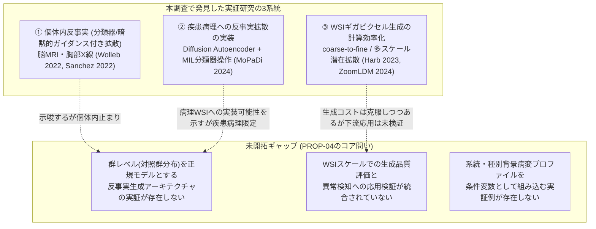
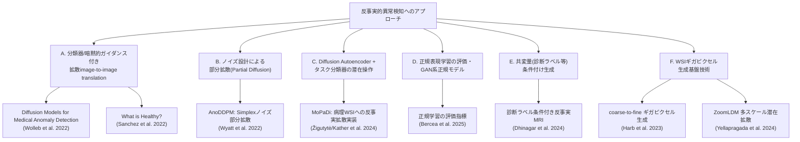
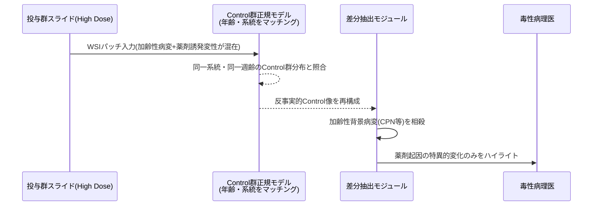

# 【調査レポート】対照群Normativeモデルによる反事実的異常検知（Counterfactual Anomaly Detection）の生成AIアーキテクチャ

> **調査日**: 2026-08-19
> **担当Agent**: Claude (Research Agent)
> **ステータス**: 完了
> **タグ**: `#異常検知` `#拡散モデル` `#反事実生成` `#背景病変` `#NormativeModeling` `#毒性病理`

---

## 📌 エグゼクティブサマリー

### 背景と目的
本調査は [PROP-04](../../../../proposals/backlog.md) として提案された、[01_toxicology_vs_clinical_pathology](../01_toxicology_vs_clinical_pathology/report.md) の「フロンティア3: 自然発生背景病変と薬剤誘発性病変の反事実的異常検知」を深掘りするものです。毒性試験には同一系統・同一飼育環境の対照群（Control群）が必ず並行して存在するという、疾患病理にはない構造的優位性があります。この対照群データを使い、加齢性・自然発生の背景病変（Spontaneous Lesions）と被験物質誘発病変を分離する「反事実生成（Counterfactual Synthesis）」の具体的な拡散モデル/VAEアーキテクチャと、病理領域での先行実装事例を、実在する2022〜2025年の一次文献にあたって検証しました。

### 主要な発見（Key Takeaways）
1. **「毒性病理×反事実生成」の直接的な実装例は本調査時点でゼロ**: 医用画像（脳MRI）の反事実拡散異常検知はWolleb et al. (2022) を起点に急速に成熟し、疾患病理のWSIパッチにも2024年にMoPaDi（KatherLab）が反事実拡散を実装済みですが、「毒性試験の同一条件対照群を正規分布として学習する」設計に踏み込んだ研究は発見できませんでした。PROP-01（動物種横断FM）と同型の「要素技術は個別に存在するが、組み合わせは未着手」というパターンが、ここでも確認されました。
2. **既存の反事実異常検知は本質的に「個体内反事実」であり、毒性病理が必要とする「群レベル正規分布反事実」ではない**: Wolleb (2022) やSanchez (2022) の手法は「この患者の病変がなかったら」という**単一画像内の条件変換**であり、MoPaDi (2024) も個々のWSIパッチの潜在表現を分類器境界の反対側へ操作するものです。一方、毒性病理が理想とするのは「数百〜数千個体のControl群の分布」を正規モデルとして学習し、投与群の個体をその分布に射影する設計であり、アーキテクチャの条件付け粒度が根本的に異なります。
3. **WSIギガピクセルスケールへの拡張技術と異常検知への応用が、別々のトラックで進んでいる**: Harb et al. (2023) のcoarse-to-fine生成やZoomLDM (2024) の多スケール潜在拡散（4096×4096画像を約8分で生成）はWSI規模の生成コストを実用域に近づけていますが、いずれも「生成品質の忠実性」評価が目的であり、生成画像を反事実異常検知の差分計算に使う検証は行われていません。
4. **系統・種別の背景病変プロファイルを条件変数として組み込む実証例も未発見**: 最も近い先行例はDhinagar et al. (2024) の、アルツハイマー病診断ラベルを条件とした反事実MRI生成です。毒性病理側ではラット系統別の慢性進行性腎症（CPN）診断AI（2024年, YOLOv8/Mask R-CNN/SOLOv2による検出・分割）は存在しますが、判別モデルに留まり生成・反事実には及んでいません。
5. **正規モデルの「学習品質」を評価する方法論はすでに整備されている**: Bercea et al. (2025, Nature Communications) は、生成AIが健常集団の分布をどれだけ正しく学習できているかを評価する指標群を提案しており、毒性病理版の対照群正規モデルを構築した際の妥当性検証にそのまま転用できる可能性があります。



---

## 1. 背景・課題設定

### 1.1 なぜ反事実的異常検知が毒性病理で極めて強力か
[01_toxicology_vs_clinical_pathology](../01_toxicology_vs_clinical_pathology/report.md) で整理した通り、疾患病理には「厳密な同一条件の対照群」が存在しません（個々の患者の過去データや健常者データは年齢・生活歴・遺伝的背景が大きく異なる）。一方、毒性試験では**同一系統・同一年齢・同一飼育環境のControl群（Vehicle群）が必ず並行して試験**されており、この理想的な対照群データを正規モデル（Normative Model）の学習に使えることが、毒性病理特有の構造的優位性です。

### 1.2 疾患病理の反事実生成との質的な違い
本調査で発見したMoPaDi（2.4節）のような疾患病理向け反事実生成は、「この腫瘍がMSI-highでなかったら」のように**個々の画像を潜在空間内で操作する**設計です。これは「その患者に固有の反事実」であり、集団の分布を明示的に扱いません。対して毒性病理が必要とするのは、「Control群という現実に存在する数百〜数千個体の分布」を正規分布として学習し、投与群の個体をその分布へ射影した際の差分を病変として抽出する、**群レベルの正規モデリング**です。この違いは、単なる応用先の違いではなく、学習データの与え方（個体ペアか、集団分布か）というアーキテクチャ設計の根本的な分岐点になります。

### 1.3 従来の課題・限界点
- 反事実拡散異常検知の主要な先行研究（Wolleb, Sanchez, Wyatt）はいずれも脳MRI・胸部X線等、256×256〜512×512程度の解像度を前提としており、WSIパッチ（数万×数万画素の中の一部）への直接適用例は本調査では確認できませんでした。
- 「加齢による自然発生病変」と「被験物質による誘発病変」はいずれも組織形態の変化として現れるため、両者を分離する反事実生成モデルは、単なる「異常/正常」の二値ではなく、**病変の"原因"を区別する多因子条件付け**が必要です。この設計に取り組んだ研究は本調査では未発見でした。
- WSIスケールでの生成コスト（ZoomLDMで4096×4096画像あたり約8分）は、1試験あたり数千枚のスライドを扱う毒性病理のスループット要件（[01のフロンティア2](../01_toxicology_vs_clinical_pathology/report.md)参照）に対して、現状は非現実的な水準です。

---

## 2. 主要技術動向・アプローチ分類



### 2.1 A. 分類器/暗黙的ガイダンス付き拡散image-to-image translation
- **概要**: DDIM/DPMの決定論的なノイズ付加・除去過程に、分類器ガイダンスまたは暗黙的ガイダンスを組み合わせ、「病変あり」→「健常」ドメインへの変換を行う。差分画像から異常マップを得る。
- **代表例**: Wolleb et al. (2022) — BRATS2020・CheXpertで検証、2024年時点でMICCAI論文の約20%が本手法を利用。Sanchez et al. (2022) — 構造的因果モデル（SCM）の枠組みで「健常だったら」を反事実として定式化。
- **メリット・強み**: 複雑な訓練手順や大規模な異常データを必要とせず、健常データのみから弱教師あり学習できる。
- **課題・制約**: いずれも個体単位（1患者・1スキャン）の反事実であり、集団分布を明示的に条件とする設計ではない。解像度も256〜512px程度が前提で、WSIパッチへの直接適用実績はない。

### 2.2 B. ノイズ設計による部分拡散（Partial Diffusion）
- **概要**: 標準的なガウスノイズではなく、マルチスケールSimplexノイズ等を用いることで、検出したい異常のサイズ・スケールを制御しつつ高解像度画像へのスケーラビリティを確保する。
- **代表例**: AnoDDPM (Wyatt et al. 2022) — DDPMはGANよりモード網羅性が高く、VAEよりサンプル品質が高いという特性を活用。
- **メリット・強み**: 異常サイズの制御可能性は、毒性病理の病変が単細胞壊死（微細）から広範な空胞変性（びまん性）まで幅広いスケールを持つ点と相性が良い。
- **課題・制約**: 高解像度化はWSIパッチレベル（1024px程度）までは射程に入るが、ギガピクセル全体を扱うものではない。

### 2.3 C. Diffusion Autoencoder + タスク分類器の潜在操作
- **概要**: 画像をエンコード・デコードするDiffusion Autoencoderと、タスク特化のMIL分類器を組み合わせ、分類器の予測が反転する方向に潜在表現を操作することで反事実画像を生成する。
- **代表例**: MoPaDi (Žigutytė, Han, Kather et al. 2024–2025) — TCGA等の疾患病理WSIパッチで、がん種・組織型・MSIステータス等の反事実を生成し病理医によるユーザースタディで検証。
- **メリット・強み**: 本調査で発見できた、**反事実拡散モデルを実際の病理WSIパッチに適用した唯一の実装例**。アーキテクチャ自体はドメイン非依存で、対照群データで学習し直せば毒性病理へ転用しうる技術的土台がある。
- **課題・制約**: 対象は疾患病理（腫瘍性病変）であり、「同一条件対照群」という概念は前提とされていない。分類器境界を挟んだ個体内操作であり、群レベルの正規分布モデリングとは設計思想が異なる（4.1節で詳述）。

### 2.4 D. 正規表現学習の評価・GAN系正規モデル
- **概要**: 健常集団の典型的な解剖学的分布をどれだけ正確に学習できているかを、生成AIモデル横断で定量評価する枠組み。GAN系（f-AnoGAN等）や拡散モデル等、複数アーキテクチャを共通の評価軸で比較する。
- **代表例**: Bercea et al. (2025, Nature Communications) — 専門医との大規模マルチリーダー研究を含む評価指標を提案。
- **メリット・強み**: 「正規モデルの学習品質をどう検証するか」という、PROP-04の実装後に必ず直面する妥当性検証の課題に対する既製の方法論。
- **課題・制約**: 評価枠組みであり、生成アーキテクチャそのものの提案ではない。毒性病理版正規モデルの構築後に転用する位置づけ。

### 2.5 E. 共変量（診断ラベル等）条件付け生成
- **概要**: 臨床診断ラベルのような離散カテゴリ変数を条件として、条件付き潜在拡散モデル・DDPMで反事実画像を生成する。
- **代表例**: Dhinagar et al. (2024) — アルツハイマー病 vs 健常という診断ラベルを条件変数として、個体レベルでの疾患効果を可視化する反事実3D MRIを生成。
- **メリット・強み**: PROP-04のコア問い2（動物種・系統別の自然発生病変プロファイルを条件付けとしてどう組み込むか）に対する、最も直接的に転用可能な先行実装パターン。診断ラベルを系統名や用量群ラベルに置き換える拡張が理論的に可能。
- **課題・制約**: 単一の条件変数（診断の有無）のみで検証されており、系統×用量群×臓器といった多階層の条件を同時に扱う設計は未検証。

### 2.6 F. WSIギガピクセル生成基盤技術
- **概要**: 段階的な解像度向上（coarse-to-fine）や、倍率認識型の条件付けによる多スケール潜在拡散により、ギガピクセル規模のWSI生成を計算可能な範囲に収める。
- **代表例**: Harb et al. (2023, WACV2024) — coarse-to-fineサンプリング。ZoomLDM (Yellapragada et al. 2024, CVPR2025) — 4096×4096画像を約8分で生成（従来手法は4〜12時間）。
- **メリット・強み**: WSIスケールでの反事実生成という、PROP-04のコア問い1に対する計算基盤の目処が立ちつつある。
- **課題・制約**: いずれも「生成品質の忠実性」評価が目的であり、生成された画像を異常検知・反事実差分抽出のパイプラインに組み込んだ検証は行われていない。

---

## 3. 主要論文・技術比較

| 手法/研究 | 発表年 | 対象ドメイン | 条件付け方式 | 扱う解像度 | 主な定量結果 | リンク / PDF |
|:---|:---:|:---|:---|:---|:---|:---:|
| Diffusion Models for Medical Anomaly Detection | 2022 | 脳MRI・胸部X線 | 分類器ガイダンス(DDIM) | 256px程度 | MICCAI2024論文の約20%が採用 | [Paper](papers/index.md#paper-1) |
| What is Healthy? | 2022 | 脳MRI | 暗黙的ガイダンス+アテンション(SCM) | 未記載(同水準) | 画像レベルラベルのみで病変局在化 | [Paper](papers/index.md#paper-2) |
| AnoDDPM | 2022 | 脳MRI | Simplexノイズ部分拡散 | 高解像度対応(具体値未確認) | GAN比でモード網羅性向上 | [Paper](papers/index.md#paper-3) |
| MoPaDi | 2024–2025 | 疾患病理WSIパッチ(TCGA等) | Diffusion AE+MIL分類器潜在操作 | パッチスケール | 病理医ユーザースタディで検証 | [Paper](papers/index.md#paper-4) |
| 正規学習評価 (Bercea) | 2025 | 脳MRI(生成AI横断比較) | - (評価指標) | - | 専門医マルチリーダー研究と比較 | [Paper](papers/index.md#paper-5) |
| Counterfactual MRI (Dhinagar) | 2024 | 脳MRI(アルツハイマー病) | 診断ラベル条件付きLDM/DDPM | 3D volumetric | 個体レベルAD効果の可視化 | [Paper](papers/index.md#paper-6) |
| Gigapixel WSI Diffusion (Harb) | 2023 | 病理WSI(生成のみ) | coarse-to-fine | ギガピクセル | 病理医ユーザースタディで構造再現確認 | [Paper](papers/index.md#paper-7) |
| ZoomLDM | 2024 | 病理WSI(生成のみ) | 倍率認識(magnification-aware) | 4096×4096 | 8分/枚(従来4〜12時間) | [Paper](papers/index.md#paper-8) |
| Survey (Liu et al.) | 2025 | 横断的分類軸 | - (サーベイ) | - | 再構成/密度/ハイブリッドの3分類 | [Paper](papers/index.md#paper-9) |
| CPN診断AI | 2024 | ラット腎臓(判別モデル) | - (条件付けなし・検出のみ) | パッチスケール | Mask R-CNNがmAP50最高 | [Paper](papers/index.md#paper-10) |

---

## 4. 詳細分析・技術的考察

### 4.1 「個体内反事実」と「群レベル正規分布反事実」という2つの設計思想
本調査で発見した反事実生成研究は、すべて**個体内反事実（Individual-level Counterfactual）**、すなわち「この1枚の画像・1人の患者について、特定の条件が異なっていたらどう見えるか」を扱うものでした。一方、PROP-04が本来目指すのは**群レベル正規分布反事実（Population-level Normative Counterfactual）**、すなわち「Control群という実在する集団の分布に、この投与群個体を射影したらどう見えるか」です。

```mermaid
flowchart LR
    subgraph IndivCF["個体内反事実 (既存研究の主流)"]
        I1["1患者のWSI/MRI"] --> I2["潜在空間内で条件を反転"] --> I3["同一個体の反事実画像"]
    end

    subgraph PopCF["群レベル正規分布反事実 (PROP-04が目指す設計)"]
        P1["Control群 数百〜数千個体のWSI"] --> P2["正規分布モデル<br/>(Normative Diffusion/AE)"] --> P3["投与群個体を分布へ射影"]
        P3 --> P4["射影結果との差分 = 被験物質誘発病変候補"]
    end

    IndivCF -.->|技術基盤(Diffusion AE等)は転用可能| PopCF
```

この違いは、学習データの与え方（ペア画像か、集団分布か）だけでなく、**評価の考え方も変える**という点で本質的です。個体内反事実は「この画像がどう変わるべきか」という決定論的な問いですが、群レベル正規分布反事実は「この個体はControl群の分布のどこに位置するか」という確率的な問いであり、Bercea et al. (2025) が提案するような正規学習の評価指標（2.4節）との親和性が高くなります。

### 4.2 WSIスケール拡張における計算コストの壁
ZoomLDM (2024) の「4096×4096画像を約8分で生成」という結果は、WSIギガピクセル生成の計算効率化における最新の到達点です。しかし、典型的な毒性病理WSI（数万×数万画素）を単純に敷き詰めれば、1枚のスライドの反事実生成だけで数時間〜数十時間を要する計算になり、1試験あたり数千枚を扱う毒性病理のスクリーニング要件（[01のフロンティア2](../01_toxicology_vs_clinical_pathology/report.md)）とは大きく乖離します。したがって、現実的な設計としては「WSI全体の反事実生成」ではなく、**病理医が着目するROI（関心領域）単位での反事実生成**、あるいは特徴量レベル（パッチ埋め込みのMILバッグ）での正規分布モデリングに絞り込むアプローチが、当面のスコープになると考えられます。

### 4.3 背景病変と誘発病変の交絡分離という理論的整理
[01_toxicology_vs_clinical_pathology](../01_toxicology_vs_clinical_pathology/report.md) で示した通り、毒性病理の核心的な課題は「加齢による自然発生病変」と「被験物質による誘発病変」の交絡分離です。反事実的異常検知の枠組みでこれを整理すると、以下のようになります。



このパイプラインを実現する上での未解決点は、**「年齢・系統をマッチングしたControl群のみを正規モデルの学習データとして選別する」条件付けの設計**です。CPN診断AI（paper-10）のような系統別背景病変の検出モデルは存在しますが、これを正規モデルの条件変数として組み込んだ生成モデルは本調査では発見できませんでした。

### 4.4 系統別条件付けの実現方法の考察
Dhinagar et al. (2024) の「診断ラベルを条件とした反事実MRI生成」は、条件変数を離散カテゴリ（AD/健常）として扱う点で、毒性病理の「系統ラベル」「用量群ラベル」への転用が構造的に容易です。ただし毒性病理では、系統・週齢・性別・臓器という**複数の条件変数を同時に扱う必要**があり、単一条件変数での実証にとどまるDhinagarの手法をそのまま多条件へ拡張した場合の生成品質・計算コストは未検証の領域です。

---

## 5. 今後の展望・オープンクエスチョン

### 未解決の学術・技術的課題
1. **群レベル正規分布反事実生成の実証研究が皆無**: 本調査で発見した反事実生成研究はすべて個体内反事実（4.1節）であり、「Control群の集団分布」を明示的に正規モデルとして学習する拡散モデル/VAEアーキテクチャの実証例は存在しません。これはPROP-04の最も直接的な次アクション候補です。
2. **WSIスケールでの生成と異常検知応用の統合検証が存在しない**: Harb (2023) やZoomLDM (2024) はWSI生成の計算コストを大きく引き下げましたが、生成画像を反事実異常検知の差分計算に用いた検証は行われていません。ROI単位・パッチ埋め込みレベルでの現実的な統合設計が今後の焦点です。
3. **多条件（系統×週齢×用量群×臓器）の同時条件付けが未検証**: Dhinagar (2024) の単一条件変数（診断ラベル）モデルを、毒性病理に必要な多階層の条件変数へ拡張した場合の生成品質・計算コストは未知数です。
4. **正規モデルの妥当性検証プロトコルの毒性病理への適用**: Bercea et al. (2025) の正規学習評価指標を毒性病理版の正規モデルにそのまま適用できるか、あるいは病変の多様性（40〜50臓器）に応じた指標の再設計が必要かは未検証です。
5. **GLP規制受容性**: [01のフロンティア6](../01_toxicology_vs_clinical_pathology/report.md)や[PROP-09](../../../../proposals/backlog.md)とも関わるが、反事実生成という「実在しない画像を作り出す」技術をGLP試験の正式な意思決定プロセスに組み込むための規制当局側の検証基準（生成画像を根拠資料としてよいか等）は全く整備されていません。

---

## 6. 参考文献・関連リソース

### 主要論文・文献
- **Wolleb, J., Bieder, F., Sandkühler, R., Cattin, P. C.** (2022). "Diffusion Models for Medical Anomaly Detection." *MICCAI 2022*. [arXiv:2203.04306](https://arxiv.org/abs/2203.04306) / [PDF](papers/pdfs/2022_Wolleb_DiffusionMedicalAnomalyDetection.pdf)
- **Sanchez, P., Kascenas, A., Liu, X., O'Neil, A. Q., Tsaftaris, S. A.** (2022). "What is Healthy? Generative Counterfactual Diffusion for Lesion Localization." *DGM4MICCAI Workshop*. [arXiv:2207.12268](https://arxiv.org/abs/2207.12268) / [PDF](papers/pdfs/2022_Sanchez_WhatIsHealthyCounterfactualDiffusion.pdf)
- **Wyatt, J., Leach, A., Schmon, S. M., Willcocks, C. G.** (2022). "AnoDDPM: Anomaly Detection With Denoising Diffusion Probabilistic Models Using Simplex Noise." *CVPR Workshops 2022*. [CVF OpenAccess](https://openaccess.thecvf.com/content/CVPR2022W/NTIRE/html/Wyatt_AnoDDPM_Anomaly_Detection_With_Denoising_Diffusion_Probabilistic_Models_Using_Simplex_CVPRW_2022_paper.html) / [PDF](papers/pdfs/2022_Wyatt_AnoDDPM.pdf)
- **Žigutytė, L., Lenz, T., Han, T., Hewitt, K. J., Reitsam, N. G., Foersch, S., Kather, J. N., et al.** (2024–2025). "Counterfactual Diffusion Models for Interpretable Explanations of Artificial Intelligence Models in Pathology." *bioRxiv*. [DOI:10.1101/2024.10.29.620913](https://doi.org/10.1101/2024.10.29.620913)
- **Bercea, C. I., Wiestler, B., Rueckert, D., Schnabel, J. A.** (2025). "Evaluating Normative Representation Learning in Generative AI for Robust Anomaly Detection in Brain Imaging." *Nature Communications*. [DOI:10.1038/s41467-025-56321-y](https://doi.org/10.1038/s41467-025-56321-y)
- **Dhinagar, N. J., Thomopoulos, S. I., Laltoo, E., Thompson, P. M.** (2024). "Counterfactual MRI Generation with Denoising Diffusion Models for Interpretable Alzheimer's Disease Effect Detection." *bioRxiv / IEEE EMBC 2024*. [DOI:10.1101/2024.02.05.578983](https://doi.org/10.1101/2024.02.05.578983)
- **Harb, R., Pock, T., Müller, H.** (2023). "Diffusion-based Generation of Histopathological Whole Slide Images at a Gigapixel Scale." *WACV 2024*. [arXiv:2311.08199](https://arxiv.org/abs/2311.08199) / [PDF](papers/pdfs/2023_Harb_GigapixelWSIDiffusion.pdf)
- **Yellapragada, S., et al.** (2024). "ZoomLDM: Latent Diffusion Model for Multi-scale Image Generation." *CVPR 2025*. [arXiv:2411.16969](https://arxiv.org/abs/2411.16969) / [PDF](papers/pdfs/2024_Yellapragada_ZoomLDM.pdf)
- **Liu, J., Ma, Z., Wang, Z., Zou, C., Ren, J., Wang, Z., Song, L., Hu, B., Liu, Y., Leung, V. C. M.** (2025). "A Survey on Diffusion Models for Anomaly Detection." *arXiv preprint*. [arXiv:2501.11430](https://arxiv.org/abs/2501.11430) / [PDF](papers/pdfs/2025_Liu_DiffusionAnomalyDetectionSurvey.pdf)
- **(2024)**. "Comparative Analysis of Chronic Progressive Nephropathy (CPN) Diagnosis in Rat Kidneys Using an Artificial Intelligence Deep Learning Model." *Toxicological Research*. [DOI:10.1007/s43188-024-00247-y](https://doi.org/10.1007/s43188-024-00247-y)

### 関連リポジトリ・内部リンク
- 論文詳細サマリー: [papers/index.md](papers/index.md)
- 検索ログ・思考メモ: [notes/search_log.md](notes/search_log.md)
- 関連する過去の調査: [topics/2026/08/01_toxicology_vs_clinical_pathology/report.md](../01_toxicology_vs_clinical_pathology/report.md)
- 関連する並行調査: [topics/2026/08/02_cross_species_pathology_fm/report.md](../02_cross_species_pathology_fm/report.md)
