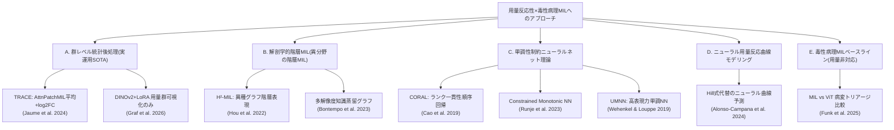
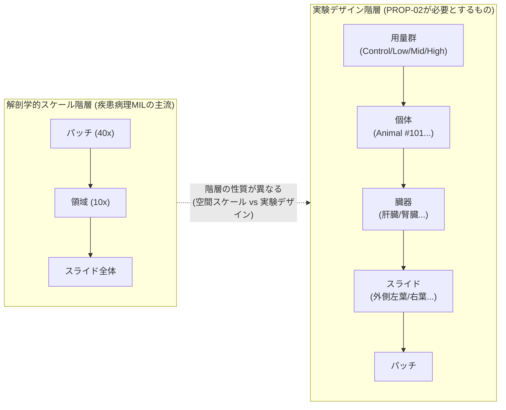

# 【調査レポート】毒性試験における用量反応性（Dose-Response）モデリングと階層的弱教師あり学習（Hierarchical Group-MIL）の数理・実装設計

> **調査日**: 2026-08-19
> **担当Agent**: Claude (Research Agent)
> **ステータス**: 完了
> **タグ**: `#弱教師あり学習` `#MIL` `#用量反応性` `#DoseResponse` `#PfizerTRACE` `#単調性制約` `#順序回帰`

---

## 📌 エグゼクティブサマリー

### 背景と目的
本調査は [PROP-02](../../../../proposals/backlog.md) として提案された、[01_toxicology_vs_clinical_pathology](../01_toxicology_vs_clinical_pathology/report.md) の「フロンティア2: 用量反応性 階層群MIL」を深掘りするものです。毒性病理の意思決定単位である「試験群（Control/Low/Mid/High） → 個体 → 臓器 → スライド → パッチ」という5階層構造をエンドツーエンドで最適化する弱教師あり学習と、用量反応の単調増加性を組み込む正則化損失の最先端実装を、実在する一次文献にあたって検証しました。

### 主要な発見（Key Takeaways）
1. **「用量反応の自動特性評価」を謳う現行SOTAでも、実装は数理的に素朴**: 最先端の実運用モデルTRACE（Jaume et al. 2024, Mahmood Lab）は「自動用量反応特性評価」を主要機能として掲げますが、実装は各群のAttnPatchMIL定量化スコアを**単純平均**し、対照群でlog2 fold change正規化するという統計的後処理に留まります。単調性正則化・Hill式フィッティング・NOAEL/BMD自動算出は本文中に一切登場しません。
2. **産業実装でも「用量依存性の確認」止まり**: Graf et al. (2026, Boehringer Ingelheim/Tübingen大)は用量群間の異常割合を可視化して用量依存的な肝細胞質空胞化を確認していますが、**統計的な用量反応分析や個体間相関のモデル化は実施していない**と論文中に明記しています。2つの独立した産業発研究が同じギャップを裏付けています。
3. **「階層MIL」には2つの異なる意味があり、両者は未統合**: 疾患病理分野で成熟した階層型MIL（H²-MIL, Bontempo et al. 2023等）が扱う「階層」は**解剖学的スケール階層**（パッチ→領域→スライド）であり、PROP-02が求める**実験デザイン階層**（群→個体→臓器→スライド→パッチ）とは性質が異なります。両者を統合したアーキテクチャは本調査では発見できませんでした。
4. **単調性制約ニューラルネットの理論は既に成熟しているが、MILへの応用は未着手**: 順序回帰のCORAL（Cao et al. 2019）、ハード制約のConstrained Monotonic NN（Runje et al. 2023）、高表現力のUMNN（Wehenkel & Louppe 2019）はいずれも「単一の連続入力→単調な出力」を保証する枠組みとして確立していますが、これを**MILのバッグレベル集約関数**（用量群→重症度スコア）に応用した実装は本調査で発見できませんでした。ここに具体的な実装ルートがあります。
5. **「単調増加性」という前提そのものに留保が必要**: 創薬スクリーニング分野のニューラル用量反応曲線モデル（Alonso-Campana et al. 2024, ICML）は、Hill方程式が前提とする「単調・対称」という仮定が生物学的実態（低用量刺激・高用量毒性のような二相性/ホルミシス）を歪めうると指摘しています。PROP-02の単調性正則化損失を設計する際は、この非単調性への配慮が必要です。

```mermaid
graph TD
    subgraph Found["本調査で発見した実証研究の3系統"]
        A["① 群レベル統計後処理<br/>AttnPatchMIL平均+log2FC正規化<br/>(Jaume et al. 2024, TRACE)"]
        B["② 用量依存性の可視化のみ<br/>DINOv2+LoRA異常検知<br/>(Graf et al. 2026, 統計モデリングなし)"]
        C["③ 解剖学的階層MIL(異分野)<br/>グラフ/知識蒸留による多解像度統合<br/>(Hou et al. 2022 / Bontempo et al. 2023)"]
    end

    subgraph Gap["未開拓ギャップ (PROP-02のコア問い)"]
        G1["実験デザイン階層(群-個体-臓器-<br/>スライド-パッチ)のエンドツーエンド<br/>グラフ/アテンションMILが存在しない"]
        G2["単調性制約ニューラルネット理論を<br/>MILのバッグ集約関数に適用した<br/>実装例が存在しない"]
        G3["NOAEL/BMD自動算出とMIL<br/>損失関数を直結した研究が存在しない"]
    end

    A -.->|示唆するが未実装| G1
    A -.->|示唆するが未実装| G3
    C -.->|階層の"種類"が異なり転用要検討| G1
    B -.->|必要性を裏付けるが未着手| G2
```

---

## 1. 背景・課題設定

### 1.1 なぜ階層的Group-MILが必要か
[01_toxicology_vs_clinical_pathology](../01_toxicology_vs_clinical_pathology/report.md) で整理した通り、毒性病理の意思決定は個別患者診断ではなく「対照群 vs 低/中/高用量群」の**群間比較**を本質とします。従来の疾患病理MIL（CLAM, TransMIL）は「1スライド＝1バッグ、1患者＝1ラベル」という構造を前提としますが、毒性試験のデータは「試験 → 用量群（Control/Low/Mid/High）→ 個体（Animal）→ 臓器（Organ）→ スライド（Slide）→ パッチ（Patch）」という5階層のネスト構造を持ちます。この構造をモデルに直接反映せず、単一スライド単位で予測してから事後的に集計する現行アプローチ（後述4.1）では、群間の統計的検出力や用量依存性の情報を学習過程で活用できません。

### 1.2 疾患病理の1スライド=1バッグMILとの違い
疾患病理MILは「このスライドに腫瘍があるか」という**インスタンス内の異質性**（一部のパッチだけが陽性）を扱う問題設計です。一方、毒性病理の階層MILが扱うべきは「この用量群は対照群と比べて病変頻度・重症度が有意に、かつ用量依存的に増加しているか」という**バッグ間（群間）の順序関係**であり、問題の数理的性質そのものが異なります。前者はインスタンス選択（Attention）が中心課題ですが、後者は複数バッグ集合間の順序制約付き比較が中心課題になります。

### 1.3 従来の課題・限界点
- 用量群は本来「対照 < 低 < 中 < 高」という順序変数ですが、大半のMILは各スライド・各群を独立なクラスとして分類しており、この順序情報を陽に利用していません。
- 生物学的には稀に1匹だけに生じる孤発病変（Spontaneous/Incidental lesion）が偽陽性として用量反応シグナルを乱すため、群レベルでの頑健な統計処理が不可欠ですが、既存MILの多くはスライド単位の予測値をそのまま報告する設計です。
- NOAEL（無毒性量）・BMD（ベンチマーク用量）は毒性病理における最終アウトプットですが、これらは伝統的に統計ソフトウェア（BMDS, PROAST等）で事後計算されるものであり、深層学習パイプラインの損失関数や出力層に統合された実装は本調査時点で確認できませんでした。

---

## 2. 主要技術動向・アプローチ分類



### 2.1 A. 群レベル統計後処理（現行実運用SOTA）
- **概要**: パッチ/スライド単位のMIL予測値を算出した後、群単位で平均・正規化するという「MIL＋事後統計処理」の2段階構成。
- **代表例**: TRACE（Jaume et al. 2024）— 157試験・46,734 WSIでiBOT事前学習したViT-Bを基盤に、AttnPatchMILで病変面積％を算出し、群内平均→対照群比のlog2 fold changeで用量反応を表現。
- **メリット・強み**: 実装がシンプルで、既存のMILパイプラインに後付け可能。大規模実データ（157試験）での検証実績があり、10名の獣医病理専門医コンセンサスを上回る一致率を達成。
- **課題・制約**: 群内の個体間分散や有意差検定を明示的に扱わないため、孤発病変による偽陽性への頑健性が理論的に保証されない。単調性・曲線フィッティングを一切使わないため、「本当に用量依存的か」の統計的主張が弱い。

### 2.2 B. 解剖学的階層MIL（異分野からの転用候補）
- **概要**: WSI内の複数解像度（パッチ→領域→スライド全体）をヘテロ型グラフやマルチスケール知識蒸留で階層的に統合するMIL。
- **代表例**: H²-MIL（Hou et al. 2022, AAAI）は解像度ピラミッドをヘテロジニアスグラフとして表現しGNNでメッセージパッシング。Bontempo et al. (2023, IEEE TMI) は高倍率・低倍率の2つのパッチグラフ間で知識蒸留を行う。
- **メリット・強み**: グラフ構築・階層的プーリングの設計パターンとして技術的に成熟しており、多段階のノード種別・エッジ重みを柔軟に扱える基盤技術が存在する。
- **課題・制約**: これらが扱う「階層」は**画像内の解剖学的スケール**であり、PROP-02が求める**試験デザイン上の階層**（群/個体/臓器/スライド）とは階層の意味が異なる。ノード種別を試験デザイン階層に置き換える設計変更なしに転用はできない（4.1で詳述）。

### 2.3 C. 単調性制約ニューラルネット理論
- **概要**: モデルの入出力関係に数学的な単調性を保証する理論的枠組み。ハード制約（アーキテクチャで保証）とソフト制約（損失関数で誘導）の2系統がある。
- **代表例**: CORAL（Cao et al. 2019）は順序回帰をK-1個の二値分類に分解し重み共有でランク一貫性を保証。Constrained Monotonic NN（Runje et al. 2023）は重み符号制約＋単調活性化関数で非凸関数も表現可能な単調性を実現。UMNN（Wehenkel & Louppe 2019）は導関数の正値性のみを制約し、より高い表現力を持つ。
- **メリット・強み**: いずれも理論的保証（ランク一貫性・単調性）が数学的に証明されており、実装（PyTorch等）も公開されている成熟した技術。
- **課題・制約**: すべて「1つの連続的入力（年齢・用量濃度等）→単調な出力」というシングルインスタンス問題を前提としており、**MILのバッグレベル集約（複数パッチ/スライドからの群スコア導出）に単調性を課す**という応用は本調査で発見できなかった。PROP-02の核心的な実装ギャップ。

### 2.4 D. ニューラル用量反応曲線モデリング
- **概要**: 創薬スクリーニング領域で、伝統的なHill方程式（4パラメータロジスティック曲線）をニューラルネットで置き換える試み。
- **代表例**: Alonso-Campana et al. (2024, ICML) は薬剤×組織トランスクリプトーム埋め込みから用量反応曲線全体を直接推定し、Hill方程式の「単調・対称」という仮定が二相性化合物（低用量刺激・高用量毒性）を表現できない限界を指摘。
- **メリット・強み**: 未知の組織・薬剤の組み合わせに対しても高精度に汎化。Hill方程式の限界を定量的に実証しており、用量反応モデリングの設計判断に直接影響する知見を提供。
- **課題・制約**: 入力がトランスクリプトームであり病理画像を対象としない。病理WSIパッチを入力として用量反応曲線を直接予測する研究は本調査では発見できなかった。

### 2.5 E. 毒性病理MILベースライン（用量非対応）
- **概要**: 毒性病理WSIにMIL/ViTを適用し、病変の有無をトリアージする現行の主要な実装アプローチ。用量反応そのものは対象外。
- **代表例**: Funk et al. (2025, Toxicologic Pathology) — 58ラット毒性試験を対象に、AttentionベースMILとVisual Transformerを比較し、肝臓病変の「病変あり/なし」の二値トリアージでAUROC良好な結果（Transformer側で高精度）を報告。
- **示唆**: 業界の実装関心は現状「正常スライドを高速除外するトリアージ」に集中しており、用量反応そのものをエンドツーエンドでモデル化する研究はまだ主流ではない。

---

## 3. 主要論文・技術比較

| 手法/研究 | 発表年 | 対象とする階層 | 用量反応の扱い | 単調性の保証 | 主な定量結果 | リンク / PDF |
|:---|:---:|:---|:---|:---|:---|:---:|
| TRACE | 2024 | 群-スライド-パッチ(個体は暗黙) | 群平均+log2FC(後処理) | なし | 病理医コンセンサス超え | [Paper](papers/index.md#paper-1) |
| Graf et al. (Mahalanobis) | 2026 | 試験-個体-WSI-パッチ | 可視化のみ(統計モデリングなし) | なし | OOD誤陰性率0.16% | [Paper](papers/index.md#paper-2) |
| H²-MIL | 2022 | 解剖学的スケール(パッチ-領域-スライド) | 対象外 | なし | 汎用WSI分類でSOTA | [Paper](papers/index.md#paper-5) |
| Bontempo et al. | 2023 | 解剖学的スケール(高倍率-低倍率) | 対象外 | なし | 汎用WSI分類でSOTA | [Paper](papers/index.md#paper-6) |
| CORAL | 2019/2020 | 単一インスタンス(順序ラベル) | 対象外(順序回帰理論) | ハード制約(ランク一貫性) | 年齢推定でMAE改善 | [Paper](papers/index.md#paper-8) |
| Constrained Monotonic NN | 2023 | 単一インスタンス | 対象外(理論) | ハード制約 | 複数ベンチマークでSOTA | [Paper](papers/index.md#paper-9) |
| UMNN | 2019 | 単一インスタンス | 対象外(理論) | ハード制約(高表現力) | 密度推定等でSOTA | [Paper](papers/index.md#paper-10) |
| Alonso-Campana et al. | 2024 | 対象外(トランスクリプトーム入力) | 曲線全体を直接推定 | なし(非単調も許容) | 未知組織/薬剤で高精度 | [Paper](papers/index.md#paper-7) |
| CLAM | 2021 | 1スライド=1バッグ | 対象外 | なし | 弱教師あり学習の基盤 | [01のpapers/index.md](../01_toxicology_vs_clinical_pathology/papers/index.md) |
| TransMIL | 2021 | 1スライド=1バッグ(相関考慮) | 対象外 | なし | インスタンス相関を考慮 | [01のpapers/index.md](../01_toxicology_vs_clinical_pathology/papers/index.md) |
| Funk et al. | 2025 | 個体-臓器-スライド | 対象外(病変トリアージのみ) | なし | Transformer AUROC良好 | - |

---

## 4. 詳細分析・技術的考察

### 4.1 「階層」の2つの意味 — 解剖学的階層と実験デザイン階層の混同を避ける
本調査で最も重要な整理は、「階層的MIL」という言葉が指す対象が研究分野によって全く異なるという点です。



H²-MILやBontempo et al. (2023) のグラフ構築・階層的プーリング機構自体は技術的に転用可能ですが、「ノードが何を表すか」を解剖学的スケールから実験デザイン階層（用量群ノード・個体ノード・臓器ノード）に置き換える設計変更が不可欠です。この置き換えを行った研究は本調査では確認できず、これ自体が具体的な実装アクションになり得ます。

### 4.2 ハード制約 vs ソフト制約という設計選択
PROP-02が当初提案した「単調増加性正則化損失」（ソフト制約：損失関数のペナルティ項として単調性を誘導）に加えて、本調査で発見したConstrained Monotonic NN（Runje et al. 2023）やUMNN（Wehenkel & Louppe 2019）のような**ハード制約**（アーキテクチャ自体が単調性を数学的に保証）という代替設計が存在します。

| 観点 | ソフト制約（損失関数） | ハード制約（アーキテクチャ） |
|:---|:---|:---|
| 保証の強さ | 学習が収束すれば近似的に満たされる | 常に厳密に満たされる |
| 実装の容易さ | 既存MILへの追加項として実装しやすい | プーリング層自体を専用設計する必要 |
| 非単調な生物学的実態への対応 | 正則化係数で緩和しやすい | 完全な単調性しか表現できない（4.3参照） |
| 該当技術 | Hill式フィッティング損失（PROP-02原案） | Runje 2023, UMNN, CORAL |

MILのバッグレベル集約関数（用量群→重症度スコア）自体をRunje et al. (2023) やUMNNの枠組みで構成すれば、学習の不安定性に依存せず単調性を保証できる可能性があり、PROP-02原案のソフト制約損失より頑健な代替設計になり得ます。

### 4.3 「単調増加性」という前提への留保 — ホルミシスと二相性用量反応
PROP-02は「用量増加に伴い病変重症度・発現率が単調増加する」という生物学的制約を前提としますが、Alonso-Campana et al. (2024) が指摘する通り、実際の生物学的用量反応には**低用量で保護的・高用量で毒性を示す二相性（ホルミシス, Hormesis）**が存在することが知られています。ハード制約で完全な単調性を課すアーキテクチャ（4.2）は、このような非単調な真の生物学的パターンを原理的に表現できません。したがって実装においては、①大多数の古典的毒性所見（肝細胞肥大・壊死等、概ね単調）にはハード制約を適用しつつ、②ホルミシス様所見が疑われる病変には単調性を緩めたソフト制約または制約なしモデルを使う、というハイブリッド設計が現実的と考えられます。

### 4.4 NOAEL/BMD自動算出への接続は依然として空白
本調査で確認した全ての実装（TRACE, Graf et al. 2026）は、深層学習の出力をNOAEL/LOAEL/BMDという毒性評価の最終指標に直結させていません。BMD自体は伝統的な統計モデリング（用量反応曲線への複数モデルフィッティングとモデル平均化、米国EPAのBMDS等）で算出されるものであり、深層学習パイプラインの出力（病変面積％やlog2FC）をBMDモデリングの入力特徴量として直結するパイプライン設計は、本調査時点で先行研究が存在しない実装ギャップです。

---

## 5. 今後の展望・オープンクエスチョン

### 未解決の学術・技術的課題
1. **試験デザイン階層に特化したグラフMILの不在**: H²-MIL等のグラフ構築ロジックを、解剖学的スケールではなく「群→個体→臓器→スライド→パッチ」というノード種別に置き換えたアーキテクチャは本調査では未発見。具体的な実装・検証が次のアクションになり得る。
2. **MILバッグ集約への単調性制約の応用不在**: CORAL/Runje/UMNNのような成熟した単調性ニューラルネット理論を、MILのプーリング関数（用量群レベルの集約）に適用した研究が存在しない。
3. **非単調（二相性/ホルミシス）所見への対応設計**: どの病変タイプに厳格な単調性制約を適用してよいか、病理学的知見に基づく体系的な分類が必要（4.3）。
4. **NOAEL/BMDと深層学習パイプラインの直結**: 病変定量化スコアを入力としたBMDモデリング（Hill式・指数モデル等の複数モデル平均化）を深層学習の損失関数・出力層に統合する研究が存在しない。
5. **個体間相関・群内分散の明示的モデリング**: 現行実装（TRACE, Graf et al. 2026）はいずれも個体間の統計的相関構造を明示的に扱っていない。混合効果モデル（Mixed-effects model）的な発想をMILに統合する設計は未検証。

---

## 6. 参考文献・関連リソース

### 主要論文・文献
- **Jaume, G., de Brot, S., Song, A. H., et al.** (2024). "Deep Learning-based Modeling for Preclinical Drug Safety Assessment." *bioRxiv*. [DOI:10.1101/2024.07.20.604430](https://www.biorxiv.org/content/10.1101/2024.07.20.604430) / [PMC11291027](https://pmc.ncbi.nlm.nih.gov/articles/PMC11291027/)
- **Graf, O., Patel, D., Groß, P., Lempp, C., Hein, M., Heinemann, F.** (2026). "Toxicity Assessment in Preclinical Histopathology via Class-Aware Mahalanobis Distance for Known and Novel Anomalies." *Scientific Reports*. [arXiv:2602.02124](https://arxiv.org/abs/2602.02124) / [PDF](papers/pdfs/2026_Graf_DINOv2LoRA_ToxPath.pdf)
- **Hou, W., Yu, L., Lin, C., Huang, H., Yu, R., Qin, J., Wang, L.** (2022). "H²-MIL: Exploring Hierarchical Representation with Heterogeneous Multiple Instance Learning for Whole Slide Image Analysis." *AAAI*, 36(1), 933–941. [Paper](https://ojs.aaai.org/index.php/AAAI/article/view/19976) / [PDF](papers/pdfs/2022_Hou_H2MIL.pdf)
- **Bontempo, G., Bolelli, F., Porrello, A., Calderara, S., Ficarra, E.** (2023). "A Graph-Based Multi-Scale Approach With Knowledge Distillation for WSI Classification." *IEEE Transactions on Medical Imaging*. [PubMed:38015690](https://pubmed.ncbi.nlm.nih.gov/38015690/)
- **Alonso Campana, P., Prasse, P., Scheffer, T.** (2024). "Predicting Dose-Response Curves with Deep Neural Networks." *ICML 2024 / PMLR* Vol. 235. [PMLR](https://proceedings.mlr.press/v235/alonso-campana24a.html)
- **Cao, W., Mirjalili, V., Raschka, S.** (2020, arXiv初出2019). "Rank Consistent Ordinal Regression for Neural Networks with Application to Age Estimation." *Pattern Recognition Letters*. [arXiv:1901.07884](https://arxiv.org/abs/1901.07884) / [PDF](papers/pdfs/2019_Cao_CORAL_OrdinalRegression.pdf)
- **Runje, D., Shankaranarayana, S. M.** (2023). "Constrained Monotonic Neural Networks." *ICML 2023 / PMLR* Vol. 202. [PMLR](https://proceedings.mlr.press/v202/runje23a.html) / [PDF](papers/pdfs/2023_Runje_ConstrainedMonotonicNN.pdf)
- **Wehenkel, A., Louppe, G.** (2019). "Unconstrained Monotonic Neural Networks." *NeurIPS 2019*. [Paper](https://papers.neurips.cc/paper/8433-unconstrained-monotonic-neural-networks) / [PDF](papers/pdfs/2019_Wehenkel_UnconstrainedMonotonicNN.pdf)
- **Mehrvar, S., Himmel, L. E., Babburi, P., et al.** (2021). "Deep Learning Approaches and Applications in Toxicologic Histopathology: Current Status and Future Perspectives." *Journal of Pathology Informatics*, 12:42. [PMC8609289](https://pmc.ncbi.nlm.nih.gov/articles/PMC8609289/)
- **Funk, J., Clement, G., Togninalli, M., et al.** (2025). "Comparison of an Attention-Based Multiple Instance Learning With a Visual Transformer Model for the Detection of Histopathologic Lesions in the Rat Liver." *Toxicologic Pathology*, 53(5). [DOI:10.1177/01926233251339653](https://doi.org/10.1177/01926233251339653)
- **Lu, M. Y., et al.** (2021). "Data-efficient and weakly supervised computational pathology on whole-slide images (CLAM)." *Nature Biomedical Engineering*, 5, 555–570. [arXiv:2004.09666](https://arxiv.org/abs/2004.09666)
- **Shao, Z., et al.** (2021). "TransMIL: Transformer based Correlated Multiple Instance Learning for WSI Classification." *NeurIPS 2021*. [arXiv:2106.00908](https://arxiv.org/abs/2106.00908)

### 関連リポジトリ・内部リンク
- 論文詳細サマリー: [papers/index.md](papers/index.md)
- 検索ログ・思考メモ: [notes/search_log.md](notes/search_log.md)
- 関連する過去の調査: [topics/2026/08/01_toxicology_vs_clinical_pathology/report.md](../01_toxicology_vs_clinical_pathology/report.md)
