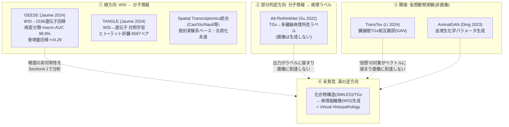
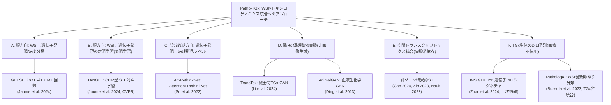

# 【調査レポート】Open TG-GATEsを活用したトキシコゲノミクス×毒性病理WSIマルチモーダルAI（Patho-TGx）の先行研究とベンチマーク調査

> **調査日**: 2026-08-19
> **担当Agent**: Claude (Research Agent)
> **ステータス**: 完了
> **タグ**: `#トキシコゲノミクス` `#OpenTGGATEs` `#マルチモーダル` `#VirtualPathology` `#GEESE` `#TANGLE`

---

## 📌 エグゼクティブサマリー

### 背景と目的
本調査は [PROP-03](../../../../proposals/backlog.md) として提案された、[01_toxicology_vs_clinical_pathology](../01_toxicology_vs_clinical_pathology/report.md) の「フロンティア5: トキシコゲノミクス統合 仮想病理」を深掘りするものです。世界最大級の公開トキシコゲノミクスデータベース「Open TG-GATEs」を用い、①組織形態（HE-WSI）から遺伝子発現・毒性パスウェイを予測する**順方向モデル**、②化合物構造やトキシコゲノミクスデータから病理組織像をシミュレーションする**逆方向モデル（Virtual Histopathology）**の到達点を、実在する一次文献にあたって検証しました。

### 主要な発見（Key Takeaways）
1. **順方向モデルは既に大規模実装済み — 報告書01の「未開拓」評価は部分的に更新が必要**: **GEESE**（Jaume et al. 2024, Mahmood Lab）は、Open TG-GATEsの**全156試験・10,234枚のWSI-遺伝子発現ペアという規模**で、HE-WSIから1,536遺伝子ターゲットの発現を予測するViTベースMILモデルを構築し、**6種類の肝病変分類でmacro-AUC 98.9%**という高精度を達成しています。ただし遺伝子発現「値」そのものの回帰精度は全遺伝子平均でPearson r=0.29と低く、「病変の有無を分類する」ことと「発現量を定量予測する」ことの精度には大きな乖離があります。
2. **逆方向モデル（化合物構造→仮想病理像生成）は依然として完全に未開拓**: PathologAI論文（Bussola et al. 2023, FDA NCTR）自身が将来構想として「ToxGANとの統合による遺伝子発現シグネチャの空間的マッピング」を明記していますが、2026年8月時点でこれを実装した後続論文は確認できませんでした。SMILES構造式や遺伝子発現ベクトルを直接の入力として病理組織像（WSIスケール）を生成する研究は、本調査で発見できた範囲では存在しません。
3. **「仮想毒性病理（Virtual Toxicopathology）」の先行例は"画像でない"レイヤーに集中**: TransTox（Li, Chen & Tong 2024, FDA NCTR）は臓器間（肝臓⇔腎臓）の遺伝子発現をGANで相互翻訳し、AnimalGAN（Ding et al. 2023, FDA NCTR）は血液生化学パラメータを生成します。いずれも「仮想動物実験」という思想の先行事例ですが、出力はベクトル（遺伝子発現・検査値）に留まり、病理組織**画像**は生成しません。
4. **独自発見: TANGLE（Jaume et al. 2024, CVPR）がフロンティア1とフロンティア5を意図せず橋渡し**: WSIと遺伝子発現をCLIP型対照学習でアライメントするTANGLEは、肝臓の事前学習データとして**ヒト（Homo sapiens）とラット（Rattus norvegicus）の両種、計6,597ペア**を用いています。毒性病理を明示的な応用先とはしていませんが、動物種横断アライメントと分子情報統合を同時に行う数少ない実例であり、PROP-01の既存レポートでは言及されていない接続点です。
5. **真の空間解像度でのWSI-オミクス対応付けは個別実験系に依存し、汎用AIモデル化は未成熟**: 空間トランスクリプトミクス（ST）を用いた前臨床毒性研究（Cao 2024, Xin 2023, Nault 2023等）はゾーン特異的な毒性応答の可視化に成功していますが、いずれも個別のST実験系（Visium, LCM等）に依存し、GEESE/TANGLEのような「HE画像単体から汎用的に発現を予測する」学習済みモデルとしては確立していません。

---

## 1. 背景・課題設定

### 1.1 Open TG-GATEsとは
[01_toxicology_vs_clinical_pathology](../01_toxicology_vs_clinical_pathology/report.md) で整理した通り、Open TG-GATEs（Igarashi et al. 2015）は170化合物についてラット（in vivo肝・腎、in vitro初代肝細胞）およびヒト初代肝細胞への曝露データを収録した世界最大級の公開トキシコゲノミクスデータベースです。生化学・血液学・病理組織所見・遺伝子発現マイクロアレイに加え、**病理組織のWSI画像自体も一部公開**されており、「HE染色組織像」と「遺伝子発現プロファイル」がペアで存在する希少なオープンデータという点が、Patho-TGx研究にとっての最大の価値です。

### 1.2 なぜ「順方向」と「逆方向」を分けて評価する必要があるか
報告書01のフロンティア5は、この双方向性を以下のように整理していました。
- **順方向**: 通常のHE染色WSIから、毒性バイオマーカー遺伝子発現（CYP誘導、Nrf2経路等）を予測する。
- **逆方向**: 化合物構造式（SMILES）や短時間の細胞アッセイ発現データから、将来誘発される病理組織像を高解像度画像としてシミュレーションする（Virtual Histopathology）。

この2方向は技術的難易度も応用インパクトも大きく異なります。順方向は「既存WSIに追加情報を付与する」回帰・分類タスクであるのに対し、逆方向は「まだ存在しない組織像を生成する」条件付き画像生成タスクであり、本調査ではこの区別を一貫して用いて先行研究を整理します。

### 1.3 従来の課題・限界点
- Open TG-GATEsの遺伝子発現データはバルクマイクロアレイであり、真の空間分解能を持たない。WSI側の局所病変とどう対応付けるかは統計的推定に依存する。
- 化合物数が170種と、疾患病理のTCGA（1万例以上）と比べて桁違いに少なく、化学構造空間のカバレッジが限定的。
- 順方向モデルの評価は「既知の病変ラベルとの相関」に留まりがちで、真に新規の分子機序を「発見」できているかの検証（in silico予測とin vitro/in vivo追加検証の突合）はまだ乏しい。

---

## 2. 主要技術動向・アプローチ分類

### 2.1 A. 順方向 — WSIから遺伝子発現・病変を予測する回帰/分類モデル
- **概要**: HE-WSIパッチを入力に、対応する遺伝子発現量またはカテゴリカルな病変ラベルを予測するMILモデル。
- **代表例**: **GEESE**（Jaume et al. 2024）— Open TG-GATEs全156試験・10,234 WSI-発現ペア（開発127試験/8,231枚、テスト29試験/2,002枚）でiBOT自己教師ありViTを事前学習し、MILで1,536遺伝子ターゲットの発現を回帰。6病変分類でmacro-AUC 98.9%。
- **メリット・強み**: 報告書01執筆時点（2026-08-18）で「未開拓」と評価されていたが、実際には**同時期に類似のTG-GATEs全量規模の実装が既に存在**しており、少なくとも「病変分類」レベルでは高精度が実証済み。
- **課題・制約**: 遺伝子発現「値」そのものの回帰精度（全遺伝子平均r=0.29）は低く、「病理医が既に区別できる病変を分子的に裏付ける」段階に留まる。新規の毒性機序を発見するというより、**既知知見の確認**に近い。単一臓器（肝臓）限定。

### 2.2 B. 順方向（表現学習）— WSIと遺伝子発現の対照学習によるアライメント
- **概要**: WSIエンコーダと遺伝子発現エンコーダをCLIP型の対照学習で共通潜在空間に整列させ、few-shot分類やスライド検索に活用する表現学習アプローチ。
- **代表例**: **TANGLE**（Jaume et al. 2024, CVPR Oral）— 肝臓（ヒト+ラット、n=6,597）・乳腺・肺で事前学習。教師ありベースラインを上回るfew-shot性能。
- **メリット・強み**: GEESEのような直接回帰と異なり、ラベル効率が高く、少量の毒性病理データでも転移しやすい可能性がある。**ヒト・ラット両種を同一の分子アライメント枠組みで扱っている点が、PROP-01（動物種横断基盤モデル）との自然な接続点**になる。
- **課題・制約**: 毒性病理を明示的な応用先として設計されておらず、ラット肝臓データの由来（TG-GATEs由来か等）は原論文からは確認できなかった。既存病変ラベルへのfew-shot分類は示されているが、GEESEのような発現量回帰やPatho-TGx特有の評価（用量反応との対応等）は行われていない。

### 2.3 C. 部分的逆方向 — 遺伝子発現から病理所見ラベルを予測するモデル
- **概要**: 化合物・用量・投与期間とトキシコゲノミクスデータを入力に、複数の病理所見をマルチラベルで予測する。
- **代表例**: Att-RethinkNet（Su et al. 2022）— Attention機構＋RethinkNet（ラベル相関を扱うメモリ構造）で肝臓・腎臓の複数所見を同時予測。
- **メリット・強み**: 従来の単一所見・単一臓器の二値分類を超え、所見間の相関を明示的にモデル化。
- **課題・制約**: **出力は病理所見の「カテゴリカルラベル」であり、組織像そのものは生成しない**。報告書01が構想する「仮想病理組織像のシミュレーション」とはアウトプットの粒度が根本的に異なる。

### 2.4 D. 隣接領域 — 画像を伴わない「仮想動物実験」系
- **概要**: WSIではなく、遺伝子発現や血液生化学パラメータをGANで生成することで、実験動物を用いずに毒性を推定する取り組み。FDA NCTR（Weida Tongグループ）の「AI4TOX」プログラム（AnimalGAN, SafetAI, BERTox, PathologAIの4本柱）が中心的に推進。
- **代表例**: TransTox（Li, Chen & Tong 2024）は肝臓⇔腎臓間の遺伝子発現を双方向GANで相互翻訳。AnimalGAN（Ding et al. 2023）は38種の血液生化学パラメータをGAN生成し、12種の従来QSAR手法を上回る精度でiDILIリスクを予測。
- **メリット・強み**: 「仮想動物実験」という設計思想はPROP-03の逆方向モデルと同じ方向を向いており、GAN学習・検証のノウハウは直接参考になる。
- **課題・制約**: 出力がベクトル（遺伝子発現・検査値）であり、**病理組織の空間構造（どの領域にどのような形態変化が生じるか）を一切表現しない**。Virtual Histopathologyへの拡張には、ベクトル生成から画像生成への根本的なアーキテクチャ転換が必要。

### 2.5 E. 空間トランスクリプトミクス（ST）統合 — 真の空間解像度だが実験系依存
- **概要**: HE組織像上に遺伝子発現を直接空間マッピングする実験技術（Visium, レーザーキャプチャマイクロダイセクション等）を用いた前臨床安全性研究。
- **代表例**: acetaminophen肝毒性のゾーン特異的転写変化（Cao et al. 2024）、虚血再灌流のpericentral脆弱性（Xin et al. 2023）、TCDD曝露の帯状構造再構築（Nault et al. 2023）、losartan腎糸球体応答（Onoda et al. 2022）等。
- **メリット・強み**: GEESE等のバルク発現回帰と異なり、**病変の局在（どの小葉帯域か等）まで直接対応付けられる**、真に空間的な検証が可能。
- **課題・制約**: 各研究は個別のST実験（コストが高く、多用量・多時点研究への適用は限定的）に依存しており、「学習済みモデルとしてHE画像単体から汎用的に空間発現を予測する」という汎用AIモデル化はまだ実現していない。前臨床種（げっ歯類等）へのST適用は、種特異的プローブ開発が追加で必要という障壁もある（Golfinos-Owens et al. 2026）。

### 2.6 F. トキシコゲノミクス単体のDILI予測（画像不使用、比較対象）
- **概要**: 遺伝子発現データのみからDILIリスクを予測するモデル群。画像を扱わないためPatho-TGxの直接的な先行研究ではないが、精度の参照値として有用。
- **代表例**: INSIGHT（Zhao et al. 2024、二次情報 — 原論文未到達）は24時間ラット肝臓トランスクリプトームから235遺伝子DILIシグネチャを定義し、AUC≈0.71。PathologAI（Bussola et al. 2023）はWSI単体（トキシコゲノミクス非統合）で自発性/治療関連壊死を弱教師あり分類。
- **示唆**: GEESEの病変分類（macro-AUC 98.9%）と比べ、遺伝子発現のみのDILI予測（AUC≈0.71）は精度が大きく劣る。**このギャップ自体が「画像とトキシコゲノミクスを統合する価値」を裏付ける定量的根拠**になり得る。

---

## 3. 主要論文・技術比較

| 手法/研究 | 発表年 | 方向性 | 入力 | 出力 | 主な定量結果 | リンク |
|:---|:---:|:---|:---|:---|:---|:---:|
| GEESE | 2024 | 順方向(回帰) | HE-WSIパッチ | 1,536遺伝子発現量 + 病変分類 | 病変分類macro-AUC 98.9% / 発現回帰r=0.29(平均) | [Paper](papers/index.md#paper-2) |
| TANGLE | 2024 | 順方向(表現学習) | HE-WSI + 遺伝子発現 | 共通潜在空間(few-shot分類用) | 教師ありベースライン超えのfew-shot性能 | [Paper](papers/index.md#paper-5) |
| PathologAI | 2023 | 順方向(画像単体) | HE-WSIパッチ | 壊死の自発性/治療関連 分類 | 外部検証82.5%(Control-F) | [Paper](papers/index.md#paper-3) |
| Att-RethinkNet | 2022 | 部分的逆方向 | TGx+化合物メタデータ | 多臓器病理所見ラベル(マルチラベル) | ラベル相関考慮で従来超え(定量値は原論文要確認) | [Paper](papers/index.md#paper-4) |
| TransTox | 2024 | 隣接(非画像) | 片臓器のTGx | もう一方の臓器のTGx(生成) | 実験データとの機序整合性を確認 | [Paper](papers/index.md#paper-6) |
| AnimalGAN | 2023 | 隣接(非画像) | 化合物構造等 | 38種血液生化学パラメータ | 従来QSAR12手法を上回る | [Paper](papers/index.md#paper-7) |
| 肝ゾーンST研究群 | 2022-2025 | 順方向(真の空間解像度) | HE + ST実験データ | ゾーン別遺伝子発現マップ | 個別研究ごとに定性的知見 | [Paper](papers/index.md#paper-9) |
| INSIGHT | 2024 | TGx単体(比較対象) | 24h肝臓トランスクリプトーム | DILIシグネチャ(235遺伝子) | AUC≈0.71(二次情報) | [Paper](papers/index.md#paper-10) |
| **(未発見)** Virtual Histopathology | - | **真の逆方向** | SMILES/化合物構造 | 病理組織像(WSI)生成 | - | - |

---

## 4. 詳細分析・技術的考察

### 4.1 「病変分類」と「発現量回帰」の精度非対称性が意味すること
GEESEの結果（病変分類macro-AUC 98.9% vs 発現量回帰r=0.29）は、単なる性能の高低ではなく、**Patho-TGxというタスクの本質的な難易度構造**を示しています。病変分類は「病理医が既にHE画像だけで下せる判断」を分子側からも裏付けるタスクであり、画像に強いシグナルが既に存在します。一方、遺伝子発現量の連続値回帰は「画像から直接読み取れない情報」を推定するタスクであり、本質的にはるかに難しい問題です。今後Patho-TGxの価値を主張する上では、**「病変分類の代替指標としてのTGx」ではなく「画像だけでは分からない毒性機序をTGxが追加的に明らかにする」ケース**を明示的に示す必要があります。

### 4.2 「逆方向モデルの不在」は偶然ではなく構造的な理由がある
本調査で逆方向モデル（化合物構造→病理像生成）が見つからなかったのは、探索不足ではなく以下の構造的な難しさによると考えられます。
1. **教師データの根本的な希少性**: ある化合物の「未投与時の状態」と「投与後の状態」のペア画像は、同一個体では原理的に取得不可能（1匹の動物は1回しか解剖できない）。フロンティア3（反事実的異常検知、[03_counterfactual_anomaly_detection](../03_counterfactual_anomaly_detection/report.md)）が対処する対照群ベースの反事実生成技術と本質的に同じ壁に直面する。
2. **出力空間の大きさ**: WSIはギガピクセル画像であり、遺伝子発現ベクトル（TransTox, AnimalGAN）や病理所見ラベル（Att-RethinkNet）を生成するよりも桁違いに高次元の生成タスクになる。
3. **評価の困難さ**: 生成された「仮想病理像」が生物学的に妥当かをどう検証するかという評価指標自体が確立していない。

### 4.3 TANGLEが示す「意図せざる統合」の可能性
TANGLE（2.2節）が肝臓の事前学習にヒトとラットの両種データを用いていた事実は、開発者がフロンティア1（動物種横断）とフロンティア5（トキシコゲノミクス統合）を意図的に統合したわけではなく、**「対照学習に十分なペア数を確保する」という別の動機から結果的に種を跨いだ**可能性が高いと考えられます（原論文に毒性病理応用の明記なし）。しかし、この副産物的な組み合わせは、両フロンティアが技術的に独立ではなく、**同じ基盤（大規模な画像-分子ペアデータでの対照学習）の上に統合しうる**ことを示す実例として、次期の研究提案（PROP-07以降）でも参照価値があります。

### 4.4 空間解像度のトレードオフ
現状の技術は「バルク発現をWSI全体から予測する（GEESE, TANGLE：スケーラブルだが空間分解能なし）」か「空間分解能を持つが個別実験系に依存する（ST研究群：高精度だがスケールしない）」かの二極に分かれています。この中間、すなわち**「HE画像単体から擬似的な空間発現マップを汎用的に予測する」**というGEESEが部分的に提示した方向性（"pseudo-spatial gene expression maps"）が、両者を橋渡しする最も現実的な次のステップと考えられますが、ST実データによる系統的な検証はまだ行われていません。

---

## 5. 今後の展望・オープンクエスチョン

### 未解決の学術・技術的課題
1. **逆方向モデル（Virtual Histopathology）の実現可能性**: PathologAI原著者が構想した「ToxGAN×PathologAI統合」を含め、化合物構造/TGxから病理組織像を生成する研究は本調査時点で不在。4.2で述べた教師データの構造的希少性をどう回避するか（反事実生成技術との統合、少数ショット生成モデル等）が鍵になる。
2. **発現量回帰精度の向上**: GEESEのr=0.29という全遺伝子平均精度をどう改善するか。上位100遺伝子でr=0.63という結果は、遺伝子選択・アンサンブル・より大規模な事前学習でさらに伸びる余地を示唆する。
3. **GEESEのpseudo-spatial mapの実証的検証**: WSI単体から生成された擬似空間発現マップが、実際のST実験データとどの程度一致するかの系統的な突合検証は、本調査では発見できなかった。
4. **多臓器・多化合物への拡張**: GEESE/TANGLEともに肝臓中心（TANGLEは乳腺・肺も含むが毒性病理文脈ではない）。腎臓・精巣・神経系等、報告書01が指摘する40〜50臓器スクリーニングへの拡張は未着手。
5. **INSIGHT等TGx単体モデルとの厳密な比較検証**: INSIGHT原論文に本調査では到達できず、AUC≈0.71という数値の検証条件（テストセット構成等）を一次資料で確認できていない。GEESEとの精度比較を厳密に行うには原論文の追加調査が必要。

---

## 6. 参考文献・関連リソース

### 主要論文・文献
- **Igarashi, Y., Nakatsu, N., Yamashita, T., et al.** (2015). "Open TG-GATEs: a large-scale toxicogenomics database." *Nucleic Acids Research*, 43(D1), D921–D927. [DOI:10.1093/nar/gku955](https://doi.org/10.1093/nar/gku955)
- **Jaume, G., Peeters, T., Song, A. H., et al.** (2024). "AI-driven Discovery of Morphomolecular Signatures in Toxicology." *bioRxiv*. [DOI:10.1101/2024.07.19.604355](https://www.biorxiv.org/content/10.1101/2024.07.19.604355) / [PMC11291055](https://pmc.ncbi.nlm.nih.gov/articles/PMC11291055/) / [PDF](papers/pdfs/2024_Jaume_GEESE.pdf)
- **Jaume, G., Oldenburg, L., Vaidya, A., Chen, R. J., Williamson, D. F. K., Peeters, T., Song, A., Mahmood, F.** (2024). "Transcriptomics-guided Slide Representation Learning in Computational Pathology." *CVPR 2024*. [arXiv:2405.11618](https://arxiv.org/abs/2405.11618) / [PDF](papers/pdfs/2024_Jaume_TANGLE.pdf)
- **Bussola, N., Xu, J., Wu, L., Gorini, L., Zhang, Y., Furlanello, C., Tong, W.** (2023). "A Weakly Supervised Deep Learning Framework for Whole Slide Classification to Facilitate Digital Pathology in Animal Study." *Chemical Research in Toxicology*, 36(8), 1321–1331. [DOI:10.1021/acs.chemrestox.3c00058](https://doi.org/10.1021/acs.chemrestox.3c00058) / [PMC10445282](https://pmc.ncbi.nlm.nih.gov/articles/PMC10445282/)
- **Su, R., Yang, H., Wei, L., Chen, S., Zou, Q.** (2022). "A multi-label learning model for predicting drug-induced pathology in multi-organ based on toxicogenomics data." *PLOS Computational Biology*, 18(9), e1010402. [DOI:10.1371/journal.pcbi.1010402](https://doi.org/10.1371/journal.pcbi.1010402) / [PDF](papers/pdfs/2022_Su_AttRethinkNet.pdf)
- **Li, T., Chen, X., Tong, W.** (2024). "Bridging organ transcriptomics for advancing multiple organ toxicity assessment with a generative AI approach." *npj Digital Medicine*, 7, 314. [DOI:10.1038/s41746-024-01317-z](https://doi.org/10.1038/s41746-024-01317-z) / [PDF](papers/pdfs/2024_Li_TransTox.pdf)
- **Ding, X., et al.** (2023). "A generative adversarial network model alternative to animal studies for clinical pathology assessment." *Nature Communications*, 14, 7040. [DOI:10.1038/s41467-023-42933-9](https://doi.org/10.1038/s41467-023-42933-9)
- **Bertolini, M., Le, V. K., Pencharz, J., Poehlmann, A., Clevert, D. A., Villalba, S., Montanari, F.** (2023). "From slides (through tiles) to pixels: an explainability framework for weakly supervised models in pre-clinical pathology." *arXiv preprint*. [arXiv:2302.01653](https://arxiv.org/abs/2302.01653)
- **Golfinos-Owens, et al.** (2026). "Mapping safety in space: the emerging role of spatial transcriptomics in safe drug development." *Frontiers in Toxicology*. [DOI:10.3389/ftox.2026.1817521](https://doi.org/10.3389/ftox.2026.1817521)
- **(著者未確認, 総説)** (2026). "Evolution of artificial intelligence and machine learning in DILI toxicogenomics: from descriptive profiling to mechanistic insights." *Frontiers in Pharmacology*. [DOI:10.3389/fphar.2026.1907884](https://doi.org/10.3389/fphar.2026.1907884)（本文中でGEESE・INSIGHTの二次情報源として参照）

### 関連リポジトリ・内部リンク
- 論文詳細サマリー: [papers/index.md](papers/index.md)
- 検索ログ・思考メモ: [notes/search_log.md](notes/search_log.md)
- 関連する過去の調査: [topics/2026/08/01_toxicology_vs_clinical_pathology/report.md](../01_toxicology_vs_clinical_pathology/report.md)
- 関連する反事実生成技術の調査: [topics/2026/08/03_counterfactual_anomaly_detection/report.md](../03_counterfactual_anomaly_detection/report.md)
