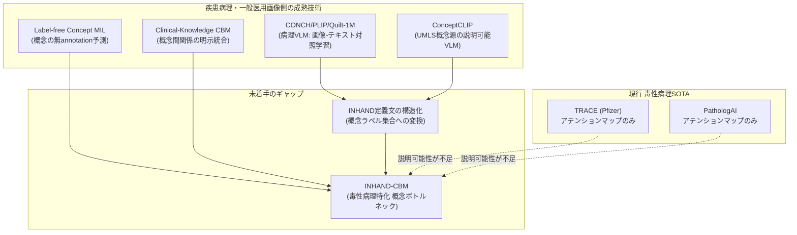
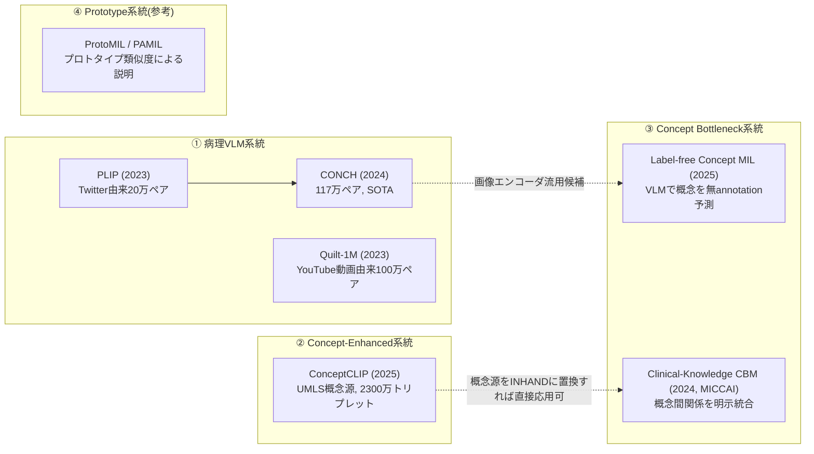
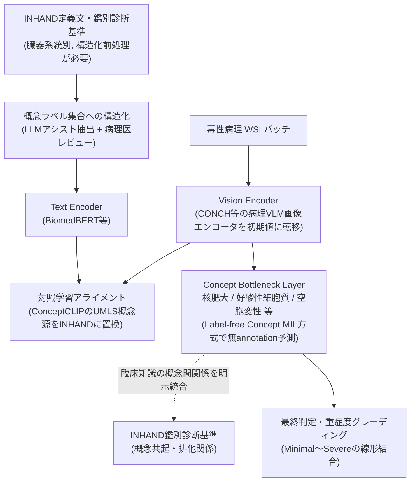

# 【調査レポート】INHAND国際オントロジー準拠のVision-Language基盤モデル＆Concept Bottleneck Model設計の先行事例調査

> **調査日**: 2026-08-19
> **担当Agent**: Claude (Research Agent)
> **ステータス**: 完了
> **タグ**: `#VisionLanguage` `#ConceptBottleneck` `#INHAND` `#説明可能AI` `#GLP規制` `#CONCH` `#ConceptCLIP`

---

## 📌 エグゼクティブサマリー

### 背景と目的
毒性病理AIがFDA/PMDA査察に耐えるためには、「肝細胞肥大 Grade 3」という最終判定だけでなく、「なぜそう判定したか」を病理医の所見積み上げプロセス（核肥大・好酸性細胞質化等）に沿って追跡可能にする必要があります。本調査は、疾患病理・一般医用画像分野で急速に成熟しているVision-Language基盤モデル（VLM）とConcept Bottleneck Model（CBM）の技術を、毒性病理の国際標準オントロジーINHAND（International Harmonization of Nomenclature and Diagnostic Criteria for Lesions in Rats and Mice）にどう適用できるかを、一次文献に基づき調査したものです。

### 主要な発見（Key Takeaways）
1. **「INHAND × VLM/CBM」の直接統合研究は現時点で不在**: 2026年8月時点の一次文献調査で、INHAND用語体系とVLM/CBMを明示的に組み合わせた研究は確認できませんでした。2025年発表の獣医病理NLP最新レビュー（Stimmer et al. 2025）自身が「獣医病理特化のNLP応用はほぼ未開拓」と明言しており、本フロンティアが真のホワイトスペースであることの強い状況証拠となっています。
2. **要素技術は疾患病理側で既に実用段階**: 概念を人手アノテーションなしにVLMで予測する解釈可能MIL（Label-free Concept MIL, Sun et al. 2025）、臨床知識を概念間関係として統合するCBM（Pang et al. 2024, MICCAI）、汎用医療オントロジー（UMLS）を概念源とする大規模事前学習（ConceptCLIP, Nie et al. 2025）が出揃っており、INHANDを概念源に差し替える形での転用は技術的に射程内です。
3. **現行の毒性病理SOTAモデルは精度が高い一方、説明可能性が手薄**: Pfizer TRACE、PathologAI（Bussola et al. 2023）はいずれも病理医合意に迫る精度を達成していますが、説明性はアテンションマップ/ヒートマップに留まり、概念レベルでの追跡可能性（Grade判定の根拠となる所見の内訳）は提供していません。
4. **課題の核心はモデリングよりデータエンジニアリング**: INHAND定義文は英語の自由記述であり、CONCH/ConceptCLIPのような対照学習にそのまま投入できる「画像-概念ペア」の形には整形されていません。最大のボトルネックは、INHANDの各病変定義文・鑑別診断基準を構造化された概念ラベル集合に変換する初期データ整備工程にあります。

---

## 1. INHANDとTox-VLM / CBMの技術的位置づけ

### 1.1 INHANDとは
INHAND（International Harmonization of Nomenclature and Diagnostic Criteria for Lesions in Rats and Mice）は、STP（Society of Toxicologic Pathology）を中心とする国際コンソーシアムが策定した、ラット・マウスの病変に関する統一用語・診断基準の体系です（Mann et al. 2012, *Toxicologic Pathology*）。臓器系統（肝・腎・心血管・内分泌・消化器等）ごとに、病変名・定義文・鑑別診断基準・5段階重症度（Minimal, Mild, Moderate, Marked, Severe）が規定されています。

### 1.2 Concept Bottleneck Model（CBM）の基本設計
CBMは、入力画像から直接最終ラベルを予測するのではなく、①画像 → 人間が理解可能な中間概念（核肥大、好酸性細胞質、脂肪滴沈着 等）を予測、②概念の線形結合 → 最終判定、という2段階構成を取ります。中間層の概念が病理医の実際の所見積み上げプロセスと一致すれば、「なぜGrade 3と判定したか」を概念スコアの内訳として提示でき、GLP監査でのトレーサビリティ要件と親和性が高い設計です。

### 1.3 なぜ疾患病理のVLM/CBMがそのまま使えないか
CONCH/PLIP等の疾患病理VLMはSNS・論文キャプション・教育動画由来の非構造化テキストで学習されており、概念語彙はWHO分類・腫瘍学用語に偏っています。毒性病理が必要とする「INHAND定義文に基づく構造化された鑑別診断基準テキスト」は全く異なる文書形式であり、対照学習のレシピをそのまま流用できるかは自明ではありません（本調査のコア問い1）。

---

## 2. 先行アプローチの分類

### 2.1 ① 病理VLM系統（画像-テキスト対照学習の基盤）
CONCH（Lu et al. 2024）はBRCAサブタイピングZero-shot精度91.3%でPLIP（50.7%）を大幅に上回り、現行最良の病理画像エンコーダです。Quilt-1M（Ikezogwo et al. 2023）はYouTube教育動画から音声認識・LLMを組み合わせ約100万ペアを自動構築しており、専門文書が乏しい毒性病理領域でも同種のデータ構築パイプラインが参考になります。

### 2.2 ② Concept-Enhanced系統（概念源としての医療オントロジー活用）
ConceptCLIP（Nie et al. 2025）はUMLS（Unified Medical Language System）由来の医療概念を概念源として2,300万件の画像-テキスト-概念トリプレットで事前学習しており、「汎用オントロジー→ドメイン特化オントロジー（INHAND）への置換」という本調査の核心的な設計方針に対する直接的なアーキテクチャ参照になります。

### 2.3 ③ Concept Bottleneck系統（本調査の中心技術）
Label-free Concept MIL（Sun et al. 2025）は、人手アノテーションなしにVLMでパッチから概念を予測し、WSIレベル予測を「Top-Kパッチの概念の線形結合」として構成する解釈可能MILで、Camelyon16/PANDAでAUC・Accuracy 0.9超を達成しています。Integrating Clinical Knowledge into CBM（Pang et al. 2024, MICCAI）は、データ駆動のみのCBMが分布外画像で臨床的に不自然な概念相関を学習する問題を指摘し、概念間の既知の関係（臨床知識）を明示的に統合する手法を提案しています。INHANDの鑑別診断基準（ある所見が別の所見と共起しやすい／排他的である、といった規則）はまさにこの「臨床知識」の形式で組み込める可能性があります。

### 2.4 ④ Prototype系統（参考: CBMの代替設計）
ProtoMIL・PAMILはスパースオートエンコーダやプロトタイプ類似度に基づく解釈手法で、CBMとは異なり固定の概念語彙を必要としない利点がありますが、その分「INHAND用語との対応付け」という規制対応上の要件は満たしにくく、本調査ではCBM系統を主軸候補とします。

---

## 3. 毒性病理SOTAモデルにおける説明可能性のギャップ

| モデル | 精度到達点 | 説明可能性の実装 | INHAND用語との対応 |
|:---|:---|:---|:---|
| **TRACE**（Pfizer, Bhattacharya et al. 2024） | 病理医合意を上回る一致度（157試験・4.6万スライド学習） | アテンションマップ・形態検索のみ | なし（明示的な概念層なし） |
| **PathologAI**（Bussola et al. 2023） | 制御群87%、投与群病変59〜83%の精度 | BiGAN潜在空間の可視化のみ | なし |
| **CONCH / ConceptCLIP等（疾患病理・一般医用側）** | 疾患病理タスクでSOTA | 概念ボトルネック・対照学習による説明性あり | INHAND非対応（WHO分類/UMLS概念のみ） |

いずれのSOTAモデルも「精度」か「INHAND準拠の説明可能性」のどちらか一方しか満たしておらず、両立させる実装は本調査時点で確認できませんでした。

---

## 4. 統合設計案：INHAND-CBM / Tox-VLM パイプライン

上記は既存の実装済み要素技術（Label-free Concept MIL、Clinical-Knowledge CBM、ConceptCLIP）を組み合わせたパイプライン仮説であり、実装・検証はまだどこにも存在しません。最大の未解決タスクは図中の「概念ラベル集合への構造化」工程で、INHANDの自由記述定義文を機械学習可能な概念ラベルへ変換する部分に人手（病理医レビュー）が残ります。

---

## 5. 実現難易度・データソース整理

| 要素技術 | 転用元 | 実現難易度 | 必要データ・リソース |
|:---|:---|:---:|:---|
| 画像エンコーダの転移 | CONCH, PLIP | 低 | 公開重みをそのまま初期値に利用可能 |
| INHAND定義文の構造化 | — (新規工程) | 中〜高 | INHAND原文（STP刊行物, 臓器系統ごとに分冊）、病理医レビュー工数 |
| 概念の無annotation予測 | Label-free Concept MIL | 中 | 動物WSI + 構造化された概念ラベル集合 |
| 概念間関係の明示統合 | Clinical-Knowledge CBM | 中 | INHAND鑑別診断基準からの関係抽出 |
| 概念源のドメイン特化事前学習 | ConceptCLIP | 高 | 大規模な動物病理画像-INHAND概念ペア（現状ほぼ皆無） |

---

## 6. 今後の展望・オープンクエスチョン

1. **INHAND定義文の構造化データセット化**: STP刊行物として分散しているINHAND各巻の定義文・鑑別診断基準を、機械可読な概念ラベル集合（概念名・上位/下位関係・共起/排他規則）に変換する標準的な方法論は未確立。LLMアシストによる抽出と病理医レビューを組み合わせたパイプラインの設計が最初の一歩になり得る。
2. **Zero/Few-shot設定でのINHAND概念予測の妥当性**: Label-free Concept MILのようにVLMで概念を無annotation予測する場合、ベースとなる画像エンコーダ（CONCH等）がヒト疾患病理データで学習されているため、動物毒性病理特有の所見（種特異的な正常構造との混同等）をどこまで正しく概念化できるかは未検証。
3. **概念ボトルネックの規制受容性**: CBMによる概念レベルの説明が実際にFDA/PMDA査察官にとって監査可能な粒度・形式であるかは、技術的検証だけでなく規制科学側の検討が必要（PROP-09「GLP規制環境下でのAIバリデーション」で扱う範囲と接続する）。

---

## 7. 参考文献・関連リソース

### 主要論文・文献
- **Mann, P. C., et al.** (2012). "International Harmonization of Toxicologic Pathology Nomenclature." *Toxicologic Pathology*, 40(4S), 7S–13S. [DOI:10.1177/0192623312438738](https://journals.sagepub.com/doi/full/10.1177/0192623312438738)
- **Lu, M. Y., et al.** (2024). "A visual-language foundation model for computational pathology." *Nature Medicine*, 30, 863–874. [arXiv:2307.12914](https://arxiv.org/abs/2307.12914)
- **Huang, Z., et al.** (2023). "A visual–language foundation model for pathology image analysis using medical Twitter." *Nature Medicine*, 29, 2307–2316.
- **Ikezogwo, W. O., et al.** (2023). "Quilt-1M: One Million Image-Text Pairs for Histopathology." *NeurIPS 2023 (Datasets and Benchmarks)*. [arXiv:2306.11207](https://arxiv.org/abs/2306.11207)
- **Sun, S., et al.** (2025). "Label-free Concept Based Multiple Instance Learning for Gigapixel Histopathology." [arXiv:2501.02922](https://arxiv.org/abs/2501.02922)
- **Pang, W., Ke, X., Tsutsui, S., Wen, B.** (2024). "Integrating Clinical Knowledge into Concept Bottleneck Models." *MICCAI 2024*, LNCS 15004. [arXiv:2407.06600](https://arxiv.org/abs/2407.06600)
- **Nie, Y., et al.** (2025). "An Explainable Biomedical Foundation Model via Large-Scale Concept-Enhanced Vision-Language Pre-training." [arXiv:2501.15579](https://arxiv.org/abs/2501.15579)
- **Bhattacharya, S., et al.** (2024). "Deep Learning-based Modeling for Preclinical Drug Safety Assessment." *bioRxiv*. [PMC11291027](https://pmc.ncbi.nlm.nih.gov/articles/PMC11291027/)
- **Bussola, N., Xu, J., Wu, L., Gorini, L., Zhang, Y., Furlanello, C., Tong, W.** (2023). "A Weakly Supervised Deep Learning Framework for Whole Slide Classification to Facilitate Digital Pathology in Animal Study." *Chemical Research in Toxicology*, 36(8), 1321–1331. [DOI:10.1021/acs.chemrestox.3c00058](https://pubs.acs.org/doi/10.1021/acs.chemrestox.3c00058)
- **Stimmer, L., et al.** (2025). "Natural language processing in veterinary pathology: A review." *Veterinary Pathology*, 62(6). [DOI:10.1177/03009858251347529](https://journals.sagepub.com/doi/10.1177/03009858251347529)

### 関連リポジトリ・内部リンク
- 論文詳細サマリー: [papers/index.md](papers/index.md)
- 検索ログ・思考メモ: [notes/search_log.md](notes/search_log.md)
