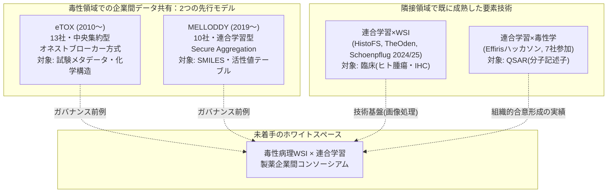
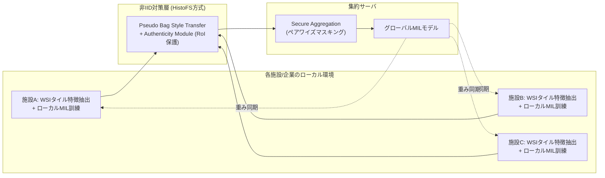

# 【調査レポート】MELLODDY型・製薬企業間連合学習コンソーシアムの毒性病理領域への応用可能性と実装障壁

> **調査日**: 2026-08-19  
> **担当Agent**: Claude (Research Agent)  
> **ステータス**: 完了  
> **タグ**: `#連合学習` `#MELLODDY` `#プライバシー保護` `#業界コンソーシアム` `#SecureAggregation` `#毒性病理`

---

## 📌 エグゼクティブサマリー

### 背景と目的
毒性病理WSIは製薬企業・CRO内で高度に機密化されており、1社単独では希少毒性所見（精巣毒性・神経毒性等）の学習データを十分に確保できません。創薬化学分野で実績のあるMELLODDY（Machine Learning Ledger of Open Drug Data）の連合学習アーキテクチャ・ガバナンスモデルを毒性病理WSIに適用する際の技術的・組織的障壁を、一次文献に基づき調査しました。

### 主要な発見（Key Takeaways）
1. **既存レポート（topics/01, フロンティア6）の記述に訂正が必要**: MELLODDYは「準同型暗号・差分プライバシー・Secure Aggregation」を組み合わせて採用したと記述されていたが、一次資料を確認した結果、**主機構はSecure Aggregation（SMPCベースのペアワイズマスキング）であり、準同型暗号は採用されていない**。両者を混同しないことが重要。
2. **「毒性病理WSI×連合学習」の直接実装例は2026年8月時点で一次文献上に存在しない**。ただし隣接する2領域——連合学習×WSI（臨床病理）と連合学習×毒性学（QSAR）——はそれぞれ独立に実績があり、本フロンティアの障壁は基盤技術の欠如ではなく「両者を組み合わせる最初の一歩」が踏み出されていないことにある。
3. Roche Diagnosticsは既に臨床病理領域（悪性黒色腫IHC画像）で連合学習WSI基盤の実運用検証を行っており（Schoenpflug et al. 2025）、同社が毒性病理AI（TRACE系）でも先行していることを踏まえると、技術的に最も近い位置にいるプレイヤーの一つと考えられる。
4. **バッチエフェクト（染色・スキャナ差異）を連合学習内で吸収する技術は既に存在する**（HistoFS, CVPR 2025；GANベース染色正規化で10%以上の性能改善）。ただし毒性病理では臨床病理にない追加軸——動物種差（ラット/マウス/イヌ/サル）——がスタイル変動に重畳するため、既存手法をそのまま適用できるかは未検証。
5. **準同型暗号のWSIスケールへの適用は依然として重い計算コストを伴う**（ハイブリッド方式でも通信量2,000倍削減と引き換えにサーバ計算コストが約15,621倍に増加）。MELLODDYの実績はこれを回避した設計（Secure Aggregation）だからこそ産業スケールで成立した可能性が高い。

---

## 1. MELLODDYアーキテクチャの正確な理解と既存レポートへの訂正

| 要素 | 内容 | 一次情報源 |
|:---|:---|:---|
| 参加組織 | 10製薬企業（Janssen, Amgen, AstraZeneca, Bayer, Boehringer Ingelheim, GSK, Merck, Novartis, Pfizer, Sanofi等）+ 学術機関・スタートアップ | Heyndrickx et al. 2023 |
| 基盤プラットフォーム | Substra（Owkin開発、後にLinux Foundation配下でOSS化） | Owkin公式発表 |
| 秘匿化の主機構 | **Secure Aggregation**（SMPCベースのペアワイズマスキング）。各参加者が自分の勾配をペアワイズ秘密でマスキングし、集約後の勾配のみがサーバから可視 | CrySyS Lab Blog 2021, Owkin公式 |
| 差分プライバシー | 標準的なDP-SGDのような明示的機構ではなく、マルチタスク学習構造自体が持つ暗黙的な防御として言及される程度 | Owkin公式 |
| 準同型暗号 | **不採用**。むしろ学術研究側（Correia et al. 2025等）で「MELLODDY型FLへの追加適用候補」として提案されている段階 | 本調査での複数ソース照合 |
| 対象データ | 2,700万化合物・4,000万活性値の**分子構造（SMILES）と活性値テーブル** | Heyndrickx et al. 2023 |
| 監査・ガバナンス | ブロックチェーン型分散台帳で各社の権限・実行ログを記録、中央権限者を置かない設計 | arXiv:2210.08871 |

**訂正の意味**: topics/01のフロンティア6は技術トレンドの見取り図としては妥当だが、「準同型暗号」はMELLODDYの実績技術ではなく将来の拡張候補と位置づけるのが正確です。毒性病理WSIへの応用を検討する際、まずMELLODDY実績通りのSecure Aggregationで設計し、暗号強化（準同型暗号併用）は計算コストとのトレードオフを見ながら段階的に検討するのが現実的な順序と考えられます。

---

## 2. 連合学習×WSI病理の現状（臨床領域が先行）

- **Schoenpflug et al. 2024**（システマティックレビュー、43件対象）: 染色・スキャナ差異が最大の課題。GANベース染色正規化で10%以上の性能改善を報告。DP/SMC併用時の性能低下は0.2〜6%と定量化。**前臨床・毒性病理への言及は皆無**。
- **Schoenpflug et al. 2025**（Roche Diagnostics/Zurich大/Basel大/ETH Zurich, 実運用ケーススタディ）: NVIDIA FLAREで悪性黒色腫IHC画像の連合学習を実装し、(1)統合モデルが必ずしも局所最適でない、(2)ギガピクセル画像で実験サイクル長期化、(3)病院/企業ネットワーク制限、(4)フレームワーク設定の複雑さ、という4つの実運用障壁を報告。**臨床（ヒト腫瘍）限定**。
- **HistoFS（Raswa et al., CVPR 2025）**: WSI内の複数形態構造を考慮したクライアント間スタイル転送＋RoI保護。3臨床データセットでSOTA。
- **TheOden（PubMed:42509385, 2026）**: 独3大学病院（エッセン・ケルン・ライプツィヒ）とダルムシュタットサーバ間で、リバースプロキシ方式によりファイアウォール越しの連合学習を実現。大腸癌・乳癌セグメンテーションでDice 0.75前後。
- **NVIDIA FLARE × Roche Digital Pathology**: WSI分類の内部シミュレーションを実施済み（詳細な定量結果は非公開）。

---

## 3. 連合学習×毒性学（QSAR）の現状

- **Effirisハッカソン（Chem. Res. Toxicol. 2023）**: Lhasa Limited開発の連合学習プラットフォーム「Effiris」を用い、Roche含む7製薬企業がSMILES構造式からのオンターゲット活性予測で参加。**製薬企業間の連合学習は毒性領域で既に組織的合意形成の実績がある**ことを示す最重要の間接的precedent。ただし画像ではなく分子記述子ベース。
- **eTOX（Cases et al. 2014, IJMS）**: IMI主導、13製薬企業が過去の毒性試験データ（4,000試験超）を「オネストブローカー」（Lhasa Limited）経由で段階的機密度別に共有する**中央集約型**モデル。MELLODDYより約9年早く、かつ非連合学習型のガバナンスで毒性領域のデータ共有が組織的に機能した実績。

両者はガバナンス設計が対照的（eTOX=中央集約＋信頼できる第三者、MELLODDY=非集約＋暗号的集約）であり、毒性病理WSIへの応用ではどちらのモデルを踏襲するかが技術選定以前の組織設計上の論点になります。

---

## 4. コア問い1: 暗号化技術のWSI連合学習への転用コスト

| 手法 | 精度への影響 | 通信コスト | 計算コスト | 出典 |
|:---|:---:|:---:|:---:|:---|
| Secure Aggregation (SMPC, MELLODDY実績) | 影響小（集約後のみ可視） | 中 | 低〜中 | Owkin, CrySyS 2021 |
| 差分プライバシー (DP-SGD) | ε≈1で大幅低下、ε≈10で許容範囲 | 低 | 低 | Radiology: AI 2025等 |
| フル準同型暗号 (FHE単独) | ほぼ影響なし | 高 | 極めて高 | Correia et al. 2025 |
| ハイブリッドHE (PASTA+BFV) | 精度97.6%（平文比-1.3%） | 帯域2,000倍削減 | サーバ側15,621倍増 | Correia et al. 2025 |

WSIパッチ特徴量（数万パッチ×数百〜数千次元の埋め込みベクトル）は、MELLODDYが扱った分子記述子（数千次元の固定長ベクトル）より遥かに大規模です。cross-silo FL（参加組織100未満、高いプライバシー要求、高い計算オーバーヘッド許容という設定）自体は製薬コンソーシアムの規模感（10社前後）と合致しますが、**準同型暗号をタイル特徴量の集約にそのまま適用するのは、現状の性能を踏まえると産業スケールでは非現実的**であり、MELLODDY実績通りのSecure Aggregationを基本線とすべきという結論が導かれます。

---

## 5. コア問い2: スキャナ・染色プロトコル差異（バッチエフェクト）の吸収

- HistoFSのPseudo Bag Style Transfer＋Authenticity Moduleは、臨床病理の施設間バッチエフェクトに対して有効性を実証済み。
- 毒性病理では、この染色・スキャナ差異に加えて**動物種差**（げっ歯類・イヌ・サル・ミニブタの組織形態差）という追加のドメインシフト軸が重畳します（[topics/02_cross_species_pathology_fm](../02_cross_species_pathology_fm/report.md)で扱った種間ドメインシフト問題と直交する形で連合学習の非IID性を悪化させる可能性）。
- 本調査の範囲では、「連合学習下でのマルチスピーシーズ・マルチスキャナのバッチエフェクトを同時に吸収する」手法の先行研究は確認できませんでした。HistoFS的スタイル転送を種特異的条件付けと組み合わせる拡張が技術的な出発点になり得ますが、これは未検証の外挿です。

---

## 6. フレームワーク比較

| フレームワーク | 強み | 弱み/留意点 | 出典 |
|:---|:---|:---|:---|
| **NVIDIA FLARE** | 本番運用スケーラビリティ最高評価。Rocheが病理WSIで内部実証済み | 設定の複雑さ（Schoenpflug 2025が課題として言及） | Gupta et al. 2025, NVIDIA |
| **Flower** | 研究・プロトタイピングの柔軟性 | 本番運用実績はFLAREに劣る | Gupta et al. 2025 |
| **Owkin Substra** | プライバシー・コンプライアンス機能に強み。MELLODDYの技術的後継でGLP監査ログとの親和性が期待できる | 病理WSI特化の実績は限定的 | Gupta et al. 2025 |
| **TheOden** | ファイアウォール越しの閉域網デプロイに特化 | 汎用MLフレームワークではなく病理WSI用途に特化した独自実装 | PubMed:42509385 |

---

## 7. 今後の展望・オープンクエスチョン

1. **多種族×多施設の複合バッチエフェクト**: 動物種差と施設間スキャナ差が連合学習の非IID性にどう複合的に影響するか、定量的な検証事例が皆無。
2. **ガバナンスモデルの選択**: WSIは分子記述子と異なり、まれな形態的特徴や付随メタデータから再識別・機密漏洩のリスクが相対的に高い可能性がある。eTOX型（中央集約＋信頼できる第三者）とMELLODDY型（非集約＋暗号的集約）のどちらが画像データに適するかは、技術選定以前の検討課題として残る。
3. **規制受容性**: GLP試験データを用いた連合学習モデルが、FDA/PMDA査察でどう扱われるか（各社ローカルデータの監査証跡と集約モデルの一貫性をどう両立するか）は未検討。PROP-09（GLP AIバリデーション）との接続が今後の課題。

---

## 8. 参考文献・関連リソース

### 主要論文・文献
- **Heyndrickx, W., et al.** (2023). "MELLODDY: Cross-pharma Federated Learning at Unprecedented Scale Unlocks Benefits in QSAR without Compromising Proprietary Information." *J. Chem. Inf. Model.*, 63(7), 1832–1839. [DOI:10.1021/acs.jcim.3c00799](https://pubs.acs.org/doi/10.1021/acs.jcim.3c00799)
- **MELLODDY Consortium** (2022). "Industry-Scale Orchestrated Federated Learning for Drug Discovery." [arXiv:2210.08871](https://arxiv.org/abs/2210.08871)
- **Schoenpflug, L. A., et al.** (2024). "A review on federated learning in computational pathology." *Computational and Structural Biotechnology Journal*. [DOI:10.1016/j.csbj.2024.10.037](https://pmc.ncbi.nlm.nih.gov/articles/PMC11584763/)
- **Schoenpflug, L. A., et al.** (2025). "Navigating real-world challenges: A case study on federated learning in computational pathology." *Journal of Pathology Informatics*. [DOI:10.1016/j.jpi.2025.100464](https://pmc.ncbi.nlm.nih.gov/articles/PMC12357140/)
- **Raswa, F. H., Lu, C.-S., Wang, J.-C.** (2025). "HistoFS: Non-IID Histopathologic Whole Slide Image Classification via Federated Style Transfer with RoI-Preserving." *CVPR 2025*. [Link](https://openaccess.thecvf.com/content/CVPR2025/html/Raswa_HistoFS_Non-IID_Histopathologic_Whole_Slide_Image_Classification_via_Federated_Style_CVPR_2025_paper.html)
- (2026). "Nationwide federated learning for histopathology: secure deployment across Germany behind firewalls." [PubMed:42509385](https://pubmed.ncbi.nlm.nih.gov/42509385/)
- **Bhattacharyya, S., et al.** (2023). "Federated Learning in Computational Toxicology: An Industrial Perspective on the Effiris Hackathon." *Chem. Res. Toxicol.*, 36(9), 1381–1390. [DOI:10.1021/acs.chemrestox.3c00137](https://pmc.ncbi.nlm.nih.gov/articles/PMC10523574/)
- **Correia, P., Silva, I., Amorim, I., Maia, E., Praça, I.** (2025). "Federated Learning: An approach with Hybrid Homomorphic Encryption." [arXiv:2509.03427](https://arxiv.org/abs/2509.03427)
- **Cases, M., et al.** (2014). "The eTOX Data-Sharing Project to Advance in Silico Drug-Induced Toxicity Prediction." *Int. J. Mol. Sci.*, 15(11), 21136–21154. [DOI:10.3390/ijms151121136](https://pmc.ncbi.nlm.nih.gov/articles/PMC4264217/)
- **Gupta, R., Chowdhury, A., Nalawade, S.** (2025). "Benchmarking Federated Learning Frameworks for Medical Imaging Deployment: NVIDIA FLARE, Flower, and Owkin Substra." [arXiv:2511.00037](https://arxiv.org/abs/2511.00037)
- CrySyS Lab (2021). "The MELLODDY Project from a Privacy Point of View." [Blog](https://blog.crysys.hu/2021/05/melloddy/)

### 関連リポジトリ・内部リンク
- 論文詳細サマリー: [papers/index.md](papers/index.md)
- 検索ログ・思考メモ: [notes/search_log.md](notes/search_log.md)
- 関連調査: [topics/2026/08/01_toxicology_vs_clinical_pathology](../01_toxicology_vs_clinical_pathology/report.md)（フロンティア6の初出、本レポートで一部訂正）, [topics/2026/08/02_cross_species_pathology_fm](../02_cross_species_pathology_fm/report.md)（種間ドメインシフト、5節で参照）
