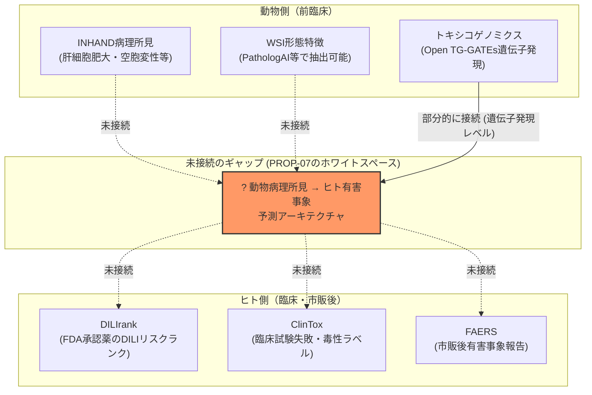
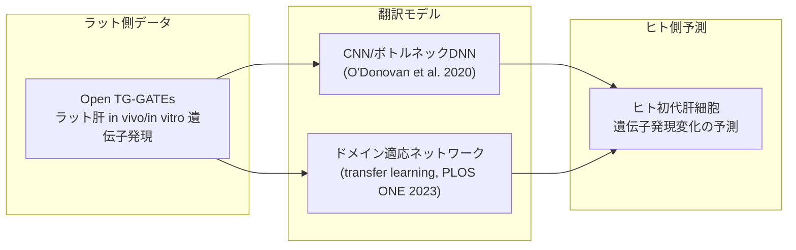
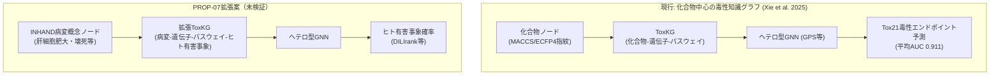

# 【調査レポート】動物毒性所見のヒト外挿性（Translational Toxicology）予測モデルの先行研究調査

> **調査日**: 2026-08-19  
> **担当Agent**: Claude (Research Agent)  
> **ステータス**: 完了  
> **タグ**: `#TranslationalToxicology` `#種差外挿` `#DILI` `#DILIrank` `#PathologAI` `#知識グラフ`

---

## 📌 エグゼクティブサマリー

### 背景と目的
本調査（topics/01）のオープンクエスチョン1「種差外挿の生物学的限界」で指摘した通り、PROP-01（動物種横断基盤モデル）は動物種間の形態を共通表現に落とし込む技術に留まり、「その動物病理所見が実際にヒトのどの有害事象（DILI、心毒性、腎毒性等）に対応するか」という創薬意思決定に直結する外挿性予測は射程外でした。本レポートでは、DILIrank・ClinTox・FAERS等の既存ヒト毒性知識ベースと動物病理所見を紐付ける先行研究を一次文献ベースで調査しました。

### 主要な発見（Key Takeaways）
1. **同一研究グループが両ピースを保有しながら未接続**: DILIrank（ヒトDILIリスクの参照データベース）の筆頭ラストオーサーWeida Tong（FDA/NCTR）は、PathologAI（ラット肝WSIの壊死弱教師あり分類システム）の著者にも名を連ねる。ヒト側ラベルと動物側WSI分類モデルが同じ研究室に存在するにもかかわらず、両者を接続する論文は本調査で発見できなかった——これが最も具体的で実行可能性の高い出発点。
2. **コア問いに最も近い定量結果は遺伝子発現ベース**: Kim/Park et al. 2025（POSTECH, eBioMedicine）の「遺伝子型-表現型差分（GPD）」モデルは、動物とヒトの遺伝子必須性・組織別発現・ネットワーク結合性の差分を特徴量化し、毒性起因の薬剤失敗予測AUROCを0.50→0.75に改善。ただし**入力はすべて遺伝子発現ネットワーク特徴であり、WSI形態情報は一切使用していない**。
3. **「動物病理WSI形態→ヒト臨床アウトカム」の直接統合研究は皆無**: 既存研究は(a) 動物・ヒト間の遺伝子発現翻訳（O'Donovan et al. 2020, Gardiner et al. 2020）、(b) 化学構造・知識グラフベースのヒト毒性予測（Xie et al. 2025）、(c) FAERS→前臨床オフターゲットの逆方向翻訳（Maciejewski et al. 2017）のいずれかに分類され、WSI形態情報を組み込んだ翻訳モデルは本調査の範囲で発見できなかった。
4. **アーキテクチャの有力候補は知識グラフ+GNN**: Xie et al. 2025のToxKG+GNN（化合物ノード×遺伝子×パスウェイのヘテロ型グラフ、GPSモデルでTox21平均AUC 0.911）は、化合物ノードをINHAND病変概念ノードに置換する形で、コア問い2のアーキテクチャ候補になり得る。
5. **規制動向が追い風になり得る**: FDA「動物試験削減ロードマップ」（2025年4月）により、限られた動物データの情報価値を最大化する外挿モデルへの規制的・実務的ニーズが今後高まる可能性がある。

---

## 1. 現状の到達点：ヒト側とアニマル側、それぞれの「片翼」

| リソース | 対象 | 内容 | 本調査での位置づけ |
|:---|:---|:---|:---|
| **DILIrank** (Chen et al. 2016) | ヒト | FDA承認薬1,036件（2.0版で1,336件）をDILIリスクでランク付け | ヒト側の「正解ラベル」として利用可能 |
| **ClinTox** (MoleculeNet) | ヒト | 承認薬/臨床試験失敗薬1,491件、毒性・FDA承認の2値ラベル | ヒト側ラベルの代替候補 |
| **FAERS** | ヒト | 870万件超の市販後有害事象報告（1997-2015時点） | 大規模だがノイズ・報告バイアスが大きい（Maciejewski 2017が定量化） |
| **PathologAI** (Bussola et al. 2023) | 動物 | Open TG-GATEs由来ラット肝WSI 816枚の壊死弱教師あり分類（FDA/NCTR AI4TOX） | 動物側WSI特徴抽出の実装例。**著者にDILIrank著者Weida Tongを含む** |
| **AnimalGAN** (FDA/NCTR AI4TOX) | 動物 | 生成AIによる仮想動物毒性データ生成 | 動物データ拡張の要素技術。ヒト外挿は非対象 |
| **TranslAI** (FDA/NCTR AI4TOX) | 橋渡し（構想） | 臓器システム・IVIVE・ゲノミクス横断の翻訳生成AIモデル開発を標榜 | **本テーマに最も近い公式ミッションだが、査読論文としての具体実装は2026年8月時点で未確認** |

**核心的な観察**: DILIrank（ヒト側ラベル）とPathologAI（動物側WSI分類）は同じFDA/NCTR研究グループ（Weida Tong）の成果でありながら、両者を接続する研究は存在しません。組織的には最も統合しやすい位置にあるにもかかわらず未着手という点で、PROP-07は「技術的な空白」であると同時に「組織的には最も実現しやすい空白」でもあります。

---

## 2. コア問い1：ヒト毒性知識ベースと動物WSI所見の対応付け

### 2.1 遺伝子発現レベルでの先行実装（WSIではなく参考アーキテクチャとして）

O'Donovan et al. (2020) は、ラット肝細胞in vitro遺伝子発現からヒト初代肝細胞の遺伝子発現変化を予測するCNN/ボトルネックDNNを構築し、古典的機械学習を上回る精度を実証しました。同様にGardiner et al. (2020) は逆方向（ヒトin vitro→ラットin vivo腎毒性）で、ガウス過程ベイズ回帰により不確実性を定量化しつつテストR²を0.021→0.418（次元削減併用で0.661）まで改善しています。

**これらはいずれも遺伝子発現ベクトル空間での翻訳であり、WSI形態情報（PathologAIが抽出するような病変パターン特徴）を翻訳対象に含めた研究は本調査では確認できませんでした。** WSI形態→遺伝子発現の順方向予測（PROP-03/Patho-TGxで扱ったGEESE等）と、遺伝子発現→ヒト表現型の翻訳（本節）を連結すれば、間接的に「WSI形態→ヒト毒性」のパイプラインを構築できる可能性がありますが、これは本調査で発見した先行研究を組み合わせた未検証の外挿的アイデアです。

### 2.2 データセット構築の実務的論点

INHAND所見（肝細胞肥大、単細胞壊死、好塩基化等の定性的グレーディング）を、DILIrank/ClinToxのような化合物単位のヒトラベルと対応付けるには、最低限以下の設計判断が必要になります。

| 論点 | 選択肢 | 関連する先行実装 |
|:---|:---|:---|
| 対応付けの粒度 | 化合物単位（DILIrank型） vs. 所見単位（INHAND個別病変） | DILIrankは化合物単位のみ。所見単位の対応付けは未着手 |
| 動物種の扱い | ラット単一種 vs. 複数種統合 | 本調査で発見した実装はすべてラット単一種（TG-GATEs由来） |
| 用量の扱い | 最高用量所見のみ vs. 用量反応曲線全体 | PROP-02（用量反応MIL）との接続が必要だが未検証 |
| ラベルノイズ対策 | FAERSの報告バイアス補正 | Maciejewski et al. 2017がFAERS側のバイアス定量化手法を提示（薬剤-成分マッピングで認識率81%→98%） |

---

## 3. コア問い2：動物病理所見からヒト有害事象を予測するモデルアーキテクチャ

### 3.1 知識グラフ+GNNアーキテクチャ（化学構造ベースからの転用候補）

Xie et al. (2025) のToxKG+GNNは、化合物ノードを中心に遺伝子・パスウェイとの関係をヘテロ型グラフとして学習し、Tox21の12毒性エンドポイントで平均AUC 0.911を達成しています。このアーキテクチャは化学構造情報のみを扱いますが、グラフのノード種別を「化合物」から「INHAND病変概念」に置き換え、エッジに「病変-パスウェイ」「パスウェイ-ヒト有害事象」の関係を追加する拡張が技術的には可能と考えられます。ただし、この拡張自体を検証した研究は本調査では発見できませんでした。

### 3.2 マルチモーダルLLM／知識グラフ埋め込みの適用可能性

本調査の範囲では、動物病理所見とヒト有害事象を直接結びつけるマルチモーダルLLMやグラフ埋め込みモデルの実装例は発見できませんでした。近縁領域として、PROP-05（INHAND準拠Tox-VLM/CBM）で扱うConcept Bottleneck Modelの「概念層」の出力（例: 核肥大スコア0.88、好酸性細胞質スコア0.92）を、そのままPROP-07の知識グラフのノード特徴量として利用する設計は、両提案の技術的接続点として有望ですが、これも未検証の統合案です。

### 3.3 QSAR・PK/PDモデルとの統合

創薬初期のQSAR（定量的構造活性相関）モデルは化学構造から直接毒性を予測しますが、動物試験で観察された実際の病理所見（表現型レベルの情報）を後から統合する仕組みは標準化されていません。Gardiner et al. (2020) のベイズ推論による不確実性定量化アプローチは、QSAR予測と動物毒性所見予測を「信頼度付きで」統合する設計の参考になりますが、これは分子記述子と遺伝子発現の統合であり、WSI形態情報の統合ではありません。

---

## 4. 技術アプローチ比較まとめ

| アプローチ | 入力データ | 翻訳方向 | WSI形態情報 | 代表研究 |
|:---|:---|:---:|:---:|:---|
| 遺伝子型-表現型差分(GPD) | 遺伝子ネットワーク特徴 | 動物↔ヒト（種差定量） | ✗ | Park/Kim et al. 2025 |
| 遺伝子発現翻訳(DL/CNN) | TG-GATEs遺伝子発現 | ラット→ヒト | ✗ | O'Donovan et al. 2020 |
| ベイズ推論統合 | ヒトL1000+化学構造 | ヒトin vitro→動物in vivo（逆） | ✗ | Gardiner et al. 2020 |
| 知識グラフ+GNN | 化学構造+KG | 化合物→ヒト毒性 | ✗ | Xie et al. 2025 |
| FAERS逆翻訳 | 市販後AEレポート | ヒト→前臨床オフターゲット（逆） | ✗ | Maciejewski et al. 2017 |
| WSI弱教師あり分類 | ラット肝WSI | 動物内（外挿なし） | ○（動物側のみ） | Bussola et al. 2023 (PathologAI) |
| **WSI形態→ヒト有害事象（PROP-07が埋めるべき空白）** | **WSI形態特徴** | **動物→ヒト** | **○（本調査では未発見）** | **（該当研究なし）** |

---

## 5. 今後の展望・オープンクエスチョン

1. **PathologAI×DILIrankの直接接続の実行可能性**: 同一研究グループ（Weida Tong, FDA/NCTR）がすでに両方のコンポーネントを保有しているため、技術的には最も着手しやすい統合先だが、査読論文としての実装報告は本調査時点で存在しない。今後の文献動向を継続的に追跡する価値がある。
2. **WSI形態→遺伝子発現→ヒト表現型の間接パイプライン**: PROP-03（Patho-TGx、GEESE等）とO'Donovan et al. (2020) のような遺伝子発現翻訳モデルを連結すれば、間接的にWSI形態からヒト毒性を推定できる可能性があるが、この連結自体は本調査で発見した先行研究には存在せず、未検証の複合パイプラインである。
3. **INHAND病変概念とヒト有害事象オントロジーのマッピング**: PROP-05（INHAND準拠Concept Bottleneck Model）の概念層出力を、DILIrank/ClinTox/FAERSのラベル体系とどう対応付けるかという語彙レベルのマッピング問題は、モデリング以前のデータエンジニアリング課題として未解決。
4. **FAERSのノイズ・報告バイアスの扱い**: Maciejewski et al. (2017) が定量化した報告バイアス（重複報告、症状と適応の混同等）を、動物→ヒト方向の外挿モデルの学習・評価にどう組み込むかは検討の余地がある。
5. **規制受容性**: 動物データのみに基づく外挿モデルの予測を、FDA/PMDAがGLP試験の代替・補完としてどこまで受容するかは、PROP-09（GLP AIバリデーション）と接続する未解決の論点。

---

## 6. 参考文献・関連リソース

### 主要論文・文献
- **Chen, M., Suzuki, A., Thakkar, S., Yu, K., Hu, C., Tong, W.** (2016). "DILIrank: the largest reference drug list ranked by the risk for developing drug-induced liver injury in humans." *Drug Discovery Today*, 21(4), 648–653. [DOI:10.1016/j.drudis.2016.02.015](https://doi.org/10.1016/j.drudis.2016.02.015)
- **Park, M., Song, W., Ahn, H., Kim, S.** (2025). "Drug toxicity prediction based on genotype-phenotype differences between preclinical models and humans." *eBioMedicine*. [Link](https://www.thelancet.com/journals/ebiom/article/PIIS2352-3964(25)00438-4/fulltext)
- **Puri, M.** (2020). "Automated Machine Learning Diagnostic Support System as a Computational Biomarker for Detecting Drug-Induced Liver Injury Patterns in Whole Slide Liver Pathology Images." *Assay and Drug Development Technologies*. [PubMed:31149832](https://pubmed.ncbi.nlm.nih.gov/31149832/)
- **Bussola, N., Xu, J., Wu, L., Gorini, L., Zhang, Y., Furlanello, C., Tong, W.** (2023). "A Weakly Supervised Deep Learning Framework for Whole Slide Classification to Facilitate Digital Pathology in Animal Study." *Chemical Research in Toxicology*, 36(8), 1321–1331. [DOI:10.1021/acs.chemrestox.3c00058](https://pubs.acs.org/doi/10.1021/acs.chemrestox.3c00058)
- **FDA/NCTR** (2024–2025). "AI4TOX Program — AnimalGAN, SafetAI, PathologAI, BERTox, TranslAI Initiatives." [FDA公式ページ](https://www.fda.gov/about-fda/nctr-research-focus-areas/artificial-intelligence)
- **Xie, J., Liu, W., Hu, W., Ouyang, M., Huang, T.** (2025). "Graph Neural Network-Based Toxicity Prediction by Integrating Molecular Fingerprints and Knowledge Graph Features." *Toxics*. [PMC12656225](https://pmc.ncbi.nlm.nih.gov/articles/PMC12656225/)
- **Maciejewski, M., Lounkine, E., Whitebread, S., Farmer, P., DuMouchel, W., Shoichet, B. K., Urban, L.** (2017). "Reverse translation of adverse event reports paves the way for de-risking preclinical off-targets." *eLife*. [PMC5548487](https://www.ncbi.nlm.nih.gov/pmc/articles/PMC5548487/)
- **Gardiner, L. J., Carrieri, A. P., Wilshaw, J., Checkley, S., Pyzer-Knapp, E. O., Krishna, R.** (2020). "Combining human cell line transcriptome analysis and Bayesian inference to build trustworthy machine learning models for prediction of animal toxicity in drug development." *Scientific Reports*. [PMC7293302](https://pmc.ncbi.nlm.nih.gov/articles/PMC7293302/)
- **O'Donovan, S. D., et al.** (2020). "Use of deep learning methods to translate drug-induced gene expression changes from rat to human primary hepatocytes." *PLOS ONE*, 15(8), e0236392. [DOI:10.1371/journal.pone.0236392](https://doi.org/10.1371/journal.pone.0236392)
- **Mehrvar, S., Himmel, L. E., Babburi, P., Goldberg, A. L., Guffroy, M., Janardhan, K., Krempley, A. L., Bawa, B.** (2021). "Deep Learning Approaches and Applications in Toxicologic Histopathology: Current Status and Future Perspectives." *Journal of Pathology Informatics*, 12:42. [PMC8609289](https://pmc.ncbi.nlm.nih.gov/articles/PMC8609289/)
- **FDA** (2025). "Roadmap to Reducing Animal Testing in Preclinical Safety Studies." [公式PDF](https://www.fda.gov/files/newsroom/published/roadmap_to_reducing_animal_testing_in_preclinical_safety_studies.pdf)

### 関連リポジトリ・内部リンク
- 論文詳細サマリー: [papers/index.md](papers/index.md)
- 検索ログ・思考メモ: [notes/search_log.md](notes/search_log.md)
- 関連調査: [topics/2026/08/01_toxicology_vs_clinical_pathology](../01_toxicology_vs_clinical_pathology/report.md)（オープンクエスチョン1の初出）, [topics/2026/08/05_patho_toxicogenomics](../05_patho_toxicogenomics/report.md)（WSI↔遺伝子発現翻訳との接続可能性）
