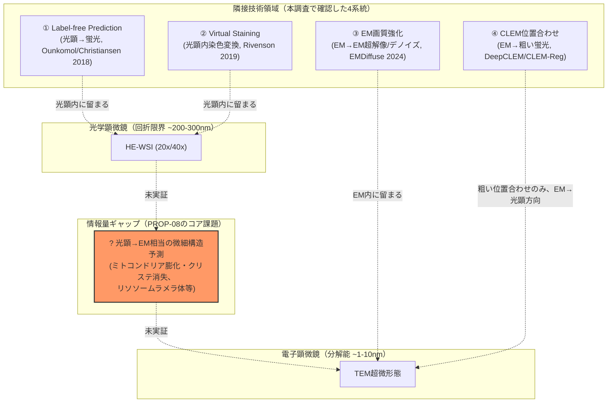
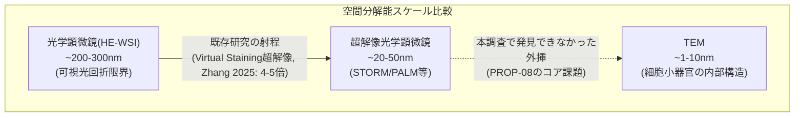
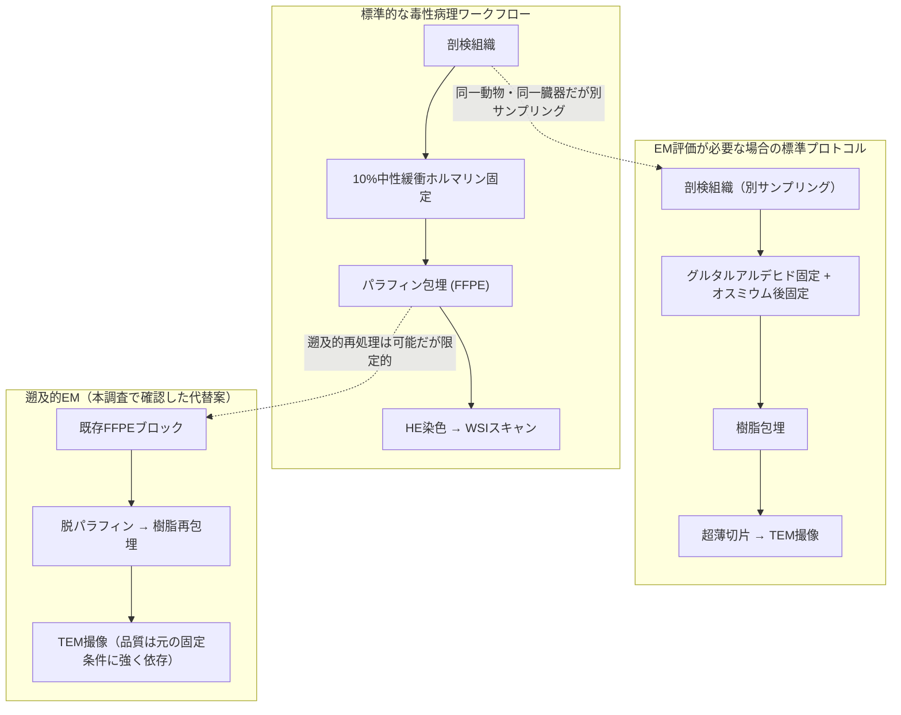

# 【調査レポート】光顕WSIからの微小構造推定（Virtual Ultrastructure / Sub-resolution Toxicity Inference）の実現可能性調査

> **調査日**: 2026-08-19  
> **担当Agent**: Claude (Research Agent)  
> **ステータス**: 完了  
> **タグ**: `#LabelFreePrediction` `#VirtualStaining` `#超解像` `#電子顕微鏡` `#ミトコンドリア毒性` `#CLEM`

---

## 📌 エグゼクティブサマリー

### 背景と目的
本調査（topics/01）のオープンクエスチョン2「微小毒性変化の検出限界」で指摘した通り、光顕HE染色WSI（20x/40x）の解像限界（約200〜300nm、可視光の回折限界）を超えるミトコンドリア変性・リソソーム内ラメラ体（薬剤性リン脂質症）等の微小毒性変化は、既存の全フロンティア（①〜⑥）・PROP-01〜07のいずれでも扱われていません。細胞生物学分野で実績のあるLabel-free Prediction（In Silico Labeling等）やVirtual Staining（HE↔IHC変換）技術、およびEM画質強化技術（EMDiffuse等）が、毒性病理の電顕（TEM）相当所見の推定にどこまで転用可能かを一次文献に基づき調査しました。

### 主要な発見（Key Takeaways）
1. **「HE-WSI→EM相当の微細構造」を直接予測する研究は、本調査の範囲では一件も発見できなかった**。存在するのはいずれも、(a) 光顕モダリティ間の変換（Label-free Prediction, Virtual Staining）、(b) EM画像同士の強化（EMDiffuse）、(c) CLEM位置合わせのための粗い相互予測（DeepCLEM, CLEM-Reg）のいずれかに分類され、光顕の回折限界を超えてEMスケールの情報を生成する研究は存在しない。
2. **方向性の非対称性が決定的**: CLEM研究（DeepCLEM）は「EM→蛍光」という情報量を削減する方向の粗い予測には成功しているが、その逆方向（光顕→EM、情報量を増やす方向）を試みた研究は見つからなかった。これは超解像研究の一般的傾向（失われた高周波成分の統計的補完はある程度可能だが、原理的に存在しない情報の創出には限界がある）とも整合する。
3. **要素技術としてのミトコンドリア予測自体は既に確立している**が粒度が全く異なる: Light My Cellsデータセット・チャレンジ（約57,000枚、8施設・30研究）は光顕からミトコンドリアの「存在・位置」を蛍光レベルで予測する基盤を持つが、これは毒性病理が必要とする「ミトコンドリア内部のクリステ変性・膨化」というEMレベルの微細形態変化とは全く異なる課題粒度である。
4. **EM画質強化技術（EMDiffuse）はPROP-08に直接転用できない**: EMDiffuseはあくまで「既に取得済みの（低品質な）EM画像」を強化する技術であり、入力は一貫してEM画像のみ。光顕からの生成という全く異なる問題設定には対応しない。
5. **教師データ収集に固有の制約**: 毒性病理の標準的な検体はホルマリン固定パラフィン包埋（FFPE）だが、標準的なTEM前処理（グルタルアルデヒド/オスミウム固定）とは異なる。FFPEブロックの遡及的EM再処理は可能だが品質は元の固定条件に強く依存し、公開されたHE-TEMペアデータセットも本調査では発見できなかった。
6. **産業的動機は実在する**: 薬剤性リン脂質症（cationic amphiphilic drug由来のリソソームラメラ体）はFDA・製薬業界が重視する毒性所見であり、TEMが診断的な形態学的指標として現に使われている（Anderson & Borlak 2006）。この既存の実運用ニーズが、PROP-08的アプローチの潜在的価値を裏付ける。

---

## 1. 隣接技術領域のランドスケープ：4つの系統に分類される既存研究

| 系統 | 入力→出力 | 代表研究 | 情報量の変化 | PROP-08との関係 |
|:---|:---|:---|:---:|:---|
| ① Label-free Prediction | 光顕(明視野) → 蛍光 | Ounkomol 2018, Christiansen 2018 | 光顕内（同スケール） | 「異なる撮像原理から生物構造を統計的に予測する」という枠組みは同型だが、EM解像度には遠く及ばない |
| ② Virtual Staining | 無染色/自家蛍光 → HE/IHC | Rivenson 2019, Kreiss 2023(レビュー), Zhang 2025(拡散モデル超解像) | 光顕内（同〜やや高スケール） | 染色プロセスの学習的置換という発想の出発点。解像度は光学的回折限界内 |
| ③ EM画質強化 | EM(低品質) → EM(高品質) | EMDiffuse (Lu/Chen 2024) | EM内（同スケール） | 入力が既にEMであるため、光顕からの外挿問題とは根本的に異なる |
| ④ CLEM位置合わせ | EM ⇄ 蛍光(粗い相互予測) | DeepCLEM (Seifert 2023), CLEM-Reg (Krentzel 2025) | 相互予測だが忠実度は低い（位置合わせ用途） | 唯一「異なる解像度スケール間」を扱うが、目的は生成ではなく幾何学的整合。方向はEM→光顕が主 |

**核心的な観察**: 4系統はいずれも「同一解像度スケール内での変換」か「位置合わせのための粗い相互予測」であり、「光顕スケール→EMスケールへの忠実な情報生成」という組み合わせは、本調査で発見した先行研究のどれにも該当しません。これは技術トレンドの見落としというより、情報理論的に困難な問題（回折限界以下の情報は原理的に光顕画像に存在しない）に対して、誰も本格的に取り組んでいないことを示唆します。

---

## 2. コア問い1：Label-free Prediction/Virtual Staining技術のEMスケールへの拡張可能性

### 2.1 解像度スケールの比較

Zhang et al. (2025) の拡散モデルベース超解像virtual stainingは、従来法比4〜5倍の超解像係数（空間帯域幅積16〜25倍）を達成していますが、これはあくまで光学顕微鏡スケール内での改善です。仮に4〜5倍を繰り返し適用できたとしても、200〜300nmの回折限界から1〜10nmのTEMスケールに到達するには理論上20〜300倍程度の分解能向上が必要であり、単純な超解像技術の延長線上にある課題ではないと考えられます（この定量比較は本調査独自の見積もりであり、この規模の外挿を直接検証した先行研究は発見できませんでした）。

### 2.2 EMDiffuseとDeepCLEMが示す「情報量の方向性」問題

EMDiffuseの3つの応用（デノイズ・超解像・等方化）は、いずれも**既にEMスケールの情報を含む画像**を入力として、失われた高周波成分やノイズを統計的に補完する問題です。一方PROP-08が求めるのは、**そもそもEMスケールの情報を一切含まない光顕画像**から、その情報を生成することです。これは「補完（interpolation/denoising）」と「創出（extrapolation across information regimes）」という質的に異なる問題であり、EMDiffuseの成功（デノイズで撮像時間18倍削減、超解像で36倍削減）を根拠にPROP-08の実現可能性を楽観視することはできません。

DeepCLEMの「EM→蛍光」予測は、この非対称性を象徴的に示しています。EM画像には蛍光チャネル情報を推定するための手がかり（構造的コンテクスト）が十分に含まれているため、粗い蛍光様信号の予測は位置合わせ用途には十分な精度で機能します。しかし、その逆方向（蛍光/光顕からEM相当の微細構造を予測）に取り組んだ研究は、本調査の範囲では確認できませんでした。

### 2.3 楽観的に評価できる部分：構造レベルの「存在検出」

Light My Cellsの実績（Liu et al. 2024）は、光顕画像から「ミトコンドリアがどこにあるか」を予測する問題は実用レベルに達していることを示しています。毒性病理が必要とするミトコンドリア毒性の一次スクリーニングが「変性ミトコンドリアの分布・密度の変化」といった粗い指標で足りるのであれば、既存のLabel-free Prediction技術の延長線上で一定の価値を持つ可能性があります。ただし、これは「クリステの膨化・消失」「マトリックス濃度変化」といった診断的に重要なEMレベルの詳細とは区別する必要があります。

---

## 3. コア問い2：TEM-HE-WSIペア収集・空間アライメントの設計

### 3.1 データ収集における毒性病理特有の制約

毒性病理の標準ワークフローでは、HE-WSI用の検体はホルマリン固定・パラフィン包埋（FFPE）される一方、TEM用の検体はグルタルアルデヒド固定・樹脂包埋という全く異なる前処理を要します。これは臨床病理・細胞生物学領域のCLEM研究（同一切片を光顕→EMで連続撮像できる設計）とは異なり、**毒性病理では「同一切片」でのペアリングが標準プロトコル上そもそも困難**であることを意味します。

本調査で確認した限り、既存FFPEブロックを脱パラフィン・再包埋してTEM評価する遡及的手法は存在しますが、品質が元の固定条件に強く依存するという制約があります。また、公開されているHE-TEMペア画像データセット（毒性病理に限らず一般病理でも）は本調査の範囲では発見できませんでした。

### 3.2 実現可能な設計案（本調査からの示唆、未検証）

- **プロスペクティブ設計**: 新規毒性試験において、標準HE用サンプリングに加え、隣接する組織ブロックからTEM用検体を意図的に追加サンプリングし、解剖学的に近接した領域同士でペアを構成する（同一細胞レベルの厳密な対応ではなく、近傍組織学的対応に留まる）。
- **CLEM技術の転用**: DeepCLEM/CLEM-Regが確立した位置合わせ技術は、毒性病理検体でも「同一切片でなくても近傍切片同士を粗くアライメントする」用途には応用可能と考えられるが、毒性病理検体（FFPE由来）への適用例は本調査では確認できなかった。
- **遡及的パイロットデータセット**: 薬剤性リン脂質症のように、EM所見が既に規制上重要とされている限られた毒性所見（Anderson & Borlak 2006）から着手し、既存のアーカイブ検体（EM実施済みの既存試験）を横断的に収集することが、ゼロからのプロスペクティブ収集より現実的な出発点になり得る。

---

## 4. 技術アプローチ比較まとめ

| アプローチ | 入力 | 出力 | 情報量の方向 | 忠実度 | PROP-08への転用可能性 |
|:---|:---|:---|:---:|:---:|:---|
| Label-free Prediction (Ounkomol/Christiansen 2018) | 明視野zスタック | 蛍光ラベル | 光顕内 | 高（定量検証済み） | 枠組みのみ参考。スケール不足 |
| Virtual Staining超解像 (Zhang 2025) | 無染色組織 | 高解像度仮想染色 | 光顕内（超解像込み） | 高 | 4-5倍の超解像では回折限界を超えられない |
| EMDiffuse (Lu/Chen 2024) | 低品質EM | 高品質EM | EM内 | 高 | 転用不可（入力が既にEM） |
| DeepCLEM/CLEM-Reg | EM ⇄ 蛍光 | 位置合わせ用信号 | 相互（主にEM→光顕、粗い） | 低（位置合わせ用途のみ） | アライメント技術としてのみ参考になりうる |
| Light My Cells (Liu 2024) | 明視野 | ミトコンドリア等の蛍光位置 | 光顕内 | 中〜高 | 「存在検出」の粒度でのみ参考 |
| **HE-WSI → TEM相当微細構造（PROP-08）** | **光顕HE-WSI** | **EM相当微細構造** | **光顕→EM（本調査では前例なし）** | **不明** | **該当研究なし** |

---

## 5. 今後の展望・オープンクエスチョン

1. **情報理論的な実現可能性の検証**: 回折限界を超えた情報を「創出」することの原理的な妥当性（単なる統計的にもっともらしいテクスチャの生成であり、個体固有の実際のミトコンドリア形態を反映しない可能性）をどう扱うか。診断用途に耐えうるのか、それとも粗いスクリーニング指標としての位置づけに留めるべきかは未解決。
2. **毒性病理特有のCLEM/データ収集プロトコルの確立**: FFPE標準ワークフローと矛盾しない形で、毒性試験にHE-TEMペアサンプリングを組み込む実務プロトコルの設計は、本調査では先行研究を発見できなかった空白領域。
3. **「存在検出」から「形態変化定量」への橋渡し**: Light My Cells的な「構造の存在検出」技術と、EM診断で要求される「クリステ膨化・ラメラ体形成」等の定量的形態変化検出との間のギャップをどう埋めるか。
4. **代替アプローチとしての非光学モダリティの検討**: 本調査の範囲外ではあるが、ラマン分光・赤外分光・原子間力顕微鏡等、光の回折限界に縛られない他のモダリティを補助的に組み込む設計も、光顕WSI単独での外挿よりも現実的な可能性として今後検討の余地がある。

---

## 6. 参考文献・関連リソース

### 主要論文・文献
- **Ounkomol, C., Seshamani, S., Maleckar, M. M., Collman, F., Johnson, G. R.** (2018). "Label-free prediction of three-dimensional fluorescence images from transmitted-light microscopy." *Nature Methods*, 15, 917–920. [DOI:10.1038/s41592-018-0111-2](https://doi.org/10.1038/s41592-018-0111-2)
- **Christiansen, E. M., Yang, S. J., Ando, D. M., et al.** (2018). "In Silico Labeling: Predicting Fluorescent Labels in Unlabeled Images." *Cell*, 173(3), 792–803. [DOI:10.1016/j.cell.2018.03.040](https://doi.org/10.1016/j.cell.2018.03.040)
- **Rivenson, Y., Wang, H., Wei, Z., et al.** (2019). "Virtual histological staining of unlabelled tissue-autofluorescence images via deep learning." *Nature Biomedical Engineering*, 3(6), 466–477. [DOI:10.1038/s41551-019-0362-y](https://doi.org/10.1038/s41551-019-0362-y)
- **Kreiss, L., Jiang, S., Li, X., et al.** (2023). "Digital staining in optical microscopy using deep learning — a review." [arXiv:2303.08140](https://arxiv.org/abs/2303.08140)
- **Zhang, Y., Huang, L., Pillar, N., Li, Y., Chen, H., Ozcan, A.** (2025). "Pixel super-resolved virtual staining of label-free tissue using diffusion models." [arXiv:2410.20073](https://arxiv.org/abs/2410.20073)
- **Lu, C., Chen, K., Qiu, H., Chen, X., Chen, G., Qi, X., Jiang, H.** (2024). "Diffusion-based deep learning method for augmenting ultrastructural imaging and volume electron microscopy." *Nature Communications*, 15, 4677. [DOI:10.1038/s41467-024-49125-z](https://doi.org/10.1038/s41467-024-49125-z)
- **Seifert, R., Markert, S. M., Britz, S., Perschin, V., Erbacher, C., Stigloher, C., Kollmannsberger, P.** (2023). "DeepCLEM: automated registration for correlative light and electron microscopy using deep learning." *F1000Research*, 9:1275. [DOI:10.12688/f1000research.27158.3](https://doi.org/10.12688/f1000research.27158.3)
- **Krentzel, D., Elphick, M., Domart, M.-C., et al.** (2025). "CLEM-Reg: an automated point cloud-based registration algorithm for volume correlative light and electron microscopy." *Nature Methods*, 22(9), 1923–1934. [DOI:10.1038/s41592-025-02794-0](https://doi.org/10.1038/s41592-025-02794-0)
- **Liu, H., Li, H., Wang, J., Fan, Y., Xu, Z., Oguz, I.** (2024). "Predicting fluorescent labels in label-free microscopy images with pix2pix and adaptive loss in Light My Cells challenge." [arXiv:2406.15716](https://arxiv.org/abs/2406.15716)
- **Anderson, N., Borlak, J.** (2006). "Drug-induced phospholipidosis." *FEBS Letters*, 580(23), 5533–5540. [DOI:10.1016/j.febslet.2006.08.061](https://doi.org/10.1016/j.febslet.2006.08.061)

### 関連リポジトリ・内部リンク
- 論文詳細サマリー: [papers/index.md](papers/index.md)
- 検索ログ・思考メモ: [notes/search_log.md](notes/search_log.md)
- 関連調査: [topics/2026/08/01_toxicology_vs_clinical_pathology](../01_toxicology_vs_clinical_pathology/report.md)（オープンクエスチョン2の初出）
