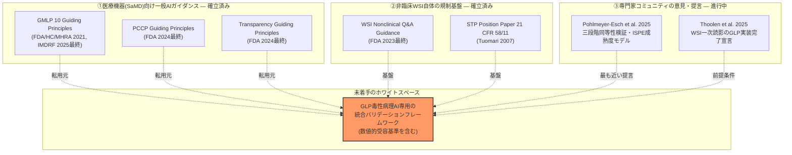
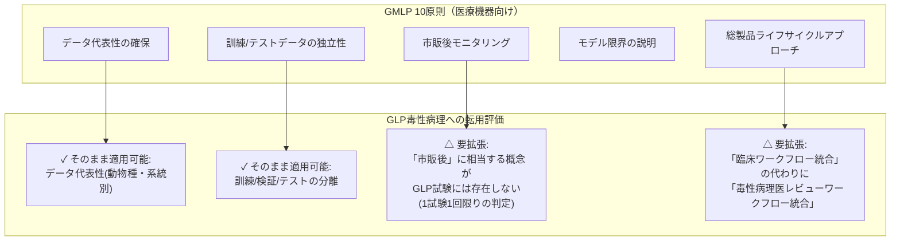
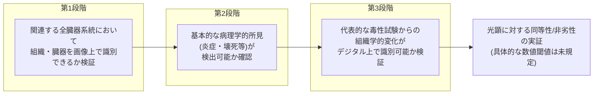

# 【調査レポート】GLP規制環境下でのAIバリデーション・信頼性保証フレームワーク（Good Machine Learning Practice for GLP Toxicologic Pathology）調査

> **調査日**: 2026-08-19  
> **担当Agent**: Claude (Research Agent)  
> **ステータス**: 完了  
> **タグ**: `#GLP` `#GoodMachineLearningPractice` `#FDA` `#PMDA` `#規制科学` `#21CFRPart11`

---

## 📌 エグゼクティブサマリー

### 背景と目的
PROP-01〜08はいずれもモデル・アーキテクチャ面の技術調査でしたが、本調査（topics/01）の4.2節・7章で指摘した通り、AIによる「陰性除外（Normal Triage）」を正式なGLP安全性試験プロセスとして規制当局に受容させるための客観的バリデーション基準は未確立のままです。技術が完成しても採用障壁を越えられなければ実用化しないため、本レポートでは規制科学（Regulatory Science）側からのギャップを一次資料に基づき独立に深掘りしました。

### 主要な発見（Key Takeaways）
1. **GLP毒性病理AI専用のFDA/PMDA/EMAガイダンスは2026年8月時点で存在しない**。ただし基盤となる3層——①医療機器（SaMD）向け一般AIガイダンス（GMLP・PCCP・透明性指導原則）、②非臨床WSI自体の規制基盤（FDA 2023年最終ガイダンス、STP 2007年ポジションペーパー）、③専門家コミュニティの意見論文（Pohlmeyer-Esch 2025, Thoolen 2025）——はいずれも既に確立しており、これらを統合してGLP毒性病理AI専用のフレームワークに仕立てる作業そのものが未着手というのが実態です。
2. **Pohlmeyer-Esch et al. (2025)** が提示する「三段階同等性検証アプローチ」とISPEの6段階AIバリデーション成熟度モデルが、コア問い2（バリデーションプロトコル設計）に対する現時点で最も具体的な出発点です。ただし要求されているのは「光顕に対する同等性・非劣性」の実証のみで、感度/特異度/NPVの具体的な数値的受容基準（閾値）を定めた一次文献は本調査では確認できませんでした。
3. **PCCP（Predetermined Change Control Plan）**は、AIモデルの継続的更新を都度の再承認なしに実施できる規制ツールとして2024年にFDAが最終化しており、GLP試験でのAIモデルのバージョン管理・変更管理・監査証跡設計の参考枠組みになり得ますが、GLP毒性病理文脈への適用を論じた文献は発見できませんでした。
4. **PMDA（日本）はGLP毒性病理AIに特化したガイダンスを公表していません**。一般的なプログラム医療機器（AI搭載SaMD）審査の枠組みに留まり、非臨床安全性試験のAIトリアージという文脈固有の規定はありません。
5. **「AIによる陰性除外（Normal Triage）」に特化した具体的な感度/NPV受容基準を定めた規制文書・論文は、本調査の範囲では一件も確認できませんでした**——これが最も具体的で未解決なホワイトスペースです。
6. WSI自体のGLP実装（AI以前の段階）は既に「到達済み」と評価する意見論文（Thoolen et al. 2025）が2025年に発表されており、AIバリデーション議論の前提となるデータ基盤の規制受容は着実に進んでいます。

---

## 1. 規制ガイダンスの3層構造

| 層 | 対象 | 代表文書 | 発行元・年 | GLP毒性病理への適用状況 |
|:---|:---|:---|:---|:---|
| ① 医療機器(SaMD)向け一般AIガイダンス | 市販後のAI/ML搭載医療機器全般 | GMLP 10 Guiding Principles | FDA/HC/MHRA 2021、IMDRF 2025最終 | 前臨床・GLP試験は対象外（臨床応用のSaMDが主眼） |
| ① 同上 | AIモデルの反復更新の事前承認 | PCCP Guiding Principles / Marketing Submission Recommendations | FDA 2024最終 | GLP試験のAIツール更新管理への転用は未検討 |
| ① 同上 | AI/MLモデルの透明性開示要件 | Transparency for ML-Enabled Medical Devices | FDA 2024最終 | 同上 |
| ① 同上 | 医薬品開発全体でのAI利用の信頼性評価 | Considerations for the Use of AI... (ドラフト) | FDA 2025年1月ドラフト | 非臨床データも対象範囲に含むが病理画像AI個別言及なし |
| ① 同上 | 医薬品ライフサイクル全体でのAI利用 | Reflection Paper on the Use of AI | EMA 2024年9月最終 | 動物試験段階も対象範囲だが病理画像AI個別言及なし |
| ② 非臨床WSI規制基盤 | GLP試験でのWSI使用そのもの | Use of WSI in Nonclinical Toxicology Studies Q&A | FDA 2023年5月最終 | **GLP・非臨床特化の数少ない確定ガイダンス。ただしAI自体は対象外** |
| ② 同上 | 病理画像データの生データ該当性・21 CFR 58/11準拠 | STP Position Paper on Pathology Image Data | Tuomari et al. 2007 | AI以前の基礎文書。監査証跡設計の出発点 |
| ③ 専門家意見 | GLP毒性病理AIの現状・課題の包括整理 | Digital Pathology and AI Applied to Nonclinical Toxicology Pathology | Pohlmeyer-Esch et al. 2025 | **本調査の中核文献。「専用ガイダンス不在」を明言** |
| ③ 同上 | WSI一次読影のGLP実装完了宣言 | Toxicologic Pathology Forum: ...Yes, We Are There! | Thoolen et al. 2025 | AIバリデーション議論の前提となるデータ基盤の成熟を示す |

**核心的な観察**: 3層はいずれも単独では存在するが、「GLP毒性病理AIのトリアージ判定を、①の指導原則と②の非臨床規制基盤を統合し、③が示す検証手法で具体的な数値基準まで落とし込む」という統合作業を行った文献は、本調査の範囲では確認できませんでした。

---

## 2. コア問い1：GMLP/PCCPのGLP前臨床試験への転用可能性

### 2.1 GMLP 10 Guiding Principlesの転用評価

GMLPの10原則のうち、データ管理・モデル訓練の実践（過学習回避、ハイパーパラメータ文書化）に関わる原則は、GLP毒性病理AIにもそのまま適用可能と考えられます。一方、「市販後モニタリング（Post-Deployment Monitoring）」という概念は、継続的に患者にケアを提供する臨床SaMDを前提としており、単一のGLP試験内で完結するAIトリアージにはそのままの形では当てはまりません。GLP試験特有の対応としては、「試験×試験」を跨いだモデル性能のドリフト監視（同一AIツールを複数の毒性試験に反復使用する際の一貫性検証）という形に読み替える必要があると考えられますが、この読み替え自体を論じた文献は本調査では見つかりませんでした。

### 2.2 PCCPのGLP試験への適用可能性

PCCP（2024年FDA最終ガイダンス）は、AIモデルの「意図された使用の範囲内での」反復更新をあらかじめ承認された変更管理計画の枠内で行える仕組みです。GLP毒性病理AIへの転用を考える場合、以下のような読み替えが技術的には可能と推測されますが、これは本調査独自の外挿であり、検証した先行研究は発見できていません。

| PCCPの構成要素（SaMD向け） | GLP毒性病理AIへの読み替え案（未検証） |
|:---|:---|
| 計画される変更内容の記述 | 新規動物種・系統・臓器への適用範囲拡大の事前記述 |
| 変更の開発・検証・実装方法論 | モデル再訓練時の検証データセット（既存試験のアーカイブスライド）の指定 |
| 変更の影響評価 | 陰性除外の感度/NPVが既存モデルから逸脱しないことの確認手順 |

### 2.3 Transparency Guiding Principlesとの接続

Transparency for ML-Enabled Medical Devices（2024年FDA最終）が求める「意図された使用・学習データ・既知の限界の開示」は、PROP-05（INHAND準拠Tox-VLM/CBM）が目指すConcept Bottleneck Modelの説明可能性設計と直接的に整合します。GLP監査（Audit）において、AIが「なぜこのスライドを正常と判定したか」を追跡可能にする要件は、透明性指導原則とGLP Part 11監査証跡要件の両方を同時に満たす設計として、PROP-05との統合が今後の検討課題になり得ます。

---

## 3. コア問い2：陰性除外バリデーションプロトコルの設計

### 3.1 Pohlmeyer-Esch et al. (2025) の三段階同等性検証アプローチ

この三段階アプローチはWSI一般（AI以前）の妥当性検証を念頭に設計されたものですが、AIモデルの陰性除外判定に拡張する場合、各段階で「AIが見逃した所見」を体系的に評価する枠組みとして転用できる可能性があります。ただし、Pohlmeyer-Esch et al. (2025) 自身も指摘する通り、要求されるのは「光顕との同等性・非劣性」という定性的な基準であり、具体的な感度・特異度・NPVの数値閾値は業界でもまだ定まっていません。

### 3.2 ISPE AIバリデーション成熟度モデル（6段階）

Pohlmeyer-Esch et al. (2025) が紹介するISPE（2022年4月）のモデルは、AIシステムの自律性とコントロール設計に基づき6段階（レベルI：情報提供のみで検証不要 〜 レベルVI：自律学習・検証概念は開発中）を定義しています。GLP毒性病理AIの「陰性除外トリアージ」は、病理医が最終判断を下す限り、比較的低いレベル（人間がAI出力を確認して承認する段階）に位置づけられ、レベルVI（完全自律学習）には現時点で該当しないと考えられます。この段階付けの考え方自体は、GLP文脈でのバリデーション要求レベルを設計する際の出発点になり得ます。

### 3.3 21 CFR Part 11監査証跡要件との統合設計

Tuomari et al. (2007) が定めたSTPポジション（画像データの生データ該当性、認証・アーカイブ要件）とPohlmeyer-Esch et al. (2025) が整理するALCOA原則（Attributable, Legible, Contemporaneous, Original, Accurate）を踏まえると、AIトリアージの監査証跡には最低限以下が必要になると考えられます。

- AIモデルのバージョン識別子とその判定根拠（アテンションマップ等）の保存
- 「AIが正常と判定し、病理医がその判定を確認・承認した」という人間レビューステップの記録（タイムスタンプ・レビュー担当者付き）
- モデル出力を後から改変不可能な形でアーカイブする仕組み（原データを覆い隠さず、注記として重ねる設計）

これらはPart 11の一般原則から演繹される設計要件であり、GLP毒性病理AIに特化した形で明文化した規制文書・論文は本調査では発見できませんでした。

---

## 4. 各国・地域規制動向比較

| 地域 | 規制当局 | GLP毒性病理AI特化ガイダンス | 関連する一般AIガイダンス | 特徴 |
|:---|:---|:---:|:---|:---|
| 米国 | FDA | なし（WSI自体のガイダンスのみ） | GMLP, PCCP, Transparency, AI規制決定支援(ドラフト) | 最も文書体系が充実。SaMD向けと医薬品開発向けの2系統のガイダンス群が並行して発展 |
| 欧州 | EMA | なし | Reflection Paper on AI (2024最終) | ライフサイクル全体を俯瞰する反省文書。具体的なバリデーション手順は今後の個別ガイダンスに委ねる姿勢 |
| 日本 | PMDA | なし | 一般的なプログラム医療機器審査の枠組みのみ | 非臨床安全性試験のAIトリアージという文脈固有の規定は本調査時点で未確認 |

---

## 5. 今後の展望・オープンクエスチョン

1. **感度/NPV数値基準の業界標準化**: 「AIによる陰性除外」がGLP試験で正式に受容されるために必要な具体的な感度・特異度・NPVの閾値は、業界レベルでもまだ合意形成されていません。STPやESTP（欧州毒性病理学会）等の専門家コミュニティが今後どのような数値基準を提言するかが、実用化の分水嶺になると考えられます。
2. **PCCPのGLP試験への正式な適用可能性**: PCCPは市販後SaMDを念頭に設計された制度であり、単発のGLP試験ごとに完結するAIツールの変更管理にどう適用されるか（あるいは適用されないか）は未検討の論点です。
3. **PMDA固有のガイダンス策定の必要性**: 日本国内でGLP毒性病理AIを実装する際、PMDAが米国FDA・EMAの枠組みをそのまま参照するのか、独自のガイダンスを策定するのかは今後の動向を注視する必要があります。
4. **PROP-05（INHAND準拠CBM）との統合**: Transparency Guiding Principlesが求める説明可能性要件と、Concept Bottleneck Modelの概念層出力をどう対応付けて監査証跡に組み込むかは、両提案を接続する具体的な実装課題として残ります。
5. **「試験横断的」なモデルドリフト監視の設計**: 単一のGLP試験内で完結する現在のバリデーション発想を超えて、同一AIツールを複数の毒性試験に反復使用する際の性能一貫性をどう継続的に検証するかは、GMLPの「市販後モニタリング」原則をGLP文脈に翻訳する上での中心的な課題です。

---

## 6. 参考文献・関連リソース

### 主要文献・規制ガイダンス
- **Pohlmeyer-Esch, G., Halsey, C., Boisclair, J., Ram, S., Kirschner-Kitz, S., Knight, B., Moulin, P., Frisk, A.-L.** (2025). "Digital Pathology and Artificial Intelligence Applied to Nonclinical Toxicology Pathology—The Current State, Challenges, and Future Directions." *Toxicologic Pathology*, 53(6), 516–535. [DOI:10.1177/01926233251340622](https://doi.org/10.1177/01926233251340622) / [PMC12612283](https://pmc.ncbi.nlm.nih.gov/articles/PMC12612283/)
- **Thoolen, B., Bradley, A., Stathonikos, N., van Diest, P. J.** (2025). "Toxicologic Pathology Forum: Opinion on the Future of Histopathology Using Whole Slide Images in Toxicologic Pathology of Preclinical Studies and Its Successful Implementation in Compliance With Good Laboratory Practice—Yes, We Are There!" *Toxicologic Pathology*, 53(7). [DOI:10.1177/01926233251366270](https://journals.sagepub.com/doi/10.1177/01926233251366270)
- **FDA** (2023). "Use of Whole Slide Imaging in Nonclinical Toxicology Studies: Questions and Answers." Guidance for Industry（最終版）. [PDF](https://www.fda.gov/media/168431/download)
- **FDA** (2025). "Considerations for the Use of Artificial Intelligence To Support Regulatory Decision-Making for Drug and Biological Products." Draft Guidance for Industry. [Federal Register 2024-31542](https://www.federalregister.gov/documents/2025/01/07/2024-31542/considerations-for-the-use-of-artificial-intelligence-to-support-regulatory-decision-making-for-drug)
- **FDA / Health Canada / UK MHRA** (2021初版); **IMDRF** (2025最終版). "Good Machine Learning Practice for Medical Device Development: Guiding Principles." [PDF](https://www.fda.gov/media/153486/download)
- **FDA** (2024). "Predetermined Change Control Plans for Machine Learning-Enabled Medical Devices: Guiding Principles." [PDF](https://www.fda.gov/media/173206/download)
- **FDA** (2024). "Transparency for Machine Learning-Enabled Medical Devices: Guiding Principles." [PDF](https://www.fda.gov/media/179269/download)
- **EMA** (2024). "Reflection Paper on the Use of Artificial Intelligence (AI) in the Medicinal Product Lifecycle." CHMP/CVMP採択, 2024年9月9日. [PDF](https://www.ema.europa.eu/en/documents/scientific-guideline/reflection-paper-use-artificial-intelligence-ai-medicinal-product-lifecycle_en.pdf)
- **Turner, O. C., Aeffner, F., Bangari, D. S., et al.** (2020). "Society of Toxicologic Pathology Digital Pathology and Image Analysis Special Interest Group Article: Opinion on the Application of Artificial Intelligence and Machine Learning to Digital Toxicologic Pathology." *Toxicologic Pathology*, 48(6). [DOI:10.1177/0192623319881401](https://journals.sagepub.com/doi/full/10.1177/0192623319881401)
- **Tuomari, D. L., Kemp, R. K., Sellers, R., Yarrington, J. T., Geoly, F. J., Fouillet, X. L. M., Dybdal, N., Perry, R.** (2007). "Society of Toxicologic Pathology Position Paper on Pathology Image Data: Compliance with 21 CFR Parts 58 and 11." *Toxicologic Pathology*, 35(3), 450–455. [DOI:10.1080/01926230701284509](https://doi.org/10.1080/01926230701284509) / [PubMed:17474067](https://pubmed.ncbi.nlm.nih.gov/17474067/)

### 関連リポジトリ・内部リンク
- 論文詳細サマリー: [papers/index.md](papers/index.md)
- 検索ログ・思考メモ: [notes/search_log.md](notes/search_log.md)
- 関連調査: [topics/2026/08/01_toxicology_vs_clinical_pathology](../01_toxicology_vs_clinical_pathology/report.md)（4.2節・7章オープンクエスチョン3の初出）, [topics/2026/08/06_inhand_vlm_concept_bottleneck](../06_inhand_vlm_concept_bottleneck/report.md)（Transparency要件との接続）
