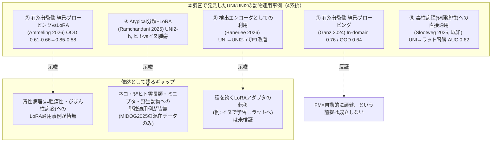
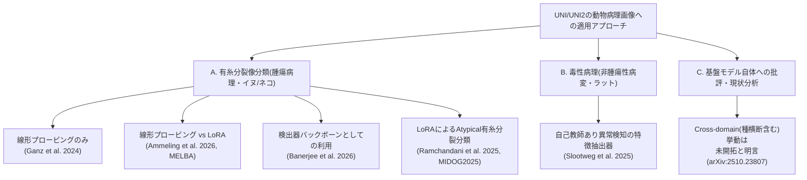
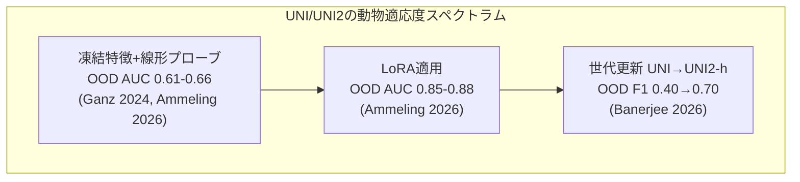

# UNI/UNI2病理基盤モデルの動物（非ヒト）組織画像への適用事例と限界・改善策の網羅調査

> **調査日**: 2026-08-20
> **担当Agent**: Claude (Research Agent)
> **ステータス**: 完了
> **タグ**: `#UNI` `#UNI2` `#基盤モデル` `#動物病理` `#獣医病理` `#LoRA` `#MIDOG` `#有糸分裂像分類` `#毒性病理`

---

## 📌 エグゼクティブサマリー

### 背景と目的
Mahmood Lab（Harvard/Mass General Brigham）が開発したヒト病理基盤モデル **UNI**（Chen et al. 2024, *Nature Medicine*）および第2世代 **UNI2 / UNI2-h**（2025年公開）を、ヒト画像ではなく動物（非ヒト）病理組織画像に適用した報告がないかを網羅的に調査するもの。[02_cross_species_pathology_fm](../02_cross_species_pathology_fm/report.md)は「動物種横断病理基盤モデル」全般を広くスコープした調査で、UNIの動物への直接適用実証はSlootweg et al. (2025)（ラット腎臓異常検知、AUC 0.62）の1件のみと結論していた。本調査は**UNI/UNI2という具体的なモデル名**に絞り込み、02では拾いきれなかった隣接研究コミュニティがないかをさらに掘り下げ、適用時に報告されている限界・改善策を整理する。

### 主要な発見（Key Takeaways）
1. **02の「UNI動物適用はSlootweg 2025のみ」を実質的に更新**: 02の調査スコープ（毒性病理・種横断FM全般）では見落とされていた**有糸分裂像（mitotic figure）分類・検出**という腫瘍病理ニッチにおいて、独Ingolstadt工科大学＋ウィーン獣医大学を中心とする研究クラスタ（Aubreville, Bertram, Ganz, Ammeling, Banerjeeら）が、MIDOG/CCMCTという**イヌ・ネコを含む公開ベンチマーク**にUNI/UNI2-hを2024年末以降、継続的に適用している。本調査で新たに4件の一次研究（Ganz 2024, Ammeling 2026, Banerjee 2026, Ramchandani 2025）を発見した。
2. **毒性病理（非腫瘍性病変）特化ではSlootweg 2025が依然として唯一**: 今回の深掘り調査でも、肝細胞肥大・空胞変性・壊死のような非腫瘍性・びまん性病変にUNI/UNI2を適用した追加事例は発見できなかった。02の毒性病理領域に関する結論はそのまま維持される。
3. **「基盤モデル＝自動的に頑健」という前提への明確な反証**: Ganz et al. (2024)は、UNIを含む凍結特徴量ベースの分類器が、動物種・施設を跨ぐドメインシフトに対して、End-to-endで学習した素のResNet50より頑健というわけでは**なかった**ことを実証（原文: *"We also did not find the FM-based classifiers to be more robust to domain shifts than one of our baselines."*）。
4. **改善策として最も再現性の高いエビデンスはLoRA**: Ammeling et al. (2026, MELBA)は、UNIへのLoRA（パラメータ効率的ファインチューニング）適用により、ドメイン外（施設・種を跨ぐ）AUCが0.61〜0.66（線形プロービング）から**0.85〜0.88**へと劇的に改善することを示した。これは[02](../02_cross_species_pathology_fm/report.md)がDINOv2+LoRA（Graf et al. 2026, マウス肝臓）で報告した知見と、モデル・研究クラスタが異なるにもかかわらず一致する。
5. **世代更新（UNI→UNI2-h）も動物データでの性能に大きく効く**: Banerjee et al. (2026)は検出エンコーダとしての利用でUNIからUNI2-hへの更新によりOOD F1が0.40→0.70へ改善したと報告する一方、H-optimus-0やVirchow2に劣後する場面もあると指摘しており、「UNI系列が動物データで常に最良」というわけではない。

---

## 1. 背景・課題設定

### 1.1 UNI/UNI2とは
- **UNI**（Chen, R.J. et al. 2024, *Nature Medicine* "Towards a general-purpose foundation model for computational pathology"）: ViT-L、10万枚超のヒトWSIから抽出した1億枚超のパッチでDINOv2ベースの自己教師あり学習を行った汎用病理基盤モデル。
- **UNI2 / UNI2-h**（MahmoodLab, 2025年公開）: より大規模なデータ・ViT-H相当アーキテクチャで再学習した第2世代モデル。HuggingFace: `MahmoodLab/UNI`, `MahmoodLab/UNI2-h`。
- 両モデルとも学習データはヒト病理WSIのみであり、動物組織への汎化性は原著論文では検証されていない。

### 1.2 なぜ「UNI/UNI2の動物適用」を狭く再調査する意味があるか
[02_cross_species_pathology_fm](../02_cross_species_pathology_fm/report.md)は「動物種横断病理基盤モデル」というテーマを、毒性病理・比較腫瘍学・汎種形態学など広い文脈で調査した。その結果、UNIの動物への直接適用事例はSlootweg et al. (2025)のラット腎臓研究のみと結論づけたが、検索クエリが「毒性病理」「種横断基盤モデル」寄りだったため、**有糸分裂像分類**という全く別の腫瘍病理サブフィールド（ヒト・イヌ・ネコの腫瘍が混在する公開ベンチマークを使う研究コミュニティ）が調査対象から漏れていた可能性が高い。本調査はモデル名（UNI/UNI2）を起点に検索し直すことで、このギャップを埋めることを目的とする。

### 1.3 従来の課題・限界点
- 有糸分裂数（mitotic count）は腫瘍の悪性度評価においてヒト・動物（特にイヌの肥満細胞腫や乳腺腫瘍）双方で重要な指標であり、これが「ヒト・イヌ・ネコ混在ベンチマーク」が存在する理由になっている。一方、毒性病理が扱う病変（肝細胞肥大・空胞変性等）はこのような明瞭な視覚特徴を持たず、既存の有糸分裂像研究の知見がそのまま転用できるかは別問題である。
- UNIは2024年公開のため、UNIを用いた動物データの再解析は必然的に2024年末以降の論文に限られる。UNI2-hはさらに新しく（2025年）、動物適用例はまだ少ない。

---

## 2. 主要技術動向・アプローチ分類

### 2.1 A. 有糸分裂像分類・検出（腫瘍病理、イヌ/ネコ）
- **概要**: MIDOG（2022/2025）・CCMCT（イヌ肥満細胞腫）という、ヒト・イヌ・ネコの腫瘍組織が混在する公開ベンチマークにUNI/UNI2-hを適用し、有糸分裂像の分類・検出精度を評価する研究群。
- **代表的な手法/モデル**: 線形プロービング（Ganz 2024）、線形プロービング+LoRA比較（Ammeling 2026）、検出器（Faster R-CNN/RetinaNet）バックボーンとしての利用（Banerjee 2026）、LoRAによるAtypical分類（Ramchandani 2025）。
- **メリット・強み**: 大規模・多施設・多種の公開ベンチマークが既に存在するため、種横断の頑健性評価がしやすい。LoRAという具体的な改善策が複数の独立研究で再現的に効果を示している。
- **課題・制約**: 対象は腫瘍性病変（有糸分裂像という強い視覚シグナル）に限定。毒性病理の非腫瘍性・びまん性病変への一般化は未検証。

### 2.2 B. 毒性病理（非腫瘍性病変、ラット）
- **概要**: [02](../02_cross_species_pathology_fm/report.md)で既出のSlootweg et al. (2025)。UNIの凍結特徴量を自己教師あり異常検知の入力として使い、ラット腎臓の毒性所見をAUC 0.62で検出。
- **メリット・強み**: 毒性病理という実運用に近い文脈でのUNI活用の数少ない実証例。
- **課題・制約**: 本調査でも追加事例は発見できず、AUC 0.62は「実用に耐えるが完全ではない」水準に留まる。LoRA等のPEFTを適用した毒性病理版の研究は本調査時点（2026年8月）で不在。

### 2.3 C. 基盤モデル自体への批評・現状分析
- **概要**: UNIを含む病理基盤モデル全般について、がん種・動物種（species）・教師あり度を同時に振ったクロスドメイン挙動の研究が「ほとんど手付かず」であると指摘する批評論文（arXiv:2510.23807, "Beyond the Failures: Rethinking Foundation Models in Pathology"）。
- **示唆**: 本調査の主要発見（=有糸分裂像分類という狭いニッチ以外では系統的な動物種検証がほぼ存在しない）を、業界の自己認識としても裏付ける傍証。

---

## 3. 主要論文・技術比較

| 研究 | 発表年 | モデル | 動物種/データセット | 適応手法 | 主な定量結果 | 限界（原文趣旨） | 改善策（原文趣旨） |
|:---|:---:|:---|:---|:---|:---|:---|:---|
| Ganz et al. | 2024 | UNI | イヌ(肺癌/リンパ腫/CCMCT肥満細胞腫) | 線形プロービング(FM凍結) | In-domain AUROC 0.76±0.03 / OOD 0.64±0.05 | FM分類器はEnd-to-end ResNet50よりドメインシフトに頑健というわけではなかった | FTすればより良い結果の可能性があるが計算コストとのトレードオフ(未実装) |
| Ammeling et al. (MELBA) | 2026 | UNI | イヌ(CCMCT, MIDOG2022) | 線形プロービング vs LoRA | CCMCT AUC 0.83→0.87、OOD AUC **0.61-0.66→0.85-0.88**(LoRA) | 施設間の染色・スキャナー差が組織の見え方を変え頑健性を損なう | **LoRAが最も効果的**。10%データで100%相当性能 |
| Banerjee et al. | 2026 | UNI, UNI2-h | イヌ(MIDOG++), OOD:TUPAC16(ヒト乳がん) | 検出器(Faster R-CNN/RetinaNet)バックボーン | MIDOG++ F1 0.45-0.66→0.72-0.76、TUPAC16(OOD) F1 0.40→0.70(UNI→UNI2-h) | H-optimus-0/Virchowに劣後する場面あり | LoRA適用が「次の自然なステップ」(未実装) |
| Ramchandani et al. | 2025 | UNI, UNI2-h | ヒト・イヌ・ネコ(MIDOG2025, 365症例12腫瘍種) | LoRA | Balanced Acc 0.78-0.80(UNI) | グループ/ドメイン分割でばらつき拡大、ドメインシフトの課題 | LoRAが線形プロービングより優位 |
| Slootweg et al. | 2025 | UNI | ラット(腎臓、毒性病理) | 自己教師あり異常検知の特徴抽出器 | AUC 0.62 / NPV 89% | 実用に耐えるが完全ではない水準 | 言及なし(本調査でも未解決のまま) |
| MIDOG 2025 Challenge | 2026 | UNI/UNI2-h含む複数FM | ヒト・イヌ・ネコ(12腫瘍種) | チャレンジ総括 | 上位チーム検出F1 0.740 | 希少・多形性の高い腫瘍型で精度低下 | - |
| Beyond the Failures | 2025-2026 | (批評) | - | - | - | 種を跨ぐクロスドメイン挙動の研究はほぼ手付かず | - |

詳細な書誌情報・要約は[papers/index.md](papers/index.md)を参照。

---

## 4. 詳細分析・技術的考察

### 4.1 なぜ「有糸分裂像分類」コミュニティだけが動物データでUNIを使っているか
有糸分裂数は腫瘍の悪性度グレーディングにおいてヒト・イヌ双方で重要な定量指標であり、そのためMIDOG（2021年設計）・CCMCTのような「ヒト・イヌ・ネコ混在」の公開ベンチマークが既に整備されていた。UNI/UNI2が2024〜2025年に公開されて以降、この既存ベンチマーク資産に新しい基盤モデルを当てはめるのは自然な研究の流れであり、独Ingolstadt工科大学＋ウィーン獣医大学クラスタ（Aubreville, Bertram, Ganz, Ammeling, Banerjee）がこの分野を継続的にリードしている。同クラスタは[02](../02_cross_species_pathology_fm/report.md)・[10_glp_ai_validation_framework](../10_glp_ai_validation_framework/report.md)で既出の獣医病理DLレビュー（Banerjee et al. 2026, 再現性システマティックレビュー）の著者とも重なる。

一方、毒性病理（非腫瘍性・びまん性病変）にはこのような「ヒト・動物混在の公開ベンチマーク」が存在しないため、UNIを適用する動機・データ双方が有糸分裂像分野より圧倒的に乏しい。これが「腫瘍病理では複数事例、毒性病理では1件のみ」という非対称の主因と考えられる。

### 4.2 限界のまとめ（4研究に共通するパターン）
1. **「基盤モデル＝自動的に頑健」という前提は成立しない**: Ganz et al. (2024)が示した通り、UNIの凍結特徴量はドメインシフト（施設差・種差を含む）に対し、シンプルなEnd-to-end CNNより優れているとは限らない。
2. **染色・スキャナー差が種差以上に効くことがある**: Ammeling et al. (2026)は「施設間の染色プロトコルとスキャナーの違いが組織の見え方を変える」ことを頑健性低下の主因として挙げており、これは種の生物学的差異とは独立した技術的要因である。
3. **UNI系列が常に最良とは限らない**: Banerjee et al. (2026)はH-optimus-0・Virchowが検出エンコーダとしてUNI/UNI2-hを上回る場面を報告している。
4. **腫瘍性病変限定**: 4研究全てが有糸分裂像という強い視覚シグナルを持つ腫瘍性病変を対象としており、毒性病理の中心である非腫瘍性・びまん性病変（肥大、空胞変性、壊死等）への一般化可能性は未検証。

### 4.3 改善策のまとめ：LoRAという再現性のあるエビデンス
本調査を通じて最も一貫していた知見は、**LoRA（Low-Rank Adaptation）によるパラメータ効率的ファインチューニングが、動物種・施設を跨ぐドメインシフトへの耐性を大きく改善する**という点である。

興味深いことに、この「LoRAが有効」という結論は、[02](../02_cross_species_pathology_fm/report.md)で発見されたGraf et al. (2026)（DINOv2+LoRA、マウス肝臓、既知異常93.93%）という**全く別のモデル・研究クラスタ・臓器**でも独立に再現されている。モデルやタスクが違っても「基盤モデルの視覚バックボーンを凍結したまま少量のLoRAパラメータのみを動物データで再学習する」というアプローチが種横断ドメイン適応の有力な共通解になりつつあることを示唆する。

### 4.4 毒性病理への示唆
有糸分裂像分野で実証されたLoRAの有効性を、毒性病理の非腫瘍性・びまん性病変にそのまま適用できるかは未検証だが、[02](../02_cross_species_pathology_fm/report.md)のGraf et al. (2026)と本調査のAmmeling et al. (2026)という独立した2系統がLoRAの有効性で一致していることは、「UNI/UNI2 + LoRA」を毒性病理の病変分類に応用する将来研究の実現可能性を後押しする間接的なエビデンスと言える。ただし、腫瘍性病変（明瞭な細胞異型）と毒性病理の初期変性（正常組織との境界が曖昧）とでは転移の難易度が異なる可能性が高く、単純な外挿は禁物である。

---

## 5. 今後の展望・オープンクエスチョン

1. **毒性病理（非腫瘍性・びまん性病変）へのUNI/UNI2 + LoRA適用**: 有糸分裂像分野で実証済みのLoRAアプローチを、肝細胞肥大・空胞変性等の毒性病理病変に適用した研究は本調査時点で不在。最も有望な次アクション候補。
2. **UNI2-hとH-optimus-0/Virchow2の動物データでの系統的な横並び比較**: Banerjee et al. (2026)が示唆するUNI系列の相対的な弱さが、他のタスク・臓器・種でも再現するかは未検証。
3. **ネコ・非ヒト霊長類・ミニブタ・野生動物への単独適用例が皆無**: MIDOG2025はネコを含むが混在データセットの一部としてのみであり、単独種として明示的に評価した研究は発見できなかった。
4. **種を跨ぐLoRAアダプタの転移**: 「イヌで学習したLoRAアダプタをラット・マウスへ再適応する」ような段階的転移の実証研究は不在（[02](../02_cross_species_pathology_fm/report.md)のオープンクエスチョン3と同根の課題）。
5. **腫瘍性 vs 非腫瘍性病変での転移難易度の定量比較**: 有糸分裂像（腫瘍性・強い視覚シグナル）とびまん性病変（非腫瘍性・弱い視覚シグナル）とで、UNI/UNI2の転移性がどの程度異なるかを定量評価する研究は不在。
6. **実効ランク（Effective Rank / RankMe）によるヒト特異性の診断**: Möllers et al. (2026, arXiv:2601.02198)がUNI/UNI2にRankMe（実効ランク）指標を適用した唯一の先行研究だが、評価対象はヒト組織（TCGA, BRACS）の拡大倍率ドメインシフトに限定されており、動物（毒性病理）組織との実効ランク比較は行っていない。ヒトサンプルと毒性病理サンプルでUNI埋め込みの実効ランクを比較すれば、「動物データに対してUNIの表現が次元崩壊（dimensional collapse）を起こしているか」＝ヒト特異性の直接的な定量証拠が得られる可能性がある。de Jong et al. (2025, arXiv:2501.18055)の「Robustness Index」（埋め込みが生物学的信号と非生物学的交絡因子のどちらに支配されているかを測る指標）と併用すれば、実効ランクの低下が単なる情報量減少なのか、施設・染色差のような非生物学的要因への支配なのかを切り分けられる可能性がある。探索した範囲ではこの比較を行った研究は発見できず、[papers/index.md](papers/index.md)の追記調査を参照。

---

## 6. 参考文献・関連リソース

### 主要論文・文献
- **Chen, R.J., Ding, T., Lu, M.Y., et al.** (2024). "Towards a general-purpose foundation model for computational pathology." *Nature Medicine*. （UNI原著論文）
- **Ganz, J., Ammeling, J., Rosbach, E., Lausser, L., Bertram, C.A., Breininger, K., Aubreville, M.** (2024). "Is Self-Supervision Enough? Benchmarking Foundation Models Against End-to-End Training for Mitotic Figure Classification." *arXiv preprint*. [arXiv:2412.06365](https://arxiv.org/abs/2412.06365)
- **Ammeling, J., Ganz, J., Rosbach, E., Lausser, L., Bertram, C.A., Breininger, K., Aubreville, M.** (2026). "Benchmarking Foundation Models for Mitotic Figure Classification." *Machine Learning for Biomedical Imaging (MELBA)*, vol.3. [arXiv:2508.04441](https://arxiv.org/abs/2508.04441) / [DOI:10.59275/j.melba.2026-a3eb](https://doi.org/10.59275/j.melba.2026-a3eb)
- **Banerjee, S., Teimoury, A., Porsche, N., et al.** (2026). "Beyond Classification: Pathology Foundation Models as Detection Encoders for Mitotic Figures." *arXiv preprint*. [arXiv:2607.28007](https://arxiv.org/abs/2607.28007)
- **Ramchandani, L., Deotale, G., Das, D.K.** (2025). "Parameter-efficient fine-tuning (PEFT) of Vision Foundation Models for Atypical Mitotic Figure Classification." *arXiv preprint*. [arXiv:2509.16935](https://arxiv.org/abs/2509.16935)
- **Slootweg, I., García-De-La-Puente, N.P., Litjens, G., Dammak, S.** (2025). "Self-supervised large-scale kidney abnormality detection in drug safety assessment studies." *arXiv preprint*. [arXiv:2509.00131](https://arxiv.org/abs/2509.00131)（[02](../02_cross_species_pathology_fm/report.md)と共通）
- **MIDOG 2025 Challenge運営チーム** (2026). "Mitosis Detection in the Wild: Multi-Tumor and Context-Aware Generalization in the MIDOG 2025 Challenge." *arXiv preprint*. [arXiv:2606.07368](https://arxiv.org/abs/2606.07368)
- **(2025-2026)**. "Beyond the Failures: Rethinking Foundation Models in Pathology." *arXiv preprint*. [arXiv:2510.23807](https://arxiv.org/abs/2510.23807)
- **Banerjee, S., Bertram, C.A., Weiss, V., et al.** (2026). "Reporting transparency in veterinary pathology deep learning: A systematic review of reproducibility-critical details." *Veterinary Pathology*. [DOI:10.1177/03009858261459452](https://doi.org/10.1177/03009858261459452)（[02](../02_cross_species_pathology_fm/report.md)・[10](../10_glp_ai_validation_framework/report.md)と共通）

### 関連リポジトリ・内部リンク
- 論文詳細サマリー: [papers/index.md](papers/index.md)
- 検索ログ・思考メモ: [notes/search_log.md](notes/search_log.md)
- 関連する過去の調査: [topics/2026/08/02_cross_species_pathology_fm/report.md](../02_cross_species_pathology_fm/report.md)（本調査の出発点となった広域調査）
- 関連する過去の調査: [topics/2026/08/10_glp_ai_validation_framework/report.md](../10_glp_ai_validation_framework/report.md)（著者クラスタが重複する獣医病理DLレビューを収載）
