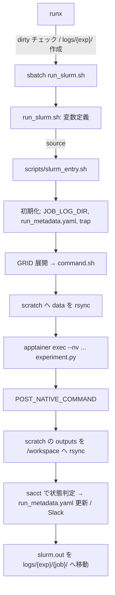

# 内製実験テンプレート 詳細編（応用・トラブル対応）

> 基本編: [research_template.md](research_template.md)
> 対象バージョン: 2026-09-25 時点の実装。主な参照元は `02-playground/toxpatho-perturbation-bench`（以下 PB）。差分がある箇所は `02-playground/toxpatho-ssl-comparison`（以下 SSL）と比べて書いた
> 関連: [slurm_deep.md](slurm_deep.md)、[apptainer_deep.md](apptainer_deep.md)、[uv_deep.md](uv_deep.md)

## Part 1. 応用・上級機能

### 1.1 投入から終了までの流れ



| 段階 | 作られる・更新されるもの |
|:---|:---|
| `runx` | `logs/{exp}/`、`outputs/{exp}/latest_job_id.txt` |
| 初期化 | `logs/{exp}/{job}/run_metadata.yaml`（status: RUNNING）、`logs/{exp}/latest` |
| GRID 展開 | `logs/{exp}/{job}/command.sh` |
| 実行 | `/scratch/$USER/{exp}_{job}/`、`outputs/{exp}/{variant}/completion.json` |
| 終了処理 | `run_metadata.yaml` の status / fail_reason、`slurm.out` の移動 |
| シグナル受信時 | `logs/{exp}/{job}/signal_debug.log` |
| 初期化失敗時（PB） | `bootstrap_failure.log`、`run_metadata.yaml`（`failure_phase: bootstrap`） |

### 1.2 slurm_entry.sh: 初期化

`run_slurm.sh` の末尾から `source` される。`set -euo pipefail` の下で動く。

スケジューラの判定:

| 条件 | `SCHEDULER` | `JOB_ID` | `ARRAY_TASK_ID` |
|:---|:---|:---|:---|
| `PBS_JOBID` がある | `pbs` | `PBS_JOBID` の `.` より前 | `PBS_ARRAY_INDEX` |
| `SLURM_JOB_ID` がある | `slurm` | `SLURM_JOB_ID` | `SLURM_ARRAY_TASK_ID` |
| どちらもない | `local` | シェルの PID（`$$`） | 空 |

ログディレクトリ:
- `RUN_MODE=array` → `logs/{exp}/{ARRAY_JOB_ID}_{ARRAY_TASK_ID}/`
- それ以外 → `logs/{exp}/{JOB_ID}/`
- アレイの各タスクは `SLURM_JOB_ID` がタスクごとに違う。ディレクトリ名に使うのは親の ID（`%A`）

初期化時の検査（PB）。失敗すると `exit 2`:

| fail_reason | 原因 |
|:---|:---|
| `MISSING_PROJECT_ROOT` / `MISSING_EXP_NAME` | `run_slurm.sh` を経由せずに source した |
| `INVALID_RUN_MODE` | `RUN_MODE` が single / array / seq 以外 |
| `LOG_DIRECTORY_CREATION_FAILED` / `LATEST_LOG_LINK_FAILED` | `logs/` に書けない |
| `NOTIFICATION_HELPER_LOAD_FAILED` | `scripts/notify_slack.sh` がない |
| `MISSING_TIME_LIMIT` | `run_slurm.sh` に行頭の `#SBATCH --time=` がない |
| `METADATA_INITIALIZATION_FAILED` | ホストの `python3` で PyYAML が使えない |

SSL との違い:

| 項目 | PB | SSL |
|:---|:---|:---|
| 必須変数の検査 | `_bootstrap_fail` で理由を記録 | `${VAR:?}` で即終了。`SIF_PATH` も必須 |
| `SIF_PATH` の定義 | `run_slurm.sh` に `export SIF_PATH="${PROJECT_ROOT}/env.sif"` | `run_slurm.sh` にない。投入元のシェルで export しておく（`--export=ALL` で渡る） |
| SIF が使えないとき | ホストで直接実行する（2.10節の不具合あり） | 常に `apptainer exec`（失敗する） |
| `run_metadata.yaml` の書き込み | ホストの `python3` + PyYAML | bash だけ（値はすべてダブルクォート） |
| `--time` が読めないとき | 初期化失敗 | `unknown` として続行。`#PBS -l walltime=` も読む |
| scratch の場所 | `/scratch` 固定 | `SCRATCH_ROOT`（既定 `/scratch`）で変えられる |
| 入力のコピー | `data/` 全体 | `DATA_SUBDIRS=(...)` で指定したサブディレクトリだけにできる。`USE_LOCAL_SSD_INPUT` の既定は 0 |
| 複数ノード | なし | PBS で `NNODES>1` のとき `pbsdsh` + torchrun（実験的） |

### 1.3 slurm_entry.sh: GRID の展開順

`GRID_ARGS` の**最初の次元が外側のループ**になる。`array` モードではこの順番の位置が `SLURM_ARRAY_TASK_ID` に対応する。

```bash
GRID_ARGS=("--model" "--seed")
GRID_VALUES=("uni2 dinov2" "0 1 2")
```

| TASK_ID | 展開されるオプション |
|---:|:---|
| 0 | `--model uni2 --seed 0` |
| 1 | `--model uni2 --seed 1` |
| 2 | `--model uni2 --seed 2` |
| 3 | `--model dinov2 --seed 0` |
| 4 | `--model dinov2 --seed 1` |
| 5 | `--model dinov2 --seed 2` |

```bash
# 特定のタスク ID が何を実行したかを確認
cat logs/<exp>/<array_job_id>_4/command.sh
```

- 値は空白で分割される（`read -ra`）。空白を含む値やクォートは使えない
- `GRID_ARGS` の要素数ぶんだけ `GRID_VALUES` が読まれる。`GRID_VALUES` の行が多すぎても余りは無視される（preflight は全行を数えるので、`--array` の N と食い違う）
- `seq` モードは最初に失敗した組み合わせで止まり、残りは実行しない

### 1.4 slurm_entry.sh: 実行と状態判定

`_run_single` はコマンドを `apptainer exec --nv` の中で実行する。コンテナの中では次のように動く。

```bash
apptainer exec --nv \
    --bind /scratch/$USER --bind "$SCRATCH_DIR" \
    --env UV_CACHE_DIR="$SCRATCH_DIR/.uv_cache" \
    "$SIF_PATH" bash -c "
        set -euo pipefail
        source $PROJECT_ROOT/.venv/bin/activate
        export CUDA_HOME=/usr/local/cuda
        cd $PROJECT_ROOT
        <コマンド>"
```

- 作業ディレクトリは `PROJECT_ROOT`。コマンド中の相対パスはプロジェクトのルートからの相対になる
- テンプレートの `RUN_COMMAND` は `--config config.yml` を渡すが、テンプレートの `experiment.py` は `--config` を定義しておらず、config は `Path(__file__).parent / "config.yml"` から読む（2.16節）
- `PRE_NATIVE_COMMAND` / `POST_NATIVE_COMMAND` はコンテナの外で `eval` される。サーバの起動や後始末に使う
- `ADD_NOTIFY="KEY : value"` を設定すると Slack 通知に項目が加わる。`SLACK_NOTIFY_ON_START=0` などで通知の種類ごとに止められる

終了後、`sleep 3` してから `sacct` でジョブの状態を取り、次の表で `run_metadata.yaml` を更新する。

| sacct の状態 | status | fail_reason |
|:---|:---|:---|
| `TIMEOUT` | TIMEOUT | `SLURM_TIMEOUT` |
| `OUT_OF_MEMORY` | OUT_OF_MEMORY | `OUT_OF_MEMORY` |
| `CANCELLED*` | CANCELLED | `CANCELLED` |
| `NODE_FAIL` | NODE_FAIL | `NODE_FAIL` |
| `COMPLETED` / `RUNNING` / `COMPLETING` / `CONFIGURING` | 終了コード 0 なら COMPLETED、それ以外は FAILED | `NONZERO_EXIT_<code>` |
| `UNKNOWN` / 空 | 同上（PB は `scheduler_state: UNKNOWN` も記録） | 同上 |
| それ以外 | FAILED | `SCRIPT_ERROR_LINE_<行>_CODE_<code>` |

- この判定はバッチスクリプトの中、つまり**ジョブの実行中**に行われる。多くの場合 sacct は `RUNNING` を返すので、終了コードで決まる。OOM で kill されたジョブは `FAILED` / `NONZERO_EXIT_137` などと記録され、sacct では `OUT_OF_MEMORY` になる（PB の `0004` の job 9206 で実例あり）。最終的な状態は sacct で確認する（2.5節）

### 1.5 シグナル処理

| trap | 契機 | 動作 |
|:---|:---|:---|
| `ERR` | コマンドの失敗（`set -e`） | 状態判定を行って終了 |
| `TERM` / `INT` | `scancel`、時間切れ（Slurm が SIGTERM を送る） | `signal_debug.log` に記録 → 状態判定 → そのまま続行して出力回収 → `exit 1` |
| `USR1` | `#SBATCH --signal=B:USR1@<margin>` | `signal_debug.log` に記録、Slack に `TIME_LIMIT_WARNING`。ジョブは止めない |

注意点（コードからの推測を含む）:
- 時間切れのとき、SIGTERM から SIGKILL までの猶予は `KillWait`（30秒）。この間に状態判定（`sleep 3` を含む）、`POST_NATIVE_COMMAND`、scratch からの rsync がすべて終わらないと、出力は `/workspace` に回収されない（2.7節）
- `B:USR1` はバッチシェルにしか送られず、`experiment.py` には届かない。Python 側でこれを契機にチェックポイントを保存することはできない
- 本体は `EXIT_CODE=$(_run_single ...)` の形で実行されている。bash はフォアグラウンドのコマンド（このコマンド置換）が終わるまで trap を実行しないので、USR1 の通知は本体が終わるまで遅れる可能性が高い。2026-09-25 時点で、このマシンの `signal_debug.log` に `TIME_LIMIT_WARNING` の記録は1件もない（未検証）
- `USR1` で Python にチェックポイントを保存させたい場合は、`run_slurm.sh` 側の仕組みを変える必要がある。一般的なやり方は [slurm_deep.md](slurm_deep.md) 1.3節

### 1.6 partition と signal margin の決まり方

`make create_exp` のときに、**テンプレート**（`templates/run_slurm.sh`）の `#SBATCH --time=` から一度だけ計算される。

1. owner をプロジェクトのパスから決める

| パス | owner |
|:---|:---|
| `/workspace/andre01/*` | `andre01` |
| `/workspace/david01/*` / `david02/*` | `david01` / `david02` |
| `/workspace/filesrv01/*`（SSL は `filesrv02` も） | `creator` |
| `/workspace/grace01/*` / `grace02/*` | `grace01` / `grace02` |
| それ以外 | エラー（SSL は `EXP_PARTITION_OWNER` で指定できる） |

2. 時間から規模を決める

| `--time` | 規模 |
|:---|:---|
| 60分以下 | `small` |
| 120分以下 | `medium` |
| 240分以下 | `large` |
| それより長い | `x-large` |

3. `--partition={規模}-{owner}`、`--signal=B:USR1@{秒}`。秒は `--time` の秒数の1%、最小30秒

| `--time` | partition（andre01） | margin |
|:---|:---|---:|
| `00:30:00` | `small-andre01` | 30 |
| `02:00:00` | `medium-andre01` | 72 |
| `04:00:00` | `large-andre01` | 144 |
| `196:00:00`（テンプレートの既定） | `x-large-andre01` | 7056 |

- 計算は `HH:MM:SS` 形式が前提。`1-00:00:00` のような日付付きの形式は想定されていない
- 実際のパーティション名と合わない owner がある（2.9節）
- 実験を作った後に `run_slurm.sh` の `--time` を変えても追従しない。手で `--partition` と `--signal` を直す

### 1.7 preflight の検査内容

`make preflight` は `python3 -m scripts.preflight_check` をホストの Python で実行する（PyYAML は不要）。対象は `experiments/` 直下で `NNNN_` で始まるディレクトリのうち名前順で最後のもの。別の実験を検査するときはパスを渡す。

```bash
python3 -m scripts.preflight_check experiments/0005_20260821_eval_x   # リポジトリのルートで実行する
```

| 検査 | Blocker になる条件 | 見ていないもの |
|:---|:---|:---|
| config キー | `experiment.py` の `config.get('x')` / `config['x']` の `x` が `config.yml` のトップレベルにない | 変数名が `config` 以外（`cfg[...]`）、ネストしたキー |
| GRID の数 | 組み合わせ数が 50 超（20 超は警告） | `GRID_ARGS` と `GRID_VALUES` の要素数の一致 |
| RUN_MODE | `GRID_ARGS` があるのに `RUN_MODE` が array / seq でない | argparse の引数名と `GRID_ARGS` の一致 |
| `--array` | `RUN_MODE=array` で行頭の `#SBATCH --array=<数>-<数>` がない、または N ≠ 組み合わせ数 − 1 | `--array=1,3,5` のような列挙形式（なしと判定される） |
| 直書き | `to_parquet(` / `to_csv(` / `open(` の第1引数が `'outputs/...'` / `'data/...'` の文字列 | `Path("outputs") / ...`、`np.save` など |

- コメント行（`#` で始まる行）は RUN_MODE や GRID の検査から除かれる。`#SBATCH` 行だけは行頭一致で見る
- `_FAILED_` 付きにリネームした実験も `NNNN_` で始まるので、ID が最大ならそれが検査される
- パーティションと `--time` の整合、`SIF_PATH` の有無は検査しない

### 1.8 completed ガードの仕様

`get_run_dir(project_root, __file__, variant_key, output_root)` の動作:

| `outputs/{exp}/{variant}/completion.json` | 動作 |
|:---|:---|
| ない | ディレクトリを作って続行 |
| `status: running` | `Warning: Resuming previously failed/interrupted run` を出して続行（途中から再開するかは experiment.py 次第） |
| `status: completed` | `guard_skipped_at` を追記し、`sys.exit(0)`（ジョブは COMPLETED で終わる） |
| JSON が壊れている | 無視して続行 |

- ガードが見るのは常に `PROJECT_ROOT/outputs/`。`OUTPUT_ROOT`（scratch）ではない
- `exp` は `experiment.py` の親ディレクトリ名。`variant_key` の `/` は最後の要素だけになり、元の値は `.variant_key_original.txt` に残る
- `USE_LOCAL_SSD_OUTPUT=1` では `completion.json` も scratch に書かれ、ジョブの最後の rsync で初めて `/workspace` 側に届く。回収が失敗すると、完了した variant も次回また実行される
- `write_run_metadata` は `completion.json` を上書きする（前回の `completed_at` などは残らない）

### 1.9 再実行・再開の2つの方法

| 方法 | 実験 ID | outputs | completed の variant | 使う場面 |
|:---|:---|:---|:---|:---|
| 同じ実験をもう一度 `runx <id>` | 同じ | 同じディレクトリ | スキップされる | アレイの一部だけ失敗した、TIMEOUT で途中まで進んだ |
| `make resume_exp name=<id>` | 新しい ID | 新しい空のディレクトリ | **全部やり直し** | コードや設定を変えてやり直す、失敗の記録を残して別実験にする |

同じ実験で再実行する流れ:

```bash
sacct -j <array_id> -X --format=JobID,State,ExitCode      # どのタスクが失敗したか
ls outputs/<exp>/*/completion.json | xargs grep -l '"running"'   # 未完了の variant
runx <id>                                                 # 全タスク投入。完了済みは数秒で終わる
```

`resume_exp` でチェックポイントを引き継ぐ場合:
- 新しい `metadata.yaml` に `resumed_from_exp` と `resume_checkpoint_dir`（元の `outputs/{exp}`）が記録される。`resume_checkpoint_file` は常に `null`
- チェックポイントのパスは自動では渡されない。`config.yml` に明示的に書き、`experiment.py` で読む
- `run_slurm.sh` と `config.yml` の中の旧実験名は新しい名前に置換される。`#SBATCH --dependency=` は再度コメントアウトされる
- 元の実験名の末尾の `_resumed` / `_retry` / `_resume` と `_FAILED_...` は取り除かれてから suffix が付く

### 1.10 実験どうしの依存関係

前処理 → 学習 → 評価のように実験を連結する。

```bash
runx 12                                             # 上流を投入
cat outputs/0012_*/latest_job_id.txt                # 例: 11256（アレイなら親の ID）
# 下流の run_slurm.sh で次の行を有効にして ID を書く
#   #SBATCH --dependency=afterok:11256
git commit -am "0013: depend on 11256"              # runx は dirty だと拒否する
runx 13
```

- アレイの親 ID に `afterok` すると、全タスクが正常終了するまで待つ。1タスクでも失敗すると `DependencyNeverSatisfied` で止まる（[slurm_deep.md](slurm_deep.md) 2.9節）
- 上流を投げ直すと ID が変わる。下流の行も書き直す
- `run_slurm.sh` を編集せずに済ませたい場合は、コマンドラインの `--dependency` が `#SBATCH` より優先されることを使える。ただし `runx` を通らないので、`logs/{exp}/` の作成と `latest_job_id.txt` の更新は手で行う

```bash
exp=0013_20260925_eval_x
mkdir -p logs/$exp
sbatch --parsable --dependency=afterok:$(cat outputs/0012_*/latest_job_id.txt) experiments/$exp/run_slurm.sh \
  | tee outputs/$exp/latest_job_id.txt
```

### 1.11 PBS・ローカル実行の扱い

- `slurm_entry.sh` は PBS（`PBS_JOBID`）とローカル（どちらの変数もない）でも動くように書かれている。PBS では `qstat -f` の comment と `Exit_status`（271 → TIMEOUT、137 → OUT_OF_MEMORY）で状態を判定する
- PB の `templates/run_qsub.sh`、`templates/run_local.sh`、`templates/headers/*.txt` は、どのツールからも参照されていない。中身も `HEADER_TYPE` / `DEFAULT_TIME` を使う旧形式で、現在の `slurm_entry.sh` はこれらの変数を読まない。使う場合は `run_slurm.sh` と同じ構造に書き直す必要がある
- SSL にはこの3つがなく、代わりに PBS の複数ノード実行（`NNODES`）がある
- ローカル（`SCHEDULER=local`）では状態の問い合わせ先がないので、終了コードだけで COMPLETED / FAILED が決まる。`cancelx` はジョブ ID を PID として `kill` する

### 1.12 テスト（SSL）

SSL には `make test` と `make shellcheck` がある。

| 対象 | 内容 | 依存 |
|:---|:---|:---|
| `tests/smoke_slurm_entry.sh` | 一時ディレクトリに最小のプロジェクトを作り、`env -i` で `slurm_entry.sh` を実行する。apptainer と rsync はスタブ、`SCRATCH_ROOT` は一時ディレクトリ | bash / coreutils |
| `tests/test_exp_common.sh` | `scripts/exp_common.sh` の ID 採番、`latest` の除外、partition / margin の計算 | bash / coreutils / findutils |
| `tests/test_collapse_guards.py` | 学習コードの一部を AST で取り出して検査 | python3 / numpy |
| `pytest lib/` | `lib/test_output_utils.py`、`lib/test_preflight_check.py` など | pytest, PyYAML |

smoke テストが確認している項目:
1. `SCHEDULER=local` で本体が実行され COMPLETED になる
2. `#PBS -l walltime=` 形式のヘッダーでも落ちない
3. 時間制限のヘッダーがなくても落ちない
4. 本体が非0で終わると FAILED になる
5. `SIF_PATH` 未設定のとき、原因がわかるメッセージで落ちる
6. `DATA_SUBDIRS` 指定時に、指定したサブディレクトリだけがコピーされる
7. `DATA_SUBDIRS` 未指定時に `data/` 全体がコピーされる

- このマシンのホストには `pytest` と `shellcheck` がない。`make test` は pytest の段階で失敗するので、pytest はコンテナ内の `.venv` で実行する
- `.github/workflows/ci.yml` は shellcheck（severity: warning）と `pytest lib/` だけを実行する。smoke テストは CI に入っていない
- `slurm_entry.sh` を他のプロジェクトにコピーするときは、smoke テストも一緒に持っていくと差分の影響を確認できる

## Part 2. トラブル対応

### 2.1 runx が投入を拒否する

- **症状**: `❌ Git working tree is dirty.`、または `❌ Experiment not found.` / `❌ sbatch failed.`
- **確認**:
```bash
git status --short
git diff --stat; git diff --cached --stat
ls -d experiments/$(printf %04d <id>)_*
```
- **原因**:
  - dirty: 追跡中のファイルに未コミットの変更（ステージ済みを含む）がある。未追跡のファイルは判定に含まれない
  - not found: ID に対応するディレクトリがない。`mark_fail` や `rename_exp` で名前が変わっても ID 部分は同じなので、多くは ID の打ち間違い
  - sbatch failed: sbatch のエラー（パーティション名、`--time` の書式など）。直前に sbatch のメッセージが出ている
- **対処**: 変更をコミットしてから投入する。`--allow-dirty` は再現性がなくなるので、確認用の投入に限る。未追跡のまま投入した新しいファイル（新しい `lib/` のモジュールなど）はコミットに含まれていないので、`git_commit` からは再現できない点に注意する

### 2.2 preflight が Blocker を出す

- **症状**: `🔴 Blocker: ...` が出て終了コード 1
- **確認**:
```bash
make preflight
python3 -m scripts.preflight_check experiments/<exp>      # 最新以外を検査
grep -nE "^\s*(RUN_MODE|GRID_ARGS|GRID_VALUES)|^#SBATCH --array" experiments/<exp>/run_slurm.sh
```
- **原因と対処**:

| メッセージ | 原因 | 対処 |
|:---|:---|:---|
| `Keys referenced in experiment.py but missing in config.yml` | `config["lr"]` などのキーが config にない | `config.yml` にキーを足す。探索する値なら argparse で受ける |
| `GRID total task count (N) exceeds safety limit of 50` | 組み合わせが多すぎる | 実験を分けるか、次元を減らす |
| `GRID_ARGS is defined but RUN_MODE is not "array" or "seq"` | `RUN_MODE="single"` の行を残したまま GRID を有効にした | single の行をコメントアウトする（最後の代入が有効になる） |
| `RUN_MODE="array" but no active #SBATCH --array=0-N line found` | `# #SBATCH --array=` のままか、`--array=1,3,5` 形式 | 行頭を `#SBATCH --array=0-N` にする |
| `#SBATCH --array=0-X does not match the GRID combination count` | N の計算違い | N = 組み合わせ数 − 1 |
| `Hardcoded direct write to outputs/ or data/` | `open("outputs/...")` など | `run_dir` / `DATASET_DIR` を使う |
| `No experiments found in experiments/` | リポジトリのルート以外で実行した | ルートで実行する（パスが相対） |

### 2.3 completed ガードで想定外にスキップされる

- **症状**: ジョブが数秒で COMPLETED になり、`slurm.out` に `Error: Run is already completed: ...`
- **確認**:
```bash
grep -h "already completed" logs/<exp>/latest/slurm.out
cat outputs/<exp>/<variant>/completion.json
ls outputs/<exp>/                                   # variant のディレクトリ一覧
cat outputs/<exp>/*/.variant_key_original.txt 2>/dev/null
```
- **原因**:
  - `variant_key` に結果に影響する次元が全部入っておらず、別の組み合わせが同じディレクトリになった（例: seed を入れ忘れ）
  - `/` を含む値の最後の要素が同じ（`google/gemma` と `other/gemma` はどちらも `gemma`）
  - 設定を変えて同じ実験で再実行したが、前回の `completed` が残っている
- **対処**: `variant_key` にすべての次元を入れ、`/` は `-` に置き換えてから渡す（`args.model.replace("/", "-")`）。やり直す variant は、中身を確認してからそのディレクトリを移動または削除する。設定を変えたなら `make create_exp` か `make resume_exp` で別の実験にする

### 2.4 SIF_PATH が未設定・コンテナが使われない

- **症状**: SSL で `SIF_PATH（apptainerのSIFイメージのパス）が未設定です`。PB で `slurm.out` に `⚠️ Apptainer not found or SIF_PATH not set. Running command on host system.`。`make uv_sync` / `make jupyter` が `apptainer` の引数エラーで落ちる
- **確認**:
```bash
echo "$SIF_PATH"; ls -l "$SIF_PATH"
grep -n "SIF_PATH" experiments/<exp>/run_slurm.sh
grep -h "^status\|^fail_reason" logs/<exp>/latest/run_metadata.yaml
```
- **原因**:
  - SSL と `tools/uv_sync.sh` / `tools/start_jupyter.sh` は、投入元のシェルの `SIF_PATH` を `--export=ALL` 経由で受け取る
  - PB の `run_slurm.sh` は `${PROJECT_ROOT}/env.sif` を固定で使う。ファイルがない、`apptainer` が PATH にない場合はホストで直接実行に切り替わる
- **対処**: `~/.bashrc` かプロジェクトの `.bashrc` で `export SIF_PATH=<絶対パス>` してから投入する。PB で警告が出たジョブはホストの Python で動いているので、結果を使う前に再実行を検討する

### 2.5 run_metadata.yaml の status と sacct が食い違う

- **症状**: `run_metadata.yaml` は `FAILED` / `NONZERO_EXIT_137` なのに、`sacct` は `OUT_OF_MEMORY`。または `COMPLETED` なのに結果がない
- **確認**:
```bash
grep -h "^status\|^fail_reason\|^job_id" logs/<exp>/<job>/run_metadata.yaml
sacct -j <job_id> -X --format=JobID,State,ExitCode,ReqMem,MaxRSS,Elapsed,Timelimit
```
- **原因**: 状態判定はジョブの実行中に行われ、sacct がまだ `RUNNING` を返すことが多い（1.4節）。その場合は終了コードだけで決まる。137 は SIGKILL（OOM の可能性が高い）、143 は SIGTERM
- **対処**: 失敗の分類は sacct の State を正とする。`make clean_failed` は `run_metadata.yaml` の status だけを見て削除するので、分類がずれていても削除対象になる点に注意する

| 終了コード | 疑うこと |
|:---|:---|
| 137 | OOM（sacct で確認）、KillWait 超過 |
| 143 | キャンセル、時間切れ |
| 1 | Python の例外。`slurm.out` の末尾を見る |
| 2 | 初期化の失敗（PB）。`bootstrap_failure.log` を見る |

### 2.6 fail_reason に警告文が入り、成功したのに FAILED になる（PB）

- **症状**: `fail_reason: "NONZERO_EXIT_⚠️ Apptainer not found or SIF_PATH not set. ...\n0"`。`slurm.out` に `integer expression expected`
- **確認**:
```bash
grep -rl "Apptainer not found" --include=run_metadata.yaml logs/ | head
grep -n "integer expression expected" logs/<exp>/<job>/slurm.out
```
- **原因**: PB の `_run_single` は、ホスト実行に切り替わるときの警告を標準出力に `echo` する。`EXIT_CODE=$(_run_single ...)` がこの警告も取り込むため、終了コードが「警告文 + 改行 + 0」になり、数値比較に失敗して FAILED と記録される。2026-09-25 時点で PB の `0001`〜`0003` に計32件ある（本体は終了コード 0 で終わっているものを含む）
- **対処**: 当面は SIF を使う状態（2.4節）にして、この分岐に入らないようにする。記録済みのものは `slurm.out` と `completion.json` で成否を判断する。修正（警告を `>&2` に出す）はテンプレートの変更になるので、方針を決めてから行う

### 2.7 TIMEOUT やキャンセルの後に outputs がない

- **症状**: 時間切れ・`scancel` の後、`outputs/{exp}/` に途中までの結果や `completion.json` がない
- **確認**:
```bash
cat logs/<exp>/<job>/signal_debug.log
grep -h "^node" logs/<exp>/<job>/run_metadata.yaml
grep -n "USE_LOCAL_SSD_OUTPUT" experiments/<exp>/run_slurm.sh
srun -p <そのノードのパーティション> -w <node> -t 10 ls -la /scratch/$USER/<exp>_<job>/outputs/<exp>/
```
- **原因**: `USE_LOCAL_SSD_OUTPUT=1` では出力はノードのローカル SSD に書かれ、ジョブの最後の rsync で回収される。SIGTERM から SIGKILL までの30秒以内に rsync が終わらないと回収されない。scratch は削除されないので、ノードには残っている
- **対処**: 同じノードでジョブを立てて手で回収する
```bash
srun -p <partition> -w <node> -t 30 \
  rsync -a /scratch/$USER/<exp>_<job>/outputs/<exp>/ /workspace/.../outputs/<exp>/
```
長時間のジョブや出力が大きいジョブは `USE_LOCAL_SSD_OUTPUT=0` にしてチェックポイントを直接 `/workspace` に書くか、途中で定期的に回収する処理を入れる

### 2.8 scratch がたまってノードの SSD が埋まる

- **症状**: `slurm.out` の末尾に `Scratch directory used during this run was NOT auto-deleted`。やがて rsync やジョブが `No space left on device` で落ちる
- **確認**:
```bash
grep -rh "NOT auto-deleted" logs/*/*/slurm.out | awk '{print $NF}' | sort -u   # 残っているパスの一覧
srun -p <partition> -w <node> -t 10 bash -c 'df -h /scratch; du -sh /scratch/$USER/* | sort -h | tail'
```
- **原因**: 誤削除を避けるため、`slurm_entry.sh` は scratch を削除しない。ジョブごとに `data/` の全コピー（`USE_LOCAL_SSD_INPUT=1`）と出力が残る
- **対処**: 回収済みであることを `outputs/` 側で確認してから、そのノード上のジョブで削除する
```bash
srun -p <partition> -w <node> -t 10 rm -rf /scratch/$USER/<exp>_<job>
```
入力のコピーを減らすには、SSL の `DATA_SUBDIRS` のように必要なサブディレクトリだけをコピーする

### 2.9 Invalid partition / パーティションが合わない

- **症状**: `runx` で `sbatch: error: invalid partition specified: x-large-grace01`、または `--time` を変えた後に `PartitionTimeLimit` で PD のまま
- **確認**:
```bash
grep -nE "^#SBATCH --(partition|time|signal)" experiments/<exp>/run_slurm.sh
sinfo -h -o "%P %l" | tr -d '*' | sort
```
- **原因**:
  - owner の表と実際のパーティション名が合わない。2026-09-25 時点のパーティションは `*-andre01`、`*-david01`、`*-david02`、`*-creator-i` / `-o`、`*-grace-i` / `-o`、`*-preproc-i` / `-o`。`grace01` → `x-large-grace01`、`filesrv01` → `x-large-creator` は存在しない。`/workspace/andre01` 配下のプロジェクトは問題ない
  - 作成後に `--time` を延ばし、`small`（1時間）のまま2時間を要求した。`EnforcePartLimits=NO` なので投入は通り、PD のまま残る
- **対処**: `run_slurm.sh` の `--partition` を `sinfo` にある名前に直し、`--signal` の秒数も `--time` の1%に合わせる。待機中のジョブは `scontrol update JobId=<id> Partition=...` で直せる

### 2.10 create_exp が失敗し、空のディレクトリが残る（PB）

- **症状**: `❌ Could not infer partition owner from path` の後、`experiments/NNNN_...` が空のまま残り、次の作成で ID が1つ飛ぶ
- **確認**:
```bash
find experiments outputs -mindepth 1 -maxdepth 1 -type d -empty
```
- **原因**: PB の `create_exp.sh` は、ディレクトリを作ってから partition を計算する。計算に失敗すると空のディレクトリが残る。SSL は計算を先に行うよう修正済み
- **対処**: 空であることを確認して削除する。`/workspace/<owner>/` 以外にあるプロジェクトでは PB の owner 表を使えないので、SSL の `EXP_PARTITION_OWNER` 方式の取り込みを検討する

### 2.11 ログが latest や別の場所に出る・見つからない

- **症状**: `logs/{exp}/{job_id}_{exp}.out` が移動されずに残る。`logs/{exp}/latest` が別のジョブを指す。`slurm.out` がない
- **確認**:
```bash
ls -la logs/<exp>/
readlink logs/<exp>/latest
ls logs/*.out logs/<exp>/*.out 2>/dev/null
```
- **原因**:
  - `slurm.out` の移動は状態判定の最後に行われる。SIGKILL や初期化失敗で終了処理まで届かないと、元の名前のまま残る
  - アレイでは各タスクが開始時に `latest` を書き換えるので、最後に開始したタスクを指す
  - `--output` を `%A_%a` に変えずに array にした。`%j` はタスクごとに別の ID になり、`slurm_entry.sh` が探すファイル名（`{親ID}_{タスク}_{exp}.out`）と合わないため移動されない
  - `make uv_sync` のログは `logs/uv-sync-log_<id>.out`、`make jupyter` のログは実行したディレクトリの `jupyter-server.out` に出る
- **対処**: `make log_clean` で `{job_id}_{exp}.out` を `{job_id}/slurm.out` に整理する。アレイの `--output` / `--error` は `%A_%a___EXP_NAME__.out` にする。SSL の `log_clean` はアレイの `{array}_{task}` も正しく扱うが、PB は最初の `_` までを job_id とみなすので、アレイのログは `{array}/slurm.out` にまとめられて上書きされうる

### 2.12 clean_failed でログが消えた

- **症状**: `make clean_failed` の後、`mark_fail` や `rename_exp` した実験のログ、または実行中だったジョブのログがない
- **確認**:
```bash
ls logs/                        # experiments/ にない名前がないか
ls experiments/
```
- **原因**:
  - `mark_fail` と `rename_exp` は `experiments/` と `outputs/` だけをリネームし、`logs/{旧名}/` はそのまま残す。`clean_failed` は `experiments/` に対応するディレクトリがない `logs/` を丸ごと削除する
  - PB は `status: RUNNING` のまま24時間以上更新がない `run_metadata.yaml` を削除する。長時間ジョブは実行中でも24時間更新されないので対象になる。SSL は `squeue` でジョブが存在しないことを確認してから削除する
  - status の判定は `run_metadata.yaml` だけに基づく（2.5節、2.6節の誤分類もそのまま削除される）
- **対処**: `clean_failed` の前に `ls logs/` と `squeue --me` を確認する。リネームした実験のログを残すなら、先に `mv logs/<旧名> logs/<新名>` しておく。削除は取り消せない

### 2.13 アレイの N と組み合わせ数が合わない

- **症状**: 一部のタスクが `unbound variable` で即終了する。または組み合わせの一部が実行されない
- **確認**:
```bash
make preflight
grep -nE "^#SBATCH --array" experiments/<exp>/run_slurm.sh
grep -n "unbound variable" logs/<exp>/*/slurm.out | head
```
- **原因**:
  - N が大きすぎる: `CONFIGS[${ARRAY_TASK_ID}]` が範囲外になり、`set -u` で落ちる
  - N が小さすぎる: 後ろの組み合わせが実行されない
  - `GRID_ARGS` と `GRID_VALUES` の要素数が違う（preflight は検出しない。1.3節）
  - preflight 後に `GRID_VALUES` を編集した
- **対処**: N = 組み合わせ数 − 1 に直して `make preflight` を通す。足りなかった組み合わせは、`--array` を直して同じ実験を再投入する（完了済みはガードでスキップされる）

### 2.14 cancelx が別のジョブのメタデータを書き換えた

- **症状**: `cancelx 112` の後、`1120` や `1125` の `run_metadata.yaml` まで `CANCELLED` になっている
- **確認**:
```bash
find logs -path "*/112*/run_metadata.yaml"
```
- **原因**: `tools/cancel_job.sh` は `-path "*/${JOB_ID}*/run_metadata.yaml"` の前方一致で探す。ジョブ ID が別のジョブ ID の先頭と一致すると、そちらも更新される（scancel 自体は指定した ID だけ）
- **対処**: 実行前に上の `find` で対象を確認する。誤って書き換えたものは `sacct` の状態を見て手で戻す

### 2.15 make review が失敗する（PB）

- **症状**: `❌ Error: template not found at .../templates/review.md`
- **確認**:
```bash
ls templates/
```
- **原因**: PB の `tools/review.sh` は `templates/review.md` を使うが、2026-09-25 時点でそのファイルがない。SSL には `make review` 自体がない
- **対処**: レビューの書式を決めて `templates/review.md` を用意するか、使わない。どちらにするかはテンプレートの方針として決める

### 2.16 argparse の unrecognized arguments で即終了する

- **症状**: 作ったばかりの実験を投入すると、`slurm.out` に `error: unrecognized arguments: --config config.yml`、status は `FAILED` / `NONZERO_EXIT_2`
- **確認**:
```bash
cat logs/<exp>/latest/command.sh
grep -n "add_argument" experiments/<exp>/experiment.py
```
- **原因**: テンプレートの `RUN_COMMAND` は `--config config.yml` を付けるが、テンプレートの `parse_args()` には引数が1つも定義されていない。GRID の次元（`--model` など）を argparse に足し忘れた場合も同じエラーになる
- **対処**: `parser.add_argument("--config", default="config.yml")` を足すか、`RUN_COMMAND` から `--config config.yml` を外す。GRID の次元は `GRID_ARGS` と同じ名前で `add_argument(..., required=True)` する。2026-09-25 時点で、このマシンの実験38件のうち36件は `--config` を定義している

