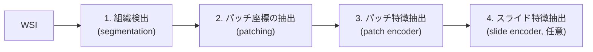

# TRIDENT チートシート

> 対象: TRIDENT 0.3.0（Mahmood Lab。このマシンの `wsi_preprocess/.venv` のソースで API を確認）
> 公式: https://github.com/mahmoodlab/TRIDENT ・ ドキュメント: https://trident-docs.readthedocs.io/

## 1. 何をするツールか

WSI の前処理を一通り行うツールキット。3つのステップを順に実行する。



- パッチの画像そのものは保存しない。**座標だけを h5 に保存**し、特徴抽出のときに WSI から読み直す
- UNI、CONCH、Virchow などのパッチエンコーダを名前で呼び出せる

## 2. 出力ディレクトリの構成

```
<job_dir>/
├── thumbnails/<slide>.jpg                         # サムネイル
├── contours/<slide>.jpg                           # 組織輪郭を重ねたサムネイル
├── contours_geojson/<slide>.geojson               # 組織輪郭（QuPath で開ける）
└── 20x_256px_0px_overlap/                         # {倍率}x_{パッチサイズ}px_{重なり}px_overlap
    ├── patches/<slide>_patches.h5                 # パッチ座標
    ├── visualization/<slide>.jpg                  # パッチ位置の可視化
    └── features_uni_v1/<slide>.h5                 # パッチ特徴量（エンコーダごと）
```

### h5 の中身

| ファイル | データセット | 形状 | 主な属性 |
|:---|:---|:---|:---|
| `patches/*.h5` | `coords` | (N, 2) | `patch_size`, `patch_size_level0`, `level0_magnification`, `target_magnification`, `overlap` |
| `features_*/*.h5` | `features` | (N, D) | `name`, `encoder` |
| | `coords` | (N, 2) | パッチ座標と同じ属性 |

- `coords` は **level 0 の左上座標 (x, y)**
- `patch_size` は target 倍率でのサイズ、`patch_size_level0` は level 0 でのサイズ
- 読み方は [h5py.md](h5py.md) を参照

## 3. Python API で使う（1枚ずつ）

```python
from trident import load_wsi
from trident.segmentation_models import segmentation_model_factory
from trident.patch_encoder_models import encoder_factory

job_dir = "results/trident"
wsi = load_wsi("slide.svs")                           # 形式から reader を自動で選ぶ

# 1. 組織検出
seg_model = segmentation_model_factory("hest")        # "hest" / "grandqc"
wsi.segment_tissue(segmentation_model=seg_model, target_mag=10, job_dir=job_dir, device="cuda:0")

# 2. パッチ座標
coords_dir = f"{job_dir}/20x_256px_0px_overlap"
coords_path = wsi.extract_tissue_coords(
    target_mag=20, patch_size=256, save_coords=coords_dir,
    overlap=0, min_tissue_proportion=0.0,
)
wsi.visualize_coords(coords_path, save_patch_viz=f"{coords_dir}/visualization")

# 3. パッチ特徴
encoder = encoder_factory("uni_v1")                   # 下の表を参照
encoder.eval().to("cuda:0")
wsi.extract_patch_features(
    patch_encoder=encoder, coords_path=coords_path,
    save_features=f"{coords_dir}/features_uni_v1", device="cuda:0",
)
```

### 主な引数

| メソッド | 引数 | 既定値 | 意味 |
|:---|:---|:---|:---|
| `load_wsi` | `reader_type` | 自動 | `openslide` / `image` / `cucim` / `sdpc` / `omezarr` / `czi` |
| | `mpp` など（kwargs） | — | メタデータに MPP がない場合に渡す |
| `segment_tissue` | `target_mag` | 10 | 組織検出を行う倍率 |
| | `holes_are_tissue` | True | 穴も組織として扱うか |
| | `batch_size` | 16 | |
| `extract_tissue_coords` | `target_mag` / `patch_size` | 必須 | 例: 20 / 256 |
| | `overlap` | 0 | 重なり（ピクセル） |
| | `min_tissue_proportion` | 0.0 | パッチ内の組織割合がこれ未満なら除外 |
| `extract_patch_features` | `saveas` | `h5` | `h5` または `pt` |
| | `batch_limit` | 512 | バッチサイズの上限 |

## 4. Processor で使う（フォルダ単位）

```python
from trident import Processor

proc = Processor(job_dir="results/trident", wsi_source="data/wsis", wsi_ext=[".svs"])
proc.run_segmentation_job(seg_model, seg_mag=10, device="cuda:0")
proc.run_patching_job(target_magnification=20, patch_size=256, overlap=0)
proc.run_patch_feature_extraction_job(
    coords_dir="20x_256px_0px_overlap", patch_encoder=encoder, device="cuda:0",
)
proc.release()
```

| 引数 (`Processor`) | 意味 |
|:---|:---|
| `wsi_source` / `wsi_ext` | WSI のフォルダと拡張子 |
| `custom_list_of_wsis` | 処理するスライドを CSV で指定する（MPP を列で渡すこともできる） |
| `skip_errors` | エラーが出たスライドを飛ばして続ける |
| `search_nested` | サブフォルダも探す |
| `wsi_cache` / `clear_cache` | ローカルディスクにコピーしてから処理する |

- 処理済みのスライドは飛ばされる（出力ファイルがあれば再計算しない）。やり直すときは該当ファイルを消す
- 処理中のファイルにはロックが作られる。途中で kill すると残ることがある

## 5. CLI

```bash
trident --version
trident doctor                          # 環境診断
trident convert --input_dir imgs/ --mpp_csv mpp.csv --job_dir out/   # 普通の画像をピラミッド TIFF に変換
trident batch  -- <run_batch_of_slides の引数>
trident single -- <run_single_slide の引数>
```

**注意: `uv add git+...` / `pip install` で入れた場合、`run_batch_of_slides.py` 本体はパッケージに含まれない（このマシンの 0.3.0 で確認）。** `trident batch` は `ModuleNotFoundError` になる。フォルダ単位の処理は、第4節の Processor を使うか、リポジトリを clone して直接実行する。

```bash
# clone した場合の典型例
python run_batch_of_slides.py --task all \
  --wsi_dir data/wsis --job_dir results/trident \
  --patch_encoder uni_v1 --mag 20 --patch_size 256
```

## 6. 使えるモデル

### パッチエンコーダ（`encoder_factory` に渡す名前）

| 名前 | 備考 |
|:---|:---|
| `uni_v1`, `uni_v2` | UNI / UNI2-h（gated。HF で申請が必要） |
| `conch_v1`, `conch_v15` | CONCH（gated） |
| `virchow`, `virchow2` | Paige |
| `gigapath` | Prov-GigaPath |
| `hoptimus0`, `hoptimus1`, `h0-mini` | Bioptimus |
| `phikon`, `phikon_v2` | Owkin |
| `ctranspath`, `hibou_l`, `musk`, `keep`, `gpfm`, `openmidnight` | |
| `kaiko-vits8` など, `lunit-vits8` | |
| `resnet50` | ImageNet（ベースライン） |

組織検出: `hest`（既定）、`grandqc`、`grandqc_artifact`（アーティファクト除去）

### 重みの置き場所

- 既定では Hugging Face Hub から自動でダウンロードする。gated モデルは事前に `hf auth login` とアクセス申請が必要（[huggingface_hub.md](../dl/huggingface_hub.md)）
- オフラインで使う場合は、`trident/patch_encoder_models/local_ckpts.json` にローカルパスを書く（`segmentation_models/` なども同じ）
- 組織検出モデルは `~/.cache/trident/` に置かれる

## 7. よくあるハマりどころ

| 症状 | 原因と対処 |
|:---|:---|
| MPP / 倍率が取れないというエラー | メタデータにない。`load_wsi(..., mpp=0.25)` のように渡すか、`custom_list_of_wsis` の CSV で指定する |
| gated モデルで 401 / 403 | HF でアクセス申請をしていない、またはログインしていない |
| 計算ノードでダウンロードできない | ネットワークが制限されている。ログインノードで事前にダウンロードし、`local_ckpts.json` か HF キャッシュを使う |
| 2回目を実行しても何も起きない | 出力が既にあるので飛ばされている。消してから実行する |
| パッチが少なすぎる・多すぎる | `min_tissue_proportion` と組織検出の結果（`contours/`）を確認する |
| `trident batch` が動かない | 第5節の注意を参照 |
| 特徴量とパッチの対応がわからない | `features_*/*.h5` にも `coords` が入っているので、それを使う |
