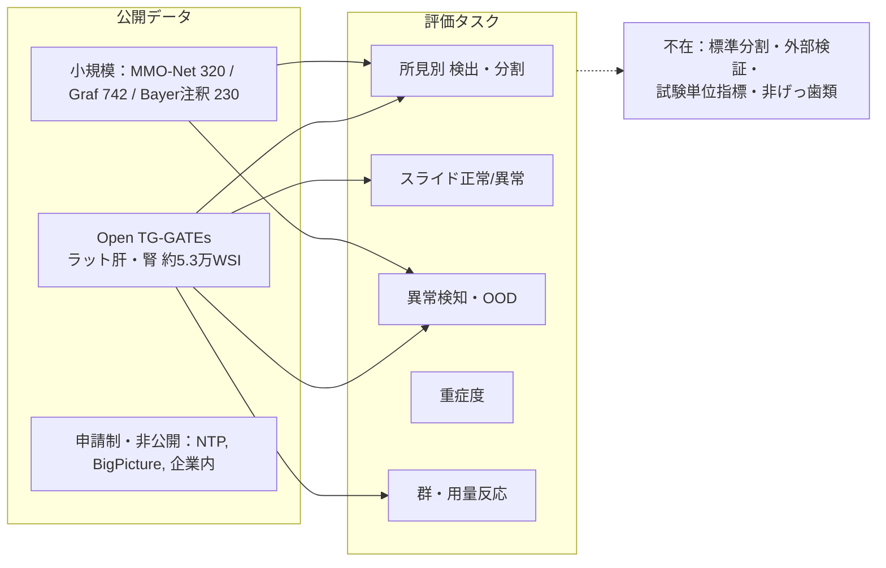

# 毒性病理画像AIのベンチマーク：公開データセットと評価タスク・指標の調査

> **調査日**: 2026-10-01
> **担当Agent**: Claude (Research Agent)
> **ステータス**: 完了
> **タグ**: `#ベンチマーク` `#公開データセット` `#評価指標` `#OpenTGGATEs` `#データ分割` `#毒性病理`

---

## 📌 結論

### 調査範囲
- 対象は非臨床毒性試験（GLP/学術）由来の病理WSI。獣医臨床病理（MIDOG等のイヌ・ネコ腫瘍）とヒト病理は除外した。
- 見る観点は (1) 公開データセット、(2) 評価タスク・指標・分割プロトコル の2つ。
- 既出のTG-GATEs（[05](../../08/05_patho_toxicogenomics/report.md)）とUNIの動物転用（[11](../../08/11_uni_animal_pathology_transfer/report.md)）は要約と参照に留めた。

### 主要な結論
1. **毒性病理WSIには、コミュニティ標準のベンチマークもチャレンジもない。** 「ベンチマーク」を名乗るのはVIPER（2026, arXiv:2608.26382）だけで、これはROI画像のVLM向けQAであり、WSIのタスクではない。
2. **自由にダウンロードできる大規模データはOpen TG-GATEs（ラット肝・腎、約5.3万WSI）だけ。** ほかに公開されているのはRoche MMO-Net（ラット多臓器320 WSI）、BI Graf 2026（マウス肝742 WSI、ピクセル注釈）、Bayer/AignosticsのTG-GATEs追加注釈（230 WSI）といった小規模なものに限られる。イヌ・サル・ミニブタの公開WSIは見つからなかった。
3. **TG-GATEsが事実上の共通データだが、分割方法が論文ごとに違うため数値を横並びで比べられない。** 試験単位・化合物単位・タイル単位の分割が混在しており、タイル単位分割にはリークがある（Kuklyte 2021）。
4. **評価タスクは5系統に分かれる**：所見別の検出・セグメンテーション、スライド単位の正常/異常トリアージ、正常のみで学習する異常検知・OOD検出、重症度グレード、群・用量レベルの反応。毒性病理の判断単位である「群・試験」での評価は少数派で、試験単位の感度/NPVや試験報告書との一致を正式な指標にした論文は見つからなかった。
5. **外部検証がほぼない。** TG-GATEsは単一系統（雄SD）・単一スキャナ（Aperio ScanScope）・CRO 3社の構成で、施設やスキャナをまたぐ検証をしたのはMMO-Net（leave-one-lab-out）だけ。
6. **汎用病理ベンチマーク（Patho-Bench、eva、HEST-Benchmark）に、毒性・齧歯類タスクは含まれない。**

---

## 1. 公開データセット

### 1.1 取得できるもの（一次ソースで確認）

| データセット | 動物種・臓器 | 規模 | ラベル | アクセス / ライセンス | 注意点 |
|:---|:---|:---|:---|:---|:---|
| **Open TG-GATEs Pathological Image DB**（TGP/NIBIOHN、Igarashi 2015 NAR） | 雄SDラット、肝・腎 | SVS 52,879枚（約25TB）、約160化合物、157試験。用量4群、屠殺時点8つ（3h〜29日） | 個体単位の所見名・部位・グレード（P/minimal〜severe）・自然発生フラグ。用語はTGP独自でINHAND準拠ではない | 登録不要のHTTP（[dbarchive](https://dbarchive.biosciencedbc.jp/data/open-tggates-pathological-images/LATEST/)）、CC BY-SA 2.1 JP | ラベルが個体単位でスライド単位ではない。雄SDのみ・スキャナ1機種・2012年頃のスキャン。腎の枚数が論文ごとに違う（28,747 / 29,168） |
| **TG-GATEs 追加注釈**（Bayer病理医+Aignostics、[Zenodo 7541930](https://doi.org/10.5281/zenodo.7541930)） | ラット肝（TG-GATEsの一部） | 230 WSI、ポリゴン1.9万件超 | 17クラス（壊死、核分裂像、中心静脈、炎症など） | CC BY-SA 2.1 JP（画像本体はTG-GATEsから取得） | 病変の種類が壊死・核分裂像に偏る |
| **MMO-Net データ**（Roche、Gámez Serna 2022 J Pathol Inform） | ラット、7臓器を注釈 | 320 WSI、CRO 3社、スキャナ2機種、対照群と投与群 | 臓器ポリゴン。肝・腎・甲状腺の所見メタデータ。論文のtrain/test分割を同梱 | [Synapse syn30282632](https://www.synapse.org/Synapse:syn30282632)、CC BY-NC 4.0 | 臓器同定向けで、所見ラベルは補助的。後続研究での利用は確認できず |
| **Graf 2026 データ**（Boehringer Ingelheim・Tübingen、Sci Rep） | マウス C57BL/6 肝、44試験 | 742 WSI | ピクセル注釈：正常＋9病変＋アーチファクト | [OSF mkvct](https://osf.io/mkvct/)。データのライセンスは未確認。コードあり | 毒性試験か薬効試験かの記述が曖昧 |
| **Zingman（BI）異常検知タイル**（arXiv:2210.07675） | マウス・ラット正常7臓器、マウスNAFLD | タイルのみ（各カテゴリ約7,000枚） | 正常/異常 | [OSF gqutd](https://osf.io/gqutd/) | WSIではない。NAFLDは食餌モデル |

### 1.2 存在するが、オープンなWSIとしては取得できないもの

| 名称 | 状況 |
|:---|:---|
| NTP Archives / CEBS | スライド750万枚、デジタル画像1.8万点超。申請・承認制。CEBSは所見の表データのみ |
| DrugMatrix (CEBS) | 病理の表データと41MBの画像zip（静止画と推定。中身は未確認） |
| IMI BigPicture | 非臨床200万WSIを目標とするDICOMリポジトリ。コンソーシアム参加者のみ |
| eTRANSAFE / SEND | 所見のデータ標準。画像は含まない |
| 企業内データ | Genentech 2,402 WSI、Merck約13.5万 WSI、BMS、塩野義（ラット精巣）など。すべて非公開 |
| Kaggle / grand-challenge / IDR / STP | 毒性病理のチャレンジ・データは見つからず |

**隣接データ（毒性試験由来ではない）**：Orbit糸球体データ（Idorsia、ラット・マウス腎88 WSI、CC0）、KidneyAI（AstraZenecaほか、糖尿病性腎症モデル）、KPIs Challenge 2024（マウスCKDモデル）。いずれも疾患モデルか、毒性試験由来かが記載されていない。

---

## 2. 評価タスクと指標

| 系統 | 代表タスク | 主な指標 | 代表論文 |
|:---|:---|:---|:---|
| ① 所見別 検出・セグメンテーション | 肝壊死・空胞化・肥大、心筋症病変、精巣所見 | Dice, IoU, F1 | Kuklyte 2021, Tokarz 2021, Shimazaki 2022/2026 |
| ② スライド単位 正常/異常 | lesion / no-lesion、所見別の二値・多ラベル分類 | AUROC, BA, macro-AUC | TRACE, TANGLE, Zehnder 2025, Funk 2025 |
| ③ 異常検知・OOD | 正常のみで学習、未知病変・アーチファクトの検出 | AUROC, 感度/特異度, NPV, FNR/FPR | Slootweg 2025, Graf 2026, Forest 2026, GraphTox 2025, Zingman 2024 |
| ④ 重症度グレード | minimal〜severeの推定 | 重みつきκ, Spearman, ±1グレード一致 | TRACE, Tokarz 2021, Babburi 2026 |
| ⑤ 群・用量反応 | 用量群ごとのスコア推移、処置関連か自然発生かの区別 | 群平均スコア, log2FC, 用量相関 | TRACE, PathologAI, Zingman 2024, Pischon 2021 |

- 臓器同定（MMO-Net）や正常組織分類（HistoNet）は前処理段のタスクとして別枠になる。
- 形態からの遺伝子発現予測（GEESE、r=0.29）は[05](../../08/05_patho_toxicogenomics/report.md)で扱った。
- 汎用ベンチマークのPatho-Bench（95タスク）、eva、HEST-Benchmarkに毒性・齧歯類タスクはない（各READMEで確認。HEST-1kにマウス検体が含まれるかは未確認）。

---

## 3. 主要論文の評価プロトコル比較

| 論文 | データ | タスク | 分割単位 | 参照標準 | 報告値 |
|:---|:---|:---|:---|:---|:---|
| TRACE（Jaume 2024, bioRxiv, Harvard/Bern） | TG-GATEs ラット肝。事前学習 46,734 WSI | 5所見の弱教師あり分類、few-shot、用量反応 | **試験単位**（学習128試験、テスト29試験） | TG-GATEs所見。読影研究は3名合議 | macro-AUC 96.9%。重みつきκは病理医平均を+10.2%上回る。外部検証なし |
| TANGLE（Jaume 2024, CVPR） | TG-GATEs ラット肝 | 6所見の多ラベル分類 | テスト29試験（試験単位とみられるが未確認） | TG-GATEs | k=10で macro-AUC 84.7% |
| PathologAI（Bussola 2023, FDA NCTR） | TG-GATEs ラット肝 816 WSI | 壊死の有無、自然発生か処置関連か | **試験単位** | TG-GATEs | 正答率：正常対照 87%、minimal 67%。AUCの報告なし |
| Slootweg 2025（Radboud） | TG-GATEs ラット腎 29,168 WSI | 自己教師あり異常検知 | **化合物単位**（83/41/34） | 病理医のピアレビューで調和したラベル | AUC 0.62、NPV 89%。UNIの1-NNは AUC 0.50 |
| Graf 2026（BI/Tübingen） | マウス肝 742 WSI/44試験 | セグメンテーション＋OOD検出 | **試験単位** 70/15/15 | 病理医1名のピクセル注釈 | FNR 0.16%、FPR 0.35% |
| Zehnder 2025（Genentech） | ラット肝 2,402 WSI | 所見別の二値分類 | 80/10/10 のMonte Carlo CV（試験単位かは不明） | 病理医のWSIラベル | 空胞化 0.945、全所見 0.815 AUROC |
| Forest 2026（Merck/AIRA） | ラット肝。参照は対照750 WSI | one-class異常検知 | 未確認 | 動物単位の診断 | 感度 95.9%、特異度 70.8% |
| GraphTox（Li 2025, MICCAI, Merck） | ラット肝 | グラフ型異常検知 | 独立テスト（詳細未確認） | 未確認 | AUC 0.80（UNI v2 graph 0.74） |
| Kuklyte 2021（Deciphex） | TG-GATEs 肝・腎、心・肺 | 病変セグメンテーション | **タイル単位**（リークあり） | 病理医注釈 | F1 0.77〜0.84 |
| Tokarz 2021（EPL/NTP/AIRA） | ラット心 | セグメンテーション＋重症度 | 学習・テスト各300 WSI | 5名中3名以上の合議 | Dice 0.85〜0.96、Spearman 0.82 |
| Shimazaki 2022（JT/AIRA） | ラット肝 406 WSI | 7所見、WSI二値判定 | 開発151/検証255 | 一次診断→ピアレビュー→5名協議 | 約75%が正解。閾値を検証セット上で決めている |
| MMO-Net（Gámez Serna 2022, Roche） | ラット 320 WSI | 臓器同定 | **施設除外（leave-one-lab-out）** | — | AUROC 0.99〜1.0 |

Funk 2025（Roche/Visium）、Babburi 2026（AbbVie）、Shimazaki 2026は抄録までしか確認できず、数値と分割方法は未確認。

---

## 4. プロトコル上の問題

1. **分割単位が揃っていない。** 毒性病理では同じ試験・化合物の動物が似た所見をもつため、タイルやスライド単位で分割すると性能が過大評価される。Pohlmeyer-Esch 2025（IMI BigPicture）は、同一動物のパッチを学習とテストに混在させないことを明記している。
2. **公式の分割がない。** TG-GATEsを使う論文はそれぞれ独自の分割を使い、Slootwegの分割も公開されていない。同じデータでも数値を比べられない。
3. **外部検証がない。** TG-GATEsは単一系統・単一スキャナなので、施設・スキャナ・系統・動物種をまたぐ汎化を測れない。TRACEも外部コホートがないことを限界として挙げている。
4. **参照標準が揃っていない。** TG-GATEs公式所見（TGP独自用語、個体単位）、社内ピアレビュー、複数名合議、病理医1名とばらばらである。病理医間のκは0.30〜0.80（TRACE）、0.56（Steinbach 2024）と低く、上限性能の解釈に影響する。
5. **毒性病理の判断単位での指標がない。** 実務の判断は「群間比較で処置関連所見があるか」だが、ほとんどの論文はスライドかパッチの単位で評価している。試験単位の感度/NPVや、試験報告書の結論との一致を測った論文は見つからなかった。この点は[04](../../08/04_dose_response_hierarchical_mil/report.md)（用量反応）と[10](../../08/10_glp_ai_validation_framework/report.md)（GLPの受容基準）で指摘した欠落と同じ。
6. **閾値を検証データで決めている例がある。** Shimazaki 2022はROC閾値を検証セット上で決めているため、報告値が楽観的になる可能性がある。

方針文書としては、STP SIG（Turner 2020, 2021）、ESTP調査（Palazzi 2023）、Zuraw 2021、Pohlmeyer-Esch 2025、製薬協AI病理TF（Tomikawa 2025）、Bertram 2026（Vet Pathol、指標・ブートストラップ・テストセット構成の推奨）がある。ただし、具体的なベンチマークタスクを定義した文書は見つからなかった。

---

## 5. 既存トピックとの関係・訂正

- **[05](../../08/05_patho_toxicogenomics/report.md)**：TG-GATEsのデータ構造とGEESEの数値は05のとおり。本調査では、TG-GATEsのラベルが個体単位であることと、ダウンロード先の実URL・ライセンスを追加で確認した。
- **[11](../../08/11_uni_animal_pathology_transfer/report.md)**：毒性病理へのUNI適用はSlootweg 2025のみという結論は変わらない。新たにGraphTox 2025（UNI v2をグラフ化、AUC 0.74）を比較対象として確認した。
- **訂正（既存ファイルは未修正）**：
  - 01・04・06・07のレポート、INDEX.md、backlog.mdでは、TRACEを「Pfizer」の成果としている。一次情報（bioRxiv 10.1101/2024.07.20.604430）で確認したところ、TRACEは**Harvard/BWH（Mahmood lab）とBern大学**の成果で、Pfizerは所属にもデータ提供元にも出てこない。
  - 「Graf et al. 2026」は**Boehringer IngelheimとTübingenによるマウス肝のMahalanobis型OOD検出論文**（Sci Rep 2026）で、TRACEとは別の論文である。
  - MMOデータセットの提供元はBayerではなく**Roche**（MMO-Net）。

---

## 6. 未確認事項

- Funk 2025のAUROC値、Forest 2026・Babburi 2026・GraphTox 2025の分割方法
- TRACEの査読版の出版先
- Graf 2026のOSFデータのライセンスと中身（OSFのページを描画できなかった）
- MMO-Netのダウンロードに Synapse アカウントが必要か
- DrugMatrixの画像zipの中身
- IHIの「AI Foundation Toxicology Model」トピック草案の内容（取得失敗）

---

## 📎 関連ファイル
- 論文一覧：[papers/index.md](papers/index.md)
- 検索ログ：[notes/search_log.md](notes/search_log.md)
